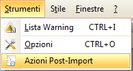
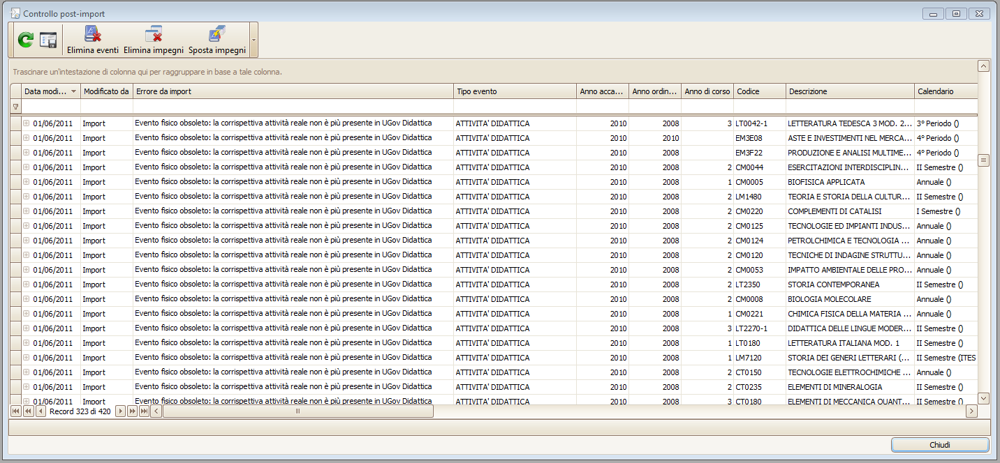
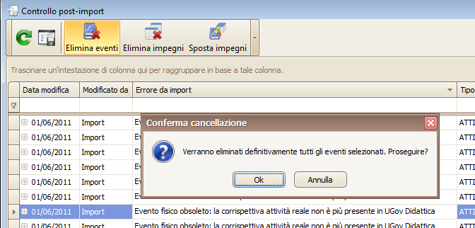
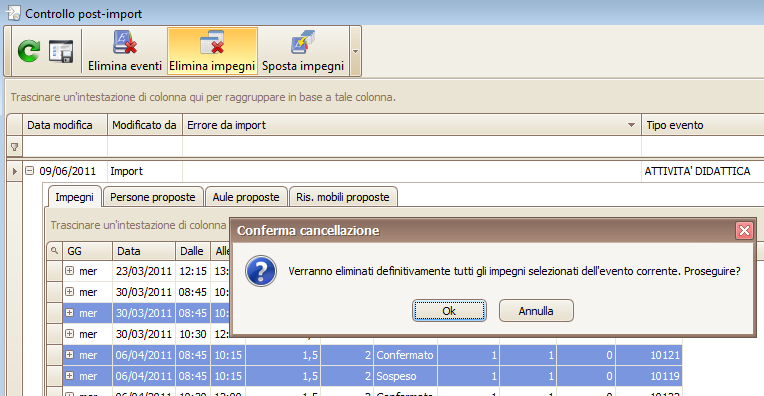
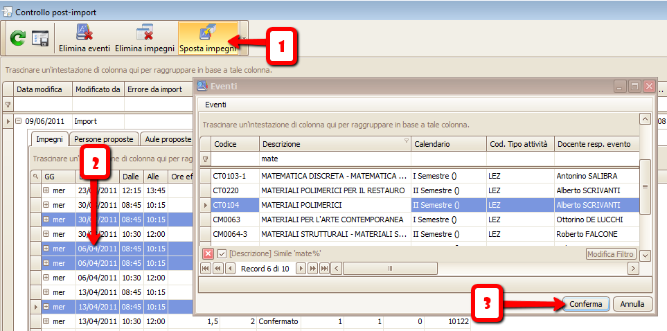

per "_pulire_" o "_recuperare_" dati.  

L'import da Ugov didattica è **incrementale** cioè nella maggior parte dei casi i dati vengono aggiornati automaticamente senza influenzare
gli impegni già inseriti in UP.

Vi sono tuttavia alcune operazioni (lato Ugov) che possono richiedere un intervento _manuale_ da parte dell'operatore,
poiché influenzano in maniera "invasiva" i dati già esportati.  

Tra queste vi sono:

  *  Cancellazione di Attività Reali (su Ugov)
  *  Cancellazione o mancata assegnazione dell'Attività Formativa Master per gruppi di attività in condivisione logistica (su Ugov)
  *  Cancellazione, mancata assegnazione o modifica della Copertura Docenti (in particolare del "tipo di attività" seguita dal docente) (su Ugov)
  *  Modifica delle date del ciclo (periodo) assegnato all'attività (su Ugov)

**NB: funzionalità disponibile ai soli utenti supervisori o configuratori**

Dal menu strumenti selezionare la voce di menu "Azioni post-import"

Si aprirà la seguente maschera

Le caratteristiche di base sono le medesime della maschera [Gestione Eventi](up_client_Eventi.md),   

con possibilità di spostare le colonne, salvare il layout, effettuare filtri e aprire il dettaglio degli impegni/proposte.

Gli **Eventi** elencati (logici o fisici) sono stati _eliminati_ o _modificati_ dalle procedure di import.  

Gli eventi in stato _eliminato_ non sono più visibili in nessun modulo di UP (reports, Web, Client) e sono gestibili unicamente da questa maschera.  

Il sistema modifica/elimina tutti gli eventi che rientrano in uno dei seguenti casi d'errore:

##  Errori import 

  *  **Logico master assente:** l'evento fa parte di una condivisione logistica senza attività master specificata 
  In SIADI: per ogni condivisione logistica, ci deve essere almeno una "attività formativa" dichiarata come _Master_ tra le altre. Evento eliminato.                              

  *  **Fisico senza logici:** l'eventi fisico (cod. corso '000') non ha alcun evento logico collegato.
  In SIADI: un'attività reale facente parte di una condivisione logistica non ha più attività formative collegate, oppure è stato fatto un "export" parziale (ad es. un solo CDS)
  e le attività formative collegate non sono ancora state esportate. Evento eliminato.

  *  **Cambio calendario:** sospesi o eliminati gli impegni dell'evento poichè sono cambiate le date del calendario associato.
  In SIADI: o è cambiato il periodo associato all'attività reale o sono cambiate le date del calendario (ciclo) associato. In questo caso l'evento non viene eliminato.

  *  **Evento fisico obsoleto:** la corrispettiva attività reale non è più presente in UGov Didattica
  In SIADI: l'attività reale è stata cancellata. Evento eliminato.

Gli impegni associati agli eventi eliminati subiscono l'azione impostata nei parametri di configurazione dell'applicativo (di default vengono "sospesi").  

Per ulteriori informazioni vedere la sezione "Parametri Import UP" [cliccando qui](Parametri-Configurazione.md) (es. paramtro "IMPORT_UP.GESTIONE_CAMBIO_CALEND").

## Operazioni disponibili

###  Cancellazione fisica degli **eventi **selezionati 

  *  Selezionare uno o più eventi (tasti SHIFT o CTRL).  

  *  Premere il pulsante "Elimina eventi".  

  *  Confermare.  

**NB:** verranno cancellati definitivamente anche tutti gli impegni/aule/persone/ris. mobili di dettaglio dell'evento

###  Cancellazione fisica degli **impegni **selezionati 

  *  Aprire l'elenco impegni cliccando il "+" a sinistra dell'evento.  

  *  Selezionare uno o più impegni (tasti SHIFT o CTRL).  

  *  Premere il pulsante "Elimina impegni".  

  *  Confermare.  

**NB:** verranno cancellati definitivamente anche tutti le aule/persone/ris. mobili di dettaglio dell'impegno

###  Spostamento degli **impegni ** selezionati 

  *  Aprire l'elenco impegni cliccando il "+" a sinistra dell'evento.  

  *  Selezionare uno o più impegni (tasti SHIFT o CTRL).  

  *  Premere il pulsante "Sposta impegni".  

  *  Confermare.  

  *  Selezionare un evento dalla lista di pop-up.  

  *  Confermare.  

**NB:** verrà sostituito il "padre" degli impegni con l'evento selezionato SENZA alcun controllo di _disponibilità aule/docenti, coerenza date, coerenza propagazioni_, ecc.
