
# Introduzione

Dalla versione 10.02.00.00 la Gestione Descrizione viene radicalmente modificata.
Le principali modifiche sono che le descrizioni diventano parametriche per ogni utente, ciò significa che ogni utente può gestire le proprie descrizioni come meglio crede.
L'utente può realizzare metodologie diverse, per la gestione delle descrizioni, a seconda dell'applicativo ([Descrizione Up Client](#Descrizione Up Client) e [Descrizione UP Web](#Descrizione UP Web)), a seconda degli eventi, delle aule, dei docenti e a seconda delle [Descrizione Report](#Descrizione Report).

 **ATTENZIONE**

**Sia il pianificatore che alcune stampe sono ordinate per descrizione della risorsa. Per ciò modificando le descrizioni verrà modificato anche l'ordinamento. **

# Gestione descrizioni UP Client

La maschera della _Gestione Descrizione_ parametriche, si trova sotto la voce di menù _Strumenti <del>> Opzioni _
Da questa maschera è possibile personalizzare i campi da visualizzare all'interno del box principale che rappresenta il singolo impegno nella time table. E' possibile  definire un layout diverso per ogni pianificatore (eventi, aule, docenti).

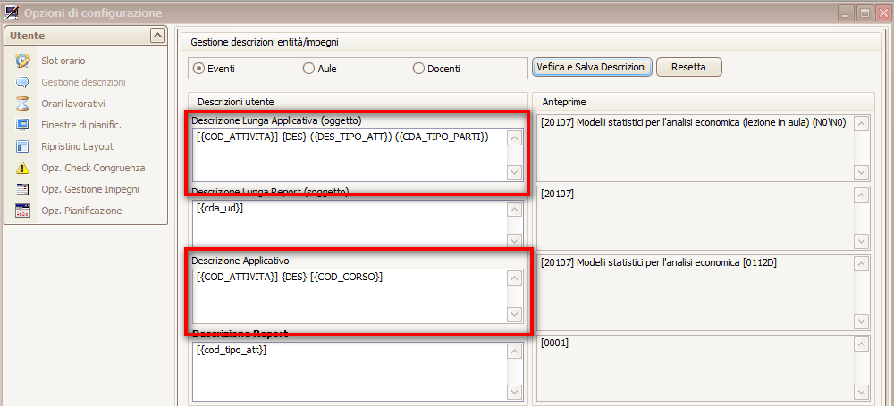

Box Eventi sono visibili quattro campi, due dei quali editabili per la descrizione dell'applicativo UP Client: _Descrizione Lunga Applicativa (oggetto)_ e _Descrizione Applicativo_. 

Box Aule sono presenti due campi editabili, uno necessario per le descrizioni dell'applicativo: _Descrizione Applicativo_.

Box Docenti sono visibili due campi, uno per l'applicativo: _Descrizione Applicativo_.

In ciascun campo descrizione di qualsiasi pianificatore è possibile specificare quali dati visualizzare.
Si possono inserire i campi della griglia sottostante in modo manuale, inserendo il nome del campo tra parentesi graffe, nel seguente modo:
    {DES_COGNOME}

Oppure, si può inserire un campo nella descrizione cliccando il campo con un semplice click dalla griglia sottostante. 
Nella descrizione verrà riportato il campo scritto in SQL.

A destra della maschera vengono riportati le anteprime delle descrizioni editate. Per visualizzare le anteprime è necessario confermare con il punsante in alto alla maschera nominato "_Verifica e Salva Descrizione_" 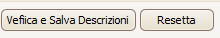. 
Oppure eliminare le modifiche riportate con il pulsante "_Resetta_".

Nel dettaglio Aule e Docenti è presente un allert 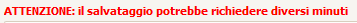, in quanto il salvataggio e la successiva visualizzazione dell'anteprima della descrizione a seconda dei campi selezionati possono impegnare l'applicazione per alcuni minuti.

Sono state implementate delle [nuove funzionalità](#nuove funzionalità).

# Gestione descrizioni UP WEB

La maschera della _Gestione Descrizione Parametriche_, si trova sotto la voce di menù _Opzioni </del>> Opzioni Personali _
Come nel client, da questa maschera è possibile personalizzare i campi da visualizzare all'interno del box principale che rappresenta il singolo impegno nella time table. E' possibile definire un layout diverso per ogni pianificatore (eventi, risorse fisse, persone).

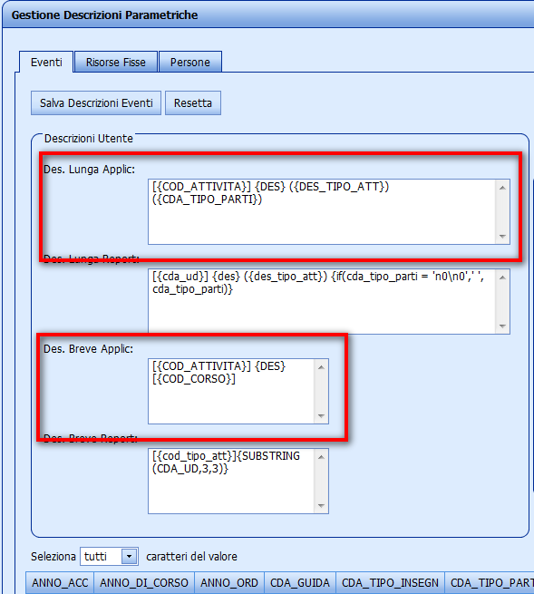

Eventi sono visibili quattro campi editabili, due per lo scheduler dell'applicativo UP Web: _Des Lunga Report_ e _Des Breve Report_. 

Risorse Fisse sono presenti due campi editabili, uno dei quali per l'applicativo UP Web: _Des. Ris. Fisse Report_.

Persone sono visibili due campi, uno per lo scheduler: _Des. Persone Report_.

In ciascun campo descrizione di qualsiasi pianificatore è possibile specificare quali dati visualizzare.
Si possono inserire i campi della griglia sottostante in modo manuale, inserendo il nome del campo tra parentesi graffe, nel seguente modo:
    {DES_COGNOME}

Oppure, si può inserire un campo nella descrizione cliccando il campo con un semplice click dalla griglia sottostante. 
Nella descrizione verrà riportato il campo scritto in SQL.

A destra della maschera vengono riportati le anteprime delle descrizioni editate. Per visualizzare le anteprime è necessario confermare con il punsante in alto alla maschera nominato "_Salva Descrizione_" 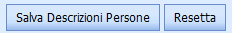. 
Oppure eliminare le modifiche riportate con il pulsante "_Resetta_".

Nel dettaglio Risorse Fisse e Persone è presente un allert 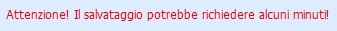, in quanto il salvataggio e la successiva visualizzazione dell'anteprima della descrizione a seconda dei campi selezionati possono impegnare l'applicazione per alcuni minuti.

Sono state implementate delle [nuove funzionalità](#nuove funzionalità).

# Gestione descrizioni Report

L'utente può diversificare le descrizione dei report a seconda dell'applicativo: UP Client o UP Web.

**Fare attenzione che per ogni report l'ordinamento dei dati in stampa è dovuto al primo campo che si trova nella descrizione parametrica per utente.**

## Descrizione Report UP Client

La maschera della _Gestione Descrizione_ parametriche, si trova sotto la voce di menù _Strumenti <del>> Opzioni _
Da questa maschera è possibile personalizzare i campi da visualizzare all'interno del box principale che rappresenta il singolo impegno nella time table. E' possibile  definire un layout diverso per ogni pianificatore (eventi, aule, docenti).

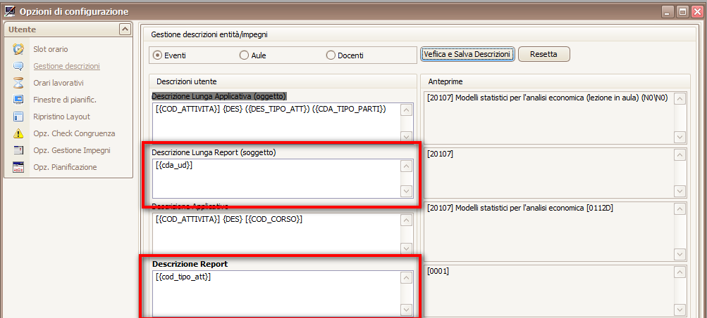

Box Eventi sono visibili quattro campi, due di questi necessari per la parametrizzazione delle descrizioni nei report: _Descrizione Lunga Report (oggetto)_ e _Descrizione Report_. 

Box Aule sono presenti due campi editabili, uno per l'applicativo: _Descrizione Report_.

Box Docenti sono visibili due campi, uno di questi per l'applicativo: _Descrizione Report_.

In ciascun campo descrizione di qualsiasi pianificatore è possibile specificare quali dati visualizzare.
Si possono inserire i campi della griglia sottostante in modo manuale, inserendo il nome del campo tra parentesi graffe, nel seguente modo:
    {DES_COGNOME}

Oppure, si può inserire un campo nella descrizione cliccando il campo con un semplice click dalla griglia sottostante. 
Nella descrizione verrà riportato il campo scritto in SQL.
A destra della maschera vengono riportati le anteprime delle descrizioni editate. Per visualizzare le anteprime è necessario confermare con il pulsante in alto alla maschera nominato "_Verifica e Salva Descrizione_" . 
Oppure eliminare le modifiche riportate con il pulsante "_Resetta_".

Nel dettaglio Aule e Docenti è presente un allert , in quanto il salvataggio e la successiva visualizzazione dell'anteprima della descrizione a seconda dei campi selezionati possono impegnare l'applicazione per alcuni minuti.

Sono state implementate delle [nuove funzionalità](#nuove funzionalità).

## Descrizione Report UP WEB

La maschera della _Gestione Descrizione Parametriche_, si trova sotto la voce di menù _Opzioni </del>> Opzioni Personali _
Come nel client, da questa maschera è possibile personalizzare i campi da visualizzare all'interno del box principale che rappresenta il singolo impegno nella time table. E' possibile definire un layout diverso per ogni report dell'applicativo UP Web (eventi, risorse fisse, persone).

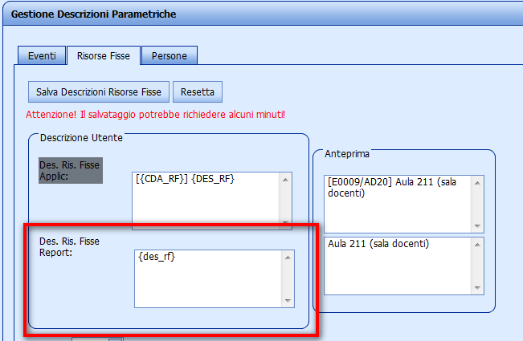

Eventi sono visibili quattro campi editabili: _Desc Lunga Report_ e _Des Breve Report_. 

Risorse Fisse sono presenti due campi editabili: _Des. Ris. Fisse Report_.

Persone sono visibili due campi: _Des. Persone Report_.

In ciascun campo descrizione di qualsiasi pianificatore è possibile specificare quali dati visualizzare.
Si possono inserire i campi della griglia sottostante in modo manuale, inserendo il nome del campo tra parentesi graffe, nel seguente modo:
    {DES_COGNOME}

Oppure, si può inserire un campo nella descrizione cliccando il campo con un semplice click dalla griglia sottostante. 
Nella descrizione verrà riportato il campo scritto in SQL.

A destra della maschera vengono riportati le anteprime delle descrizioni editate. Per visualizzare le anteprime è necessario confermare con il punsante in alto alla maschera nominato "_Salva Descrizione_" . 

Oppure eliminare le modifiche riportate con il pulsante "_Resetta_".

Nel dettaglio Risorse Fisse e Persone è presente un allert , in quanto il salvataggio e la successiva visualizzazione dell'anteprima della descrizione a seconda dei campi selezionati possono impegnare l'applicazione per alcuni minuti.

Sono state implementate delle [nuove funzionalità](#nuove funzionalità).

# Nuove Funzionalità

## Sub String

Nella parte inferiore della maschera è stata aggiunta una nuova funzionalità. 
Tramite il "_Seleziona Tutti caratteri del valore_", nella descrizione verranno riportati il valore completo del campo della griglia.

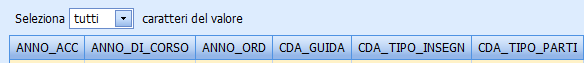

Se però l'utente necessità di visualizzare una sola parte dei campi riportati nella griglia, può effettuare una sottostringa del valore del campo.
Inserendo il "_Seleziona i primi..._" si specificano il numero di caratteri che si vogliono visualizzare ed è possibile anche decidere il valore di partenza del campo.

Esempio:
Vogliamo inserire nella descrizione dei docenti il COGNONE Docente seguito dall'iniziale del NOME.
Porremmo la selezione nel seguente modo

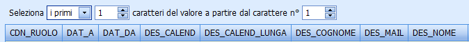

Se per esempio il docente si chiama ROSSI MARIO, nel campo della descrizione verrà riportato la funzione     {DES_COGNOME} {SUBSTRING(DES_NOME,1,1)}.
 e una volta confermata, nell'anteprima verrà visualizzato _ROSSI M._.

## IF Then Else
E' possibile inserire nel campo delle descrizioni un'altra funzionalità, implementata manualmente dall'utente. E' una struttura di controllo con uno specifico costrutto sintattico di un linguaggio di programmazione con la seguente semantica:

_SE Espressione ALLORA Statements Vero ALTRIMENTI Statements Falso_

<table align="left" border="2">
<td>Descrizione</td>
<td>Ottiene uno dei due valori a seconda del risultato di un'espressione logica </td>
<tr>
<td>Sintassi</td>
<td>{(IF _Espressione_, _Statements Vero_, _Statements Falso_)} </td>
</tr><tr>
<td>Argomenti</td>
<td>_Espressione_: L'espressione da valutare. </td>
</tr><tr>
<td>  </td>
<td>_Statements Vero_: Il valore da restituire se l'espressione è vera. </td>
</tr><tr>
<td>  </td>
<td>_Statements Falso_: Il valore da restituire se l'espressione è falsa. </td>
</tr>
</table>

Se il campo presente nella espressione è un campo stringa il valore di comparazione deve essere inserito negli apici semplici ' ', se numerico non necessità di nessun accorgimento.

Nella Espressione sono ammissibili i seguenti operatori di validazione:

<table align="left" border="2">
<td>Operatore</td>
<td>Descrizione</td>
</tr><tr>
<td>=</td>
<td>Uguale a</td>
</tr><tr>
<td><></td>
<td>Diverso da</td>
</tr><tr>
<td>>=</td>
<td>Maggiore Uguale a</td>
</tr><tr>
<td><=</td>
<td>Inferiore Uguale a</td>
</tr>
</table>

Facciamo qualche esempio:

Consideriamo il caso in cui nella espressione ricerchiamo una stringa.
Se scriviamo manualmente nel campo della _descrizione lunga applicativo (oggetto)_ la seguente sintassi

    {IF (CDA_TIPO_PARTI = 'N0\N0', '', CDA_TIPO_PARTI)}

e nella griglia siamo posizionati su una riga in cui il codice tipo partizione è uguale a N0\N0 nell'anteprima otteniamo il simbolo -.

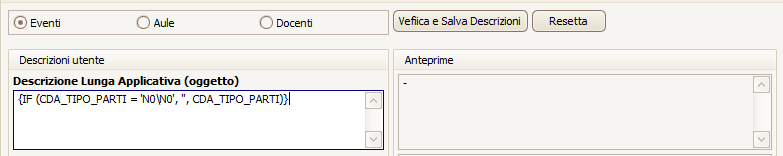

Se invece nell'espressione consideriamo dei valori interi otteniamo la seguente sintassi:

    {IF (ANNO_ACC <> 2006, 0, ANNO_ORD)}

E nella griglia siamo posizionati su una riga che ha come anno accademico proprio il 2006, e come anno ordinamento 2003, nell'anteprima otteniamo 2003, diversamente avremmo ottenuto il valore 0.

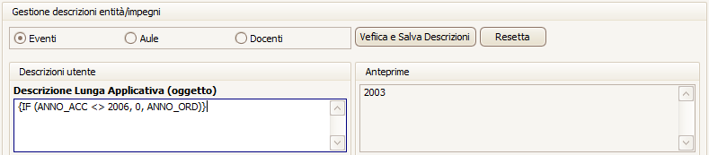

