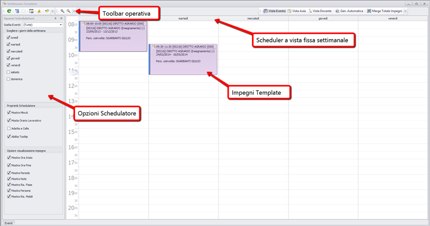
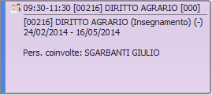
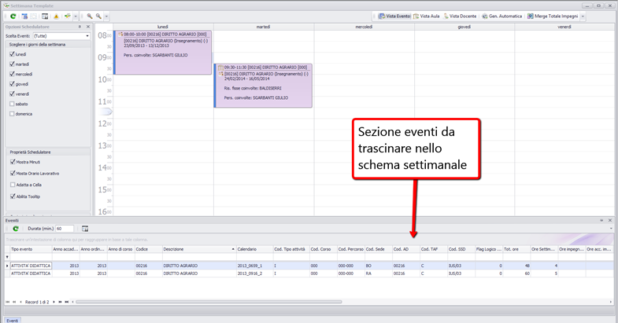
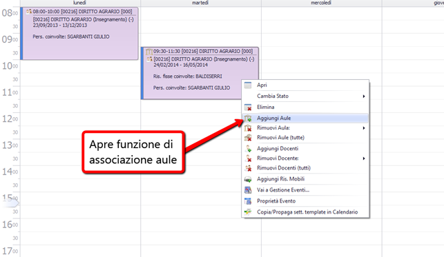
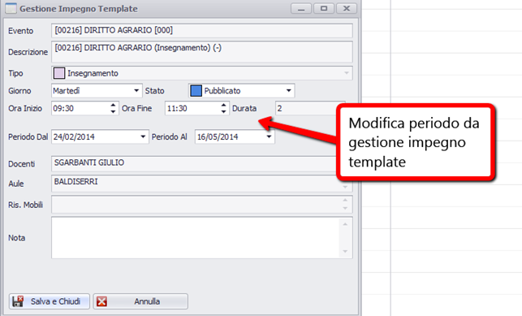



# Funzione di pianificazione per settimana template (tipo)
Esiste anche una funzionalità specifica che consiste sempre in una funzione di tipo scheduler per pianificare NON nel calendario effettivo ma per settimana template (tipo). Il vantaggio di questa modalità consiste nel poter prima creare un orario tipo astraendo dalle date di inizio dei singoli eventi. Dal punto di vista dell'interfaccia consiste in uno scheduler semplificato con alcune modalità operative più agili per velocizzare la stesura dell'orario.

Il concetto generale che sottende l'utilizzo di questa nuova funzionalità è che l'operatore prima lavori in prima battuta NON sul calendario fisico  ma sullo schema astratto della settimana tipo. Dal punto di vista tecnico questo step introduce il concetto di IMPEGNO TEMPLATE. Questo scheduler infatti non genera date di impegno effettive ma solo impegni “modello” (template) che devono poi in un secondo momento essere trasformati in impegni effettivi.

# Opzioni schedulatore

### Scegliere i giorni della settimana
Consente di selezionare i giorni della settimana da visualizzare.

### Proprietà schedulatore 
Alcune proprietà utili per ottimizzare la visualizzazione nello schema settimanale  

_**Mostra solo orario lavorativo**_: visualizza nella barra verticale dello slot solo le ore diurne  
_**Mostra minuti**_: visualizza nella barra verticale dello slot anche il dettaglio dei minuti  
_**Adatta alla cella**_: adatta la grandezza del box dell'impegno template a copertura delle righe dello scheduler  
_**Abilita tool tip**_: abilita la visualizzazione dei riquadri che compaiono quando con il mouse ci si posiziona sopra ogni impegno (può essere utile disabilitarla visto che la visualizzazione di default dell'impegno è di solito già abbastanza esaustiva) 

### Opzioni visualizzazione impegno 
Sono opzioni di visualizzazione dei dati all'interno dell'impegno template 

_**Mostra ora inizio**_: visualizza l'ora di inizio 
_**Mostra ora fine**_: visualizza l'ora di fine 
_**Mostra periodo**_: mostra il periodo/calendario associato all'evento dell'impegno template. Questo dato viene visualizzato per segnalare all'operatore quale sarà la collocazione temporale effettiva dell'orario una volta spalmato sul calendario  
_**Mostra note**_: mostra la nota associata a livello di evento 
_**Mostra Ris Fisse**_: visualizza le aule 
_**Mostra Persone**_: visualizza i docenti collegati 
_**Mostra Ris Mobili**_: visualizza le risorse mobili collegate 

Tutte queste opzioni impattano sulla visualizzazione del singolo impegno template  
 

# Scheduler settimanale

Questo scheduler si presenta in modo semplificato rispetto ai precedenti con una vista settimanale (non modificabile) e le modalità operative sono del tutto simili a quelle dello Scheduler del calendario con alcune proprietà aggiuntive. L'allocazione degli impegni template infatti può avvenire in due modi:

  *  Selezionando gli eventi del filtro dalla sezione “eventi” sottostante (come nello scheduler ordinario)

  *  Selezionando direttamente lo slot di allocazione e il tasto ENTER che abilita la funzionalità detta “inplace editor” che consente di digitare direttamente la descrizione dell'evento che si vuole schedulare. (vedi procedimento per la pianificazione per settimana tipo)

L'associazione delle risorse all'impegno template avviene esclusivamente facendo clic destro sull'impegno che mostra il menù delle possibili azioni

# Gestione impegno template

Facendo doppio click su un evento si entra in modalità gestione impegno template. Essa consente essenzialmente di visualizzare le caratteristiche dell'orario del singolo evento schedulato. Attualmente non consente di modificare le risorse associate. Un dato importante modificabile sono le date di inizio e fine del periodo  in cui l'evento dovrà avere luogo. Di default vengono visualizzate le date del periodo associate all'evento ma è possibile modificarle.
Questa feature è fondamentale per gestire orari di partenza differiti dei singoli eventi. 
Nell'ambito della pianificazione degli orari delle lezioni ad esempio, capita di frequente che pur essendo stabilita una data di inizio del semestre le lezioni effettive del singolo insegnamento partano effettivamente non la prima settimana ma settimane successive a seconda delle esigenze del singolo docente.

**N.B ** Una volta settate le date in modo adeguato, sarà il sistema in fase di propagazione a calcolare il primo giorno utile a partire dal quale posizionare l'orario.
Ad esempio ammettendo che la prima data del semestre sia  mercoledì 13 ottobre, e io abbia fissato che la lezione di MATEMATICA 1 sia di Lunedì; il sistema posizionerà la prima data di lezione non nel lunedì della stessa settimana (lu 11) ma in quello della successiva (lu 18)

Per aprire la funzione gestione impegno template DOPPIO CLIC sull'impegno

Le stesse modifiche al periodo possono essere effettuate anche contestualmente tramite l'inplace editor. Per aprire l'implace editor dal''impegno: selezionare l'impegno e ricliccare (sempre con il sinistro) dopo pochi istanti.

# Pianificazione dell'orario tramite la settimana template

Molti intendono per pianificazione dell'orario in realtà solo la predisposizione dello “schema di orario” (es: matematica Lunedì 9-11 aula 5, fisica martedì 11-13 aula 9, ecc..). In questo in caso si intende che lo schema di orario non sia necessariamente “spalmato” sul calendario effettivo ma semplicemente indicato appunto con il concetto di settimana tipo (settimana template). Pianificare l'orario tramite l'utilizzo della settimana template di fatto consente entrambe le cose: cioè un primo step la creazione di un orario generico e in un secondo step la creazione di un orario completo (creando le date effettive).

## Procedimento per la pianificazione dell'orario tramite template

  *  Apertura dello scheduler settimana tipo 

  *  Inserimento rapido impegni template

  *  Associazione delle risorse fisse (aule)

  *  Pianificazione sul calendario e propagazione

