### ATTENZIONE: Dalla release 05.13.00.00, l'icona generale è stata nascota dalla voce di menù principale, ed è stata inserita in ciascuna maschera di pianificazione.

Il sistema consente di attivare una serie di controlli su tutti gli impegni pianificati.

Le modalità di controllo previste consentono sia una gestione contestuale, attivabile mediante il tasto  sia con un'apposita funzionalità di controllo massivo. Attualmente i controlli sono di tre tipi:

  *  **Disponibilità**: viene controllato dal sistema l'effettiva disponibilità della risorsa-evento-persona, il sistema confronta quanto pianificato con il calendario di disponibilità. Per la risorsa fissa sarà l'orario d'apertura e i giorni di chiusura, per l'evento sarà il periodo didattico (es: il semestre), per la persona saranno i giorni di presenza accordata.
  *  **Sovrapposizione**: il programma segnala le sovrapposizioni di impegni (stesso calendario) sulla stessa di risorsa-evento-persona. Per la non sovrapposizione fra eventi diversi è necessario utilizzare la funzione di generazione e gestione dei vincoli.
  *  **Compatibilità**: il programma segnala infine che le caratteristiche di un evento corrispondano alle caratteristiche della risorsa fissa disponibile. Ricadono sotto questo controllo la capienza, città, edificio, piano, accesso disabili, proiettore, ecc.

# Controllo contestuale (Check Congruenze)
**ATTENZIONE: poiché i controlli di congruenza sono tanti e vengono effettuati su tutti gli impegni del periodo corrente si consiglia l'attivazione della modalità _contestuale_
solo per filtri con pochi eventi recuperati. In alternativa si può usare la modalità massiva (vedi [ui](#massivo) sotto)**

La prima modalità con cui operare sui controlli, quella più immediata, è quella di attivare il motore e lavorare direttamente sullo scheduler aperto. Su ogni impegno su cui il motore intercetta dei problemi comparirà il segnale di warning. In questa modalità il motore funziona segnalando i problemi in sequenza, quindi non tutti contemporaneamente. 

Si possono configurare e personalizzare i controlli di default che all'attivazione la procedura effettua dall'apposito pannello in opzioni.

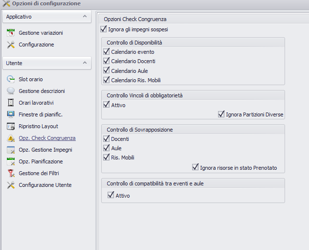

Questa modalità prevede una sequenza precisa dei controlli, in cascata. Un primo step di controlli che avvengono a livello di impegno:

1.  Controlla che l'impegno ricada nel calendario/periodo di **disponibilità** associato all'evento

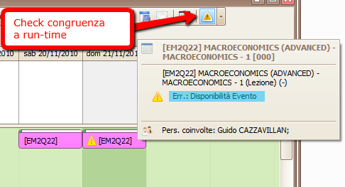

1.  Controlla che l'impegno non sia in **sovrapposizione** con un altro impegno di un altro insegnamento inserito nei vincoli
2.  Controlla la **compatibilità** delle risorse assegnate con quelle richieste dall'evento.

Il secondo step di controlli avviene invece a livello di singola risorsa associata all'impegno:

1.  Controlla che l'impegno ricada nel periodo di **disponibilità** associato al docente/persona e che non sia in **sovrapposizione** con altre a lui assegnate.
2.  Controlla che l'impegno ricada nel periodo di **disponibilità** associato alla risorsa fissa e che non sia in **sovrapposizione** con altri impegni allocate nello stesso giorno/slot nella medesima risorsa.
3.  Controlla che la lezione ricada nel periodo di **disponibilità** associato alla risorsa mobile e che non sia in **sovrapposizione** con altri impegni nello stesso giorno/slot associati alla medesima risorsa.

Se viene trovato un warning al primo livello il sistema, NON passa immediatamente a quello successivo, anche perché risolvendolo potrebbero automaticamente risolversi i warning del livello successivo. Quindi sul singolo impegno verranno visualizzati e segnalati solo i problemi di un livello per volta.

## Modalità di risoluzione
Per risalire all'errore e capire di cosa esattamente si tratta, per poi intervenire nella risoluzione, il sistema propone diversi percorsi:

1.  Muovendo il mouse sopra il box dell'impegno si vedono i dettagli dell'impegno e il tipo di errore.  
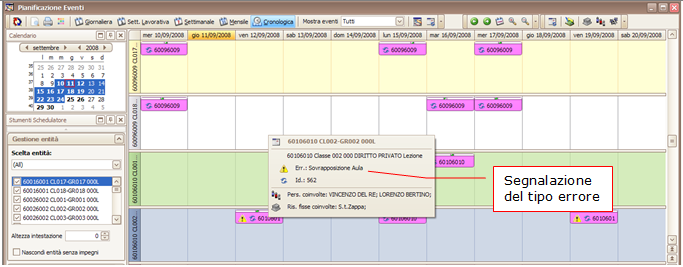  
2.  Con il “clic destro” dalla tendina scegliere “Vai a pianifica aule” oppure “Vai a pianifica docenti” a seconda del tipo di sovrapposizione segnalato. Il programma apre la funzione omonima posizionandosi sul dettaglio dell'aula e dell'impegno sovrapposti.    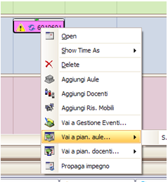  
3.  Oppure sempre con il “clic destro” dalla tendina scegliere “Vai gestione eventi”. Il programma apre la funzione omonima posizionandosi sul dettaglio dell'impegno e mostrando nella colonna apposita il motivo del problema. Questa opzione aiuta l'operatore ad effettuare un monitoraggio complessivo sull'evento, per vedere ad esempio se il problema riscontrato si ripete per altri impegni dello stesso evento.    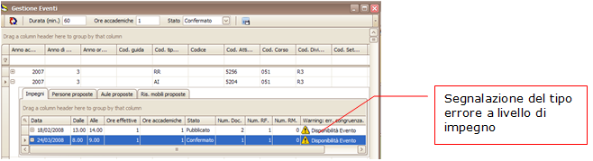

Se il problema è a livello di risorsa il programma si posizione sulla risorsa associata all'impegno e segnala il tipo di problema (es: sovrapposizione).

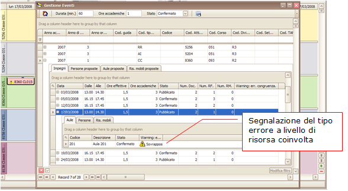

Stesso tipo di indicazione è fornita anche aprendo il dettaglio del singolo impegno, facendo doppio clic, e visualizzare all'interno il tipo di vincolo violato:

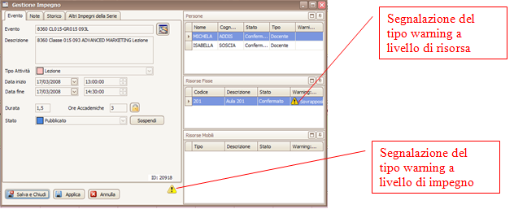

**N.B:** la modalità di controllo congruenze contestuale mostra i warning SOLO relativamente agli eventi-risorse- persone selezionate nel filtro. Per avere un quadro generale dei warning è necessario usare l'apposita funzione di controllo massivo.

#   Funzione di controllo massivo dei warning 
E' possibile attivare il controlo massivo dei warning tramite il menù a tendina "Strumenti" nella finestra principale e cliccare su "Lista Warning" oppure tramite la scorciatoia da tastiera Ctrl+i.Questa funzioonalità consente di effettuare un controllo massivo su tutti gli impegni allocati, la cui individuazione è parametrizzabile.

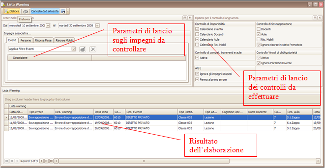

La funzione ovviamente necessita di essere lanciata su range di date da controllare, che per dafault sarà la stessa del filtro), e consente anche di fare controlli mirati (grazie ai parametri di lancio selezionabili). Cioè consente ad esempio di controllare tutti gli impegni di una determinata persona (evento o risorsa).

_Da data a data_: campi per inserire il range di date da controllare. 

Si consiglia di lanciare il controllo per un range di date non troppo ampio per ragioni di prestazioni.

_Cancella dati all'uscita_: cancella i dati dell'ultima elaborazione.

_Tab Eventi, opzioni_: 
  *  “applica filtro eventi”: lancia l'elaborazione solo sugli impegni del filtro corrente
  *  “Selezione eventi”: consente di selezionare un singolo evento fra quelli del filtro corrente
  *  “Tutti”: Ignora il filtro corrente, e mostra i warning di tutti gli impegni all'interno del filtro date

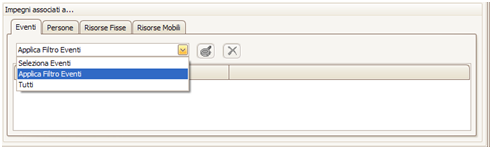

_Tab Persone, opzioni_: 
  *  “applica filtro persone”: lancia l'elaborazione solo sugli impegni del filtro corrente persone
  *  “Selezione persone”: consente di selezionare una singola persona fra quelle del filtro corrente

_Tab Risorse Fisse opzioni_: 
  *  “applica filtro risorse fisse”: lancia l'elaborazione solo sugli impegni del filtro corrente risorse
  *  “Selezione risorse”: consente di selezionare una singola risorsa fra quelle del filtro corrente

_Tab Risorse mobili opzioni_: 
  *  “applica filtro risorse fisse”: lancia l'elaborazione solo sugli impegni del filtro corrente risorse
  *  “Selezione risorse”: consente di selezionare una singola risorsa fra quelle del filtro corrente

_Dettaglio Lista warning_: E' l'area che consente di visualizzare l'elenco dei warning elaborati. Ogni riga segnala un singolo warning che viene descritto per tipologia (sovrapposizione aule, vincolo, sovrapposizione persone ecc..) e riporta di seguito i dati degli eventi/impegni coinvolti

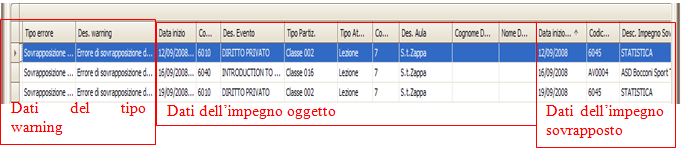

Naturalmente è possibile ordinare a piacimento le colonne ed effettuare raggruppamenti per migliorare l'individuazione dei problemi. Ad esempio in caso di visualizzazione di molti warning è possibili raggrupparli per tipo o per data, a seconda delle modalità di risoluzione scelta dall'utente.

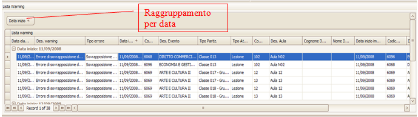

**N.B**: se entrambi gli eventi coinvolti in una sovrapposizione si trovano all'interno dello stesso filtro il warning verrà visualizzato due volte.

## Modalità di risoluzione
Per risolvere il singolo warning, con il doppio clic sulla singola riga il programma indirizza verso altre maschere/funzioni per agevolare la risoluzione

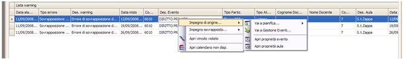

Le navigazioni consentite per la risoluzione del warning sono molteplici:

1.   **Impegno d'origine **(l'impegno su cui viene trovato il problema)  
  *  **“Vai a pianifica”**  **“e apri impegno”**: apre il “pianificatore eventi” (selezionando l'impegno in oggetto) e  apre il dettaglio dell'impegno    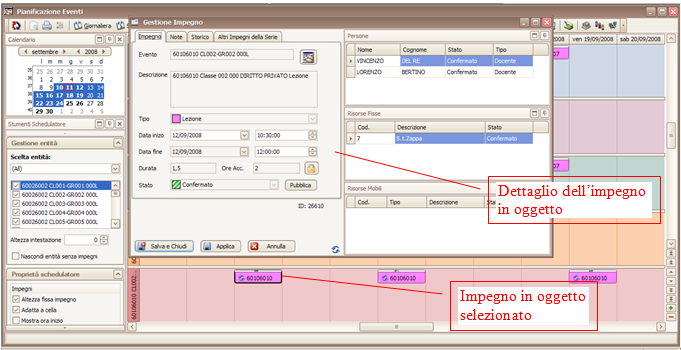    In questo modo l'operatore può risolvere il warning modificando direttamente una o più risorse associate all'impegno.   
  *  **“Vai a gestione eventi”**: apre la funzione “gestione eventi” sul dettaglio dell'impegno che ha il problema. Questa opzione aiuta l'operatore ad effettuare un monitoraggio complessivo sull'evento, per vedere ad esempio se il problema riscontrato si ripete per altri impegni dello stesso evento.    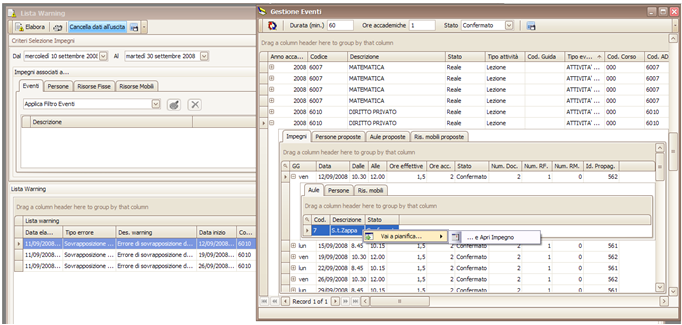    Da qui la risoluzione può proseguire fino all'apertura del pianificatore corrispondente al tipo di problema (es: se è sovrapposizione di aula, viene aperto il pianificatore risorse).   Una volta aperto il pianificatore adeguato (“pianificatore risorse” per le sovrapposizione aule, “pianificatore persone” per sovrapposizione docente) l'operatore può vedere entrambi gli eventi sovrapposti e agire sull'uno o sull'altro.  Per aprire l'impegno corrente di default basta cliccare anche su “..e apri impegno”.    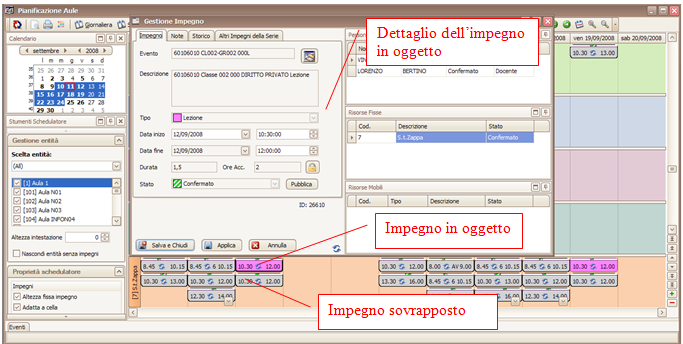  
  * ** Apri proprietà evento, aula**: offre la possibilità di modificare le proprietà dell'evento o dell'aula, nel caso ad esempio si tratti di un problema di disponibilità del calendario.  Questa opzione consente di modificare dei dati per risolvere il warning.  Altro caso potrebbe essere la modifica di requisiti di allocazioni (es: numero posti richiesto, pc, ecc..).    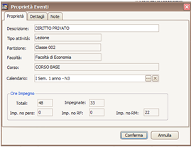   
2.   **Percorso “Impegno sovrapposto”**. La stessa procedura precedentemente descritta (vedi [sopra](#sopra)) vale anche per l'impegno su cui viene rilevata la sovrapposizione.
  *  **“Vai a pianifica”**  **“e apri impegno”**: apre il “pianificatore eventi” (selezionando l'impegno in oggetto) e  apre il dettaglio dell'impegno
  *  **“Vai a gestione eventi”**: apre la funzione “gestione eventi” sul dettaglio dell'impegno che ha il problema.   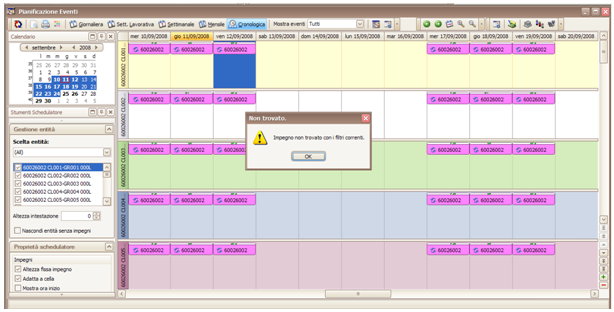    **N.B** : in entrambi i casi, se l'evento sovrapposto non è all'interno del filtro corrente utilizzato il programma lo segnala, come si vede nella figura sopra. Quindi per risolvere il problema con una modifica, occorre caricare un altro filtro che contenga l'evento sovrapposto.  
3.  Un'altra risoluzione possibile del warning potrebbe riguardare la disattivazione o la modifica di un vincolo fra eventi (vedi par successivo).

# Funzione di gestione dei vincoli fra eventi

E' possibile impostare dei vincoli di non sovrapposizione temporale fra eventi diversi. Tale funzione può in automatico venire popolata dai dati ricavati dalle regole di scelta dei corsi di studio di ESSE3, per quanto riguarda i vincoli fra attività didattiche. Ad esempio: un vincolo sulle attività obbligatorie del primo anno di un corso di laurea. La funzione consente anche di definire vincoli ad hoc da parte del singolo utente.

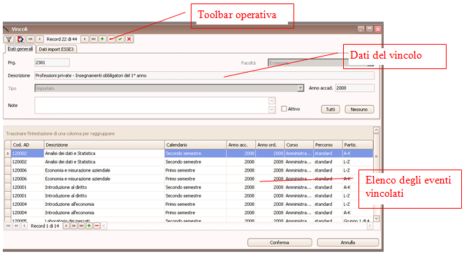

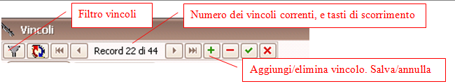

_Filtro vincoli_: il tasto consente di attivare un filtro sui vincoli già definiti utilizzando  qualsiasi attributo come criterio si selezione. Per esempio si possono filtrare tutti i vincoli derivanti da una regola di tipo =obbligatorio (cfr regole di scelta di ESSE3)

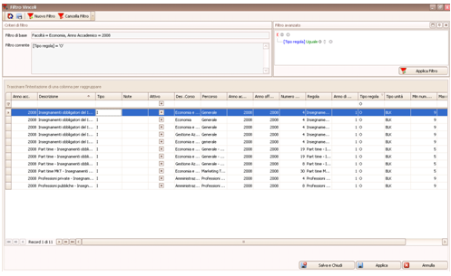

Ogni vincolo è caratterizzato da alcuni dati propri che sono:
  *  _prg_: progressivo numerico
  *  _tipo_: indica se è “importato” da ESSE3 o impostato manualmente dall'utente
  *  _descrizione_: descrizione testuale del vincolo (nel caso di import da ESSE3, sarà la stessa delle regola di scelta importata)
  *  _Anno accademico_: anno accademico di validità del vincolo
  *  _Strutt. Org._: Strutt. Org. di appartenenza del vincolo

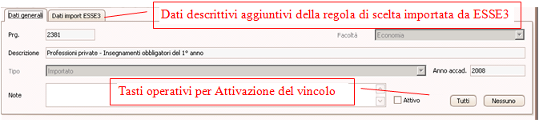

L'utente può attivare singolarmente ogni vincolo, oppure attraverso gli appositi tasti di selezione attivarli (tutti) o disattivarli tutti (nessuno) . L'attivazione del vincolo comporta l'aggiunta del controllo alla funzionalità di controllo vincoli, consigliamo per tanto di attivare solo i vincoli veramente necessari per non appesantire eccessivamente la gestione dei controlli.

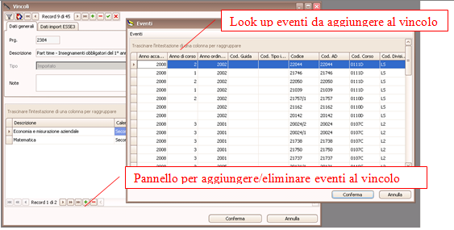

I vincoli, sia che siano importati o meno, possono essere modificati aggiungendo o eliminando eventi attraverso l'apposito pannello operativo.

## Creazione di un nuovo vincolo

Per creare un nuovo vincolo occorrerà quindi seguire la seguente procedura:

1. Cliccare su tasto +, nella toolbar in alto a sinistra, viene inserita una nuova testata di vincolo
2. Inserire una descrizione testuale del vincolo nel campo note
3. Salvare, cliccando sul tasto salva della toolbar in alto
4. Inserire nella lista eventi, nuovi eventi dal tasto + del pannello sottostante
5. Confermare

# Gestione delle eccezioni

Può capitare di dover gestire eccezioni, cioè avere la necessità di escludere sia dal controllo contestuale che dal controllo massivo alcuni impegni. Per evitare di trovare all'interno della lista warning impegni di cui conosciamo la situazione di incongruenza si può utilizzare l'apposito flag di esclusione dal controllo, attivabile direttamente dalla maschera di gestione impegno 

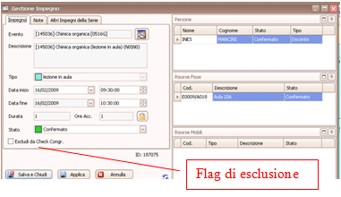

Attenzione: l'esclusione dal controllo congruenze rimane attiva anche a fronte delle modifiche successive dell'impegno.
