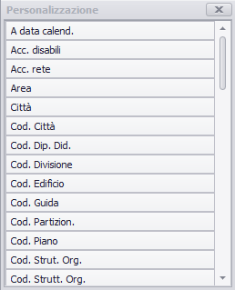

# Introduzione
La gestione dei filtri è la fase principale nella preparazione dell'ambiente di pianificazione. Conviene preparare i set di eventi, in questo caso attività didattiche, e i periodi su cui si ritiene più opportuno operare.
Ad esempio per quanto riguarda la pianificazione dell'orario delle lezioni, si suppone che possa avvenire in più soluzioni, per periodo. Prima verranno cioè pianificate le attività del primo semestre o bimestre, in seconda battuta le attività del secondo semestre o trimestre.
In questo caso converrà selezionare come filtro data:”primo semestre” del corso in cui si intende pianificare.
La pianificazione potrà poi essere fatta per tutte le attività della Strutt. Org. all'interno dello stesso periodo, oppure differenziando per Corso di studio, percorso, ecc..)

In questo caso allora converrà filtrare tutti gli eventi di tipo attività didattica di un corso:
  *  Colonna “tipo evento” = attività didattica
  *  Colonna “des.calendario” like  %primo semestre%
  *  Colonna “Corso di studio” = Economia e diritto

Altri esempi di filtri utili possono essere i seguenti:

1.  TUTTE ATTIVITÀ DEL PRIMO O DEL SECONDO SEMESTRE
  *  Colonna “tipo evento” = attività didattica
  *  Colonna calendario/personalizza: “des.calendario” like  %primo semestre% or “des.calendario” like  %secondo semestre%
2.  TUTTE LE ATTIVITÀ DI ESERCITAZIONE
  *  Colonna “tipo evento” = attività didattica
  *  Colonna “tipo attività” = esercitazione
3.  TUTTE LE ATTIVITÀ DEL SECONDO ANNO
  *  Colonna “tipo evento” = attività didattica
  *  Colonna “anno di corso” = 2

**N.B:** E' utile salvare tutti i filtri operativi più utilizzati dal pianificatore. I filtri una volta salvati possono essere la base per costruirne nuovi senza reimpostare il filtro da zero.In tal caso il nuovo filtro mantiene per default lo stesso layout (disposizione delle colonne e dei dati).

# Filtro temporale
Innanzi tutto  è necessario impostare l'anno accademico per il quale si intende lavorare, tale impostazione consente al programma di selezionare solo gli eventi dell'anno accademico sul quale si intende lavorare.

Per iniziare la pianificazione logistica è consigliato definire un filtro sulle date del periodo che si intende prendere in considerazione. Nel filtro calendario è dunque possibile selezionare una data inizio e una data fine, mese, anno, o un periodo dai calendari definiti.   

**NB: **Queste date influenzeranno: la data inizio su cui si apriranno le machere di **Pianifazione Logistica** (aula, evento e persone), le date proposte nella maschera di **Stampa**, nella **Lista warning **e nella **Gestione impegni**.

# Filtri su eventi/risorse/persone
L'utilizzo degli altri filtri invece consente di individuare gruppi di eventi, di risorse o di persone per le quali si intende svolgere l'attività di pianificazione. Il filtro principale sui dati è composto nella nuova versione da  3 pannelli:
1. 	Pannello di visualizzazione del filtro corrente.
2. 	Pannello di gestione del filtro avanzato
3. 	Pannello di visualizzazione dei dati

## Pannello visualizzazione filtro corrente.
Questo pannello riporta in sola visualizzazione due condizioni di filtro separatamente: il filtro di base che è legato alla Strutt. Org. dell'utente e all'anno accademico di lavoro selezionato, e il filtro corrente espresso in un'unica stringa.  

## Pannello filtro avanzato
Il filtro avanzato consente di comporre o modificare un filtro creando in modo flessibile condizioni in AND e in OR su più campi di filtro.  

Operativamente il filtro funziona creando o aggiungendo condizioni o gruppi di condizioni, al cui interno ogni condizione è composta da: il nome del campo, operatore (uguale a, diverso da, like, ecc..) e infine il valore del campo. Al posto del valore del campo può anche essere messo il valore di un altro campo del filtro.  
  

**ATTENZIONE:** i raggruppamenti **AND** e **OR **(_e''/_o_) si riferiscono _SEMPRE _ai nodi inferiori, _MAI _a quelli superiori, cioè vengono raggruppati i _nodi figli_.  

Esempio: il filtro dell'immagine va inteso come: _"filtra eventi con Des. Corso  uguale a Informatica triennale **AND** **('_anno di corso uguale a 2 **OR** anno di corso nullo** )**"_, come da descrizione del Filtro corrente

## Pannello visualizzazione dati. 
Questo pannello consente di visualizzare per esteso tutti i dati della risorsa selezionata (eventi, aule,persone). Si possono filtrare direttamente i valori cliccando sulle testate delle colonne.

Per impostare il filtro occorre agire direttamente sulle testate delle colonne dei dati visualizzati. 

Cliccando sulla freccia in fondo a ciascuna colonna compare una lista che comprende tutti i dati della colonna più alcune voci di default:

_Tutti:_ visualizza tutti i dati  

_Vuoto:_ visualizza tutti i record che hanno quel campo vuoto  

_Non Vuoto:_ visualizza tutti i record che hanno quel campo non vuoto (con almeno un valore presente)  

_Personalizzato:_ compare una form che consente di definire all'interno della colonna stessa un filtro in AND oppure in OR  

Dalla prima list box  selezionare l'operatore (uguale a, maggiore di, minore di, ecc..) e nel campo attiguo indicare la stringa di testo o numerica (primo semestre, Analisi%). Ad esempio, si possono filtrare tutti gli eventi del primo o del secondo semestre: selezionando “uguale a” poi “primo semestre”, OR “uguale a” poi “secondo semestre”.

E' possibile inoltre personalizzare la visualizzazione del filtro spostando a piacere le colonne, nascondendole o raggruppando i dati per colonna.

Per raggruppare i dati si possono utilizzare gli appositi comandi dal menù (clic destro) oppure trascinare direttamente le testate delle colonne nel campo grigio soprastante le colonne. Nell'esempio i dati sono raggruppati per calendario e anno di corso.

Una volta individuato l'insieme dei dati voluto, agendo su tutte le colonne necessarie, per applicare il filtro, premere su “Applica filtro”.

Si può personalizzare il layout del filtro, ordinando le colonne secondo la successione voluta semplicemente spostandole. Si possono anche nascondere le colonne di dati non rilevanti, facendo clic destro sulla testata e selezionando la voce “Selezione colonne”. Si apre un box dove si possono trascinare le colonne da e verso la griglia.

Il layout ottenuto si salva con le impostazioni volute.

## Tasti operativi

  *  _vincoli attivi:_ costruisce un filtro usando come criterio lo stesso utilizzato in qualche vincolo definito (es: obbligatori 1 anno per un CDS)

  *  _nuovo filtro:_ crea un nuovo filtro senza caricare tutti dati dal sistema. Tale funzione serve per non appesantire l'elaborazione specificando già delle impostazioni in fase iniziale di impostazione del filtro

  *  _cancella filtro:_ cancella il filtro corrente recuperando tutti i dati dal sistema. Questa operazione potrebbe richiedere tempo

  *  _applica filtro:_ applica le condizioni definite nel filtro avanzato.

  *  _Salva e chiudi:_ salva le modifiche e/o il layout del filtro corrente

  *  _Applica:_ applica le modifiche al filtro, senza chiudere il filtro

  *  _Annulla:_ annulla le modifiche al filtro corrente

# Salvataggio dei filtri
E' comodo anche salvare filtri per riutilizzarli più volte o spostarsi da un set di dati ad un altro, attraverso la funzione di salvataggio dei filtri.

**N.B:''' Il filtro salvato tiene conto contemporaneamente del filtro corrente su eventi persone, risorse, e date. E'utile inserire una descrizione sintetica di tutti i criteri di filtro impostati sui singoli filtri per ricordare quale set di dati identifica.

