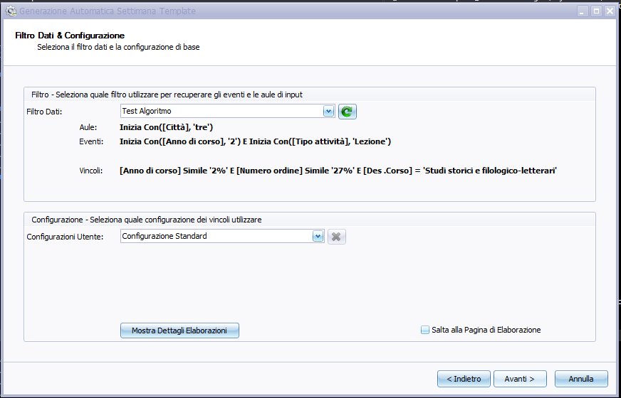
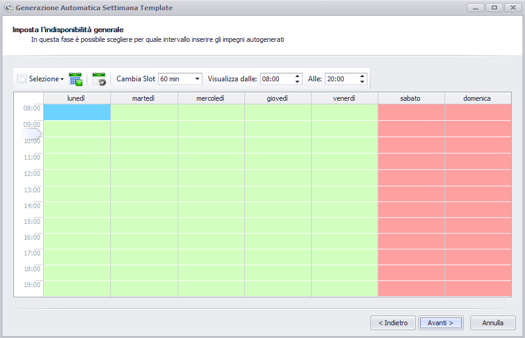
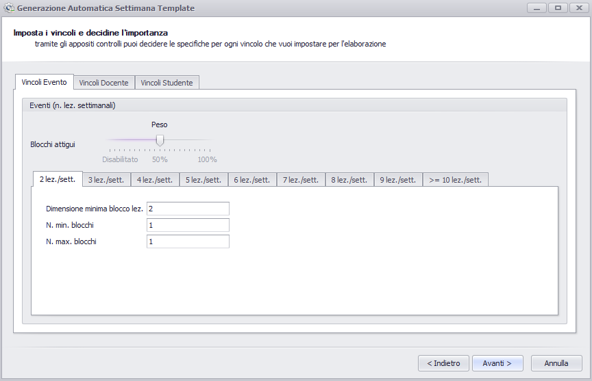
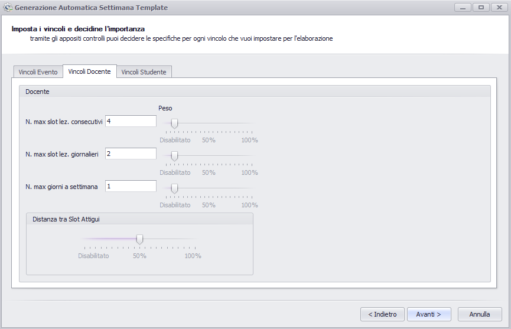
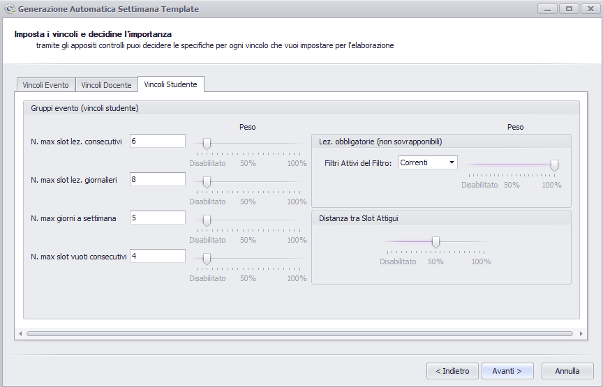
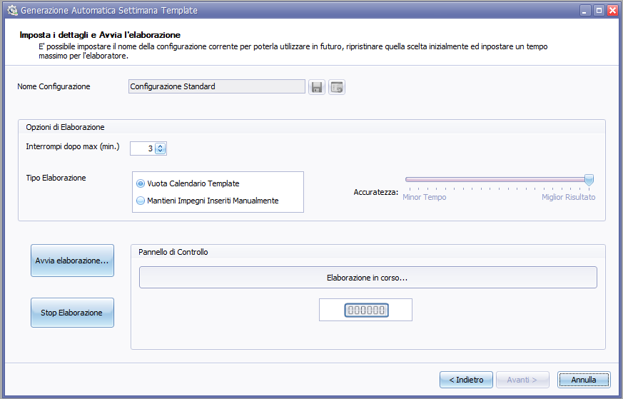
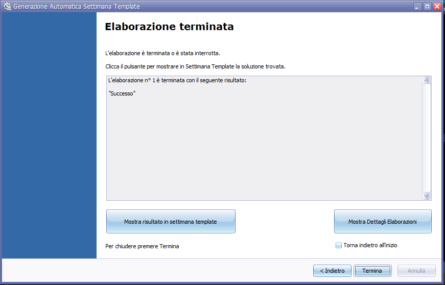



## **Prerequisiti per il Corretto Funzionamento del Generatore Automatico**
Prima di entrare nel merito del funzionamento del Generatore Automatico è corretto introdurre alcuni aspetti essenziali affiché il risultato ottenuto da questo strumento sia quello atteso.
Quindi di seguito verranno esaminati i requisiti richiesti

### **Impostazioni del filtro di UP**
Prima di avviare il generatore automatico è giusto porre particolare attenzione al filtro impostato su UP, in particolare il filtro Eventi e il filtro Aule. 

Infatti è necessario che:

 1. Lo spazio libero delle aule sia abbastanza per contenere il numero di impegni che si vogliono pianificare.

 2. Gli eventi presenti nel filtro siano tutti provvisti di un docente di copertura. Se così non fosse questi eventi non verranno considerati nell'elaborazione.

 3. Accertarsi che sia valorizzato per ogni evento il numero di ore settimanali. Questo campo viene utilizzato dall'algoritmo per sapere quanti impegni inserire all'interno della settimana template per quello specifico evento.

Per quanto riguarda invece i vincoli di incompatibilità bisogna che questi siano innanzitutto presenti all'interno del filtro e che riguardino eventi all'interno del filtro stesso.

In seguito all'interno del wizard si vedrà come vengono gestiti i vincoli di incompatibilità del filtro.

### **Wizard per il Lancio dell'Elaborazione**
In questa sezione verrà analizzata l'interfaccia del generatore automatico in modo da spiegare il significato di tutte le impostazioni che si possono abilitare prima di lanciare l'elaborazione vera e propria.

#### Filtro Dati & Configurazione

Questa sezione rappresenta la prima schermata effettiva di configurazione dell'algoritmo. Lo scopo primario di questa fase consiste nello specificare il filtro su cui si vuole effettuare la generazione automatica e la configurazione di parametri che si vuole utilizzare. Come possibilità aggiuntive inoltre è possibile visualizzare l'esito delle elaborazioni precedenti.

Con il concetto di configurazione si intende un particolare settaggio di parametri e vincoli per la generazione automatica della settimana template. Vedremo in seguito come è possibile salvare queste configurazioni. Da questa particolare parte del percorso guidato verso l'avvio dell'elaborazione è possibile richiamare una configurazione precedentemente creata oppure tramite il pulsante **X'_ è possibile eliminare quella al momento selezionata.

E' stata prevista anche una configurazione standard per l'ottimizzatore automatico che imposta i valori dei vincoli al loro default in modo da fornire una base di partenza per la creazione delle proprie configurazioni.

Nel caso si sia già certi della correttezza di una certa configurazione di parametri, settabili tramite questo wizard, allora da questa fase si può direttamente saltare alla fase conclusiva che permette di avviare l'elaborazione.

In questo secondo step invece vengono impostati gli intervalli di orario che l'algoritmo dovrà rispettare. In particolare sono previsti 2 stati: disponibile(Colore Verde) e non disponibile(Colore Rosso). Gli orari impostati in questa fase hanno una priorità maggiore rispetto agli intervalli di indisponibilità che si possono settare per le aule e per i docenti direttamente all'interno di UP_WEB.

Analizzando il menù in alto vediamo come: 

- E' possibile tramite il menù "Selezione" impostare i due stati precedentemente introdotti sull'intervallo attualmente selezionato. E' possibile accedere a questo menù direttamente tramite il tasto destro sul calendario.

- I due pulsanti affianco invece consentano rispettivamente di impostare tutto il calendario come disponibile oppure di ripristinare l'impostazione della configurazione di partenza.

- Impostare un diverso valore per lo slot di tempo di ogni singola cella, in modo da poter considerare eventuali quarti d'ora. 

- Estendere la fascia oraria gestibile tramite questo strumento.

#### Vincoli
I vincoli che consentono di manipolare la generazione automatica e deciderne le possibili opzioni vengono scelti ed impostati a questo livello. In particolare sono state previste tre diverse categorie: "Evento", "Studente", "Docente".

Si è deciso di effettuare questa distinzione per agevolare l'operatore e per disporre con più chiarezza le opzioni. Infatti nella categoria "Studente" e "Docente" ad esempio, saranno presenti tutti quei settaggi che agevolano gli uni o gli altri, i loro spostamenti e le loro esigenze, mentre nella categoria "Eventi"  sono raggruppati tutti i vincoli richiesti in genere dagli operatori incaricati di organizzare la parte didattica e gli orari. E' giusto anche specificare che ogni singola opzione è provvista di un peso che consente di indicarne l'importanza rispetto alle altre opzioni: un'opzione con un peso minore rispetto ad una con un peso maggiore verrà più facilmente violata in caso di conflitto tra loro, da parte dell'algoritmo.

Scendiamo ora nei dettagli di queste 3 categorie illustrando ogni singola opzione.

Nella categoria "Evento" troviamo il vincolo dei **"Blocchi Attigui"**: si vuole specificare, per le diverse frequenze di lezioni per settimana, se queste devono essere raggruppate in gruppi contigui in modo da favorire unici blocchi rispetto al possibile partizionamento delle lezioni e alla disposizione frammentata all'interno della settimana. Si noti come tramite il numero "Dimensione Minima Blocco Lez." venga specificato il valore minimo di blocchi da mantenere adiacenti, mentre tramite i valori di "N. max. Blocchi" e "N. min. Blocchi" si specifichi quanti di questi macro gruppi si vuole all'interno della settimana. E' importante che i valori di questi tre controlli siano inerenti alla frequenza dell'evento nella settimana.

Per i vincoli "Docente" si sono identificati questi tre differenti vincoli:

- **"N Max. Slot Lez. Consecutivi"**: Indica quante ore di lezione massime di seguito un docente è disposto ad effettuare.

- **"N Max. Slot Lez. Giornalieri"**: Indica quante ore di lezione massime un docente è disposto ad effettuare all'interno della stessa giornata.

- **"N Max. Giorni a Settimana"**: Indica il numero massimo di giorni che un docente è disposto ad effettuare nella settimana.

- **"Distanza tra slot attigui"**: Indica l'importanza da dare ai vincoli di distanza tra slot attigui.

Infine  nei vincoli "Studente" abbiamo:

- **"N Max. Slot Lez. Consecutivi"**: Indica quante ore di lezione massime di seguito un gruppo studenti è disposto ad effettuare.

- **"N Max. Slot Lez. Giornalieri"**: Indica quante ore di lezione massime un gruppo studenti è disposto ad effettuare all'interno della stessa giornata.

- **"N Max. Giorni a Settimana"**: Indica il numero massimo di giorni che un gruppo studenti è disposto ad effettuare nella settimana.

- **"N Max. Slot Vuoti Consecutivi"**: Indica l'intervallo massimo di inattività per un gruppo di studenti.

- **"Lez. Obbligatorie"**: Indica l'importanta da dare ai vincoli di incompatibilità già presenti nel filtro. In particolare è possibile scegliere se considerare solamente i vincoli che sono attivi nel filtro, tutti quelli nel filtro o : nessuno.

- **"Distanza tra slot attigui"**: Indica l'importanza da dare ai vincoli di distanza tra slot attigui.

#### Dettagli Elaborazione e Avvio
Vadiamo infine la parte in cui è possibile eseguire l'algoritmo e specificare gli ultimi dettagli di esecuzione.

Le funzionalità messe a disposizione in questo passo consistono nel poter salvare una nuova configurazione in base ai valori attuali dei parametri già visti. In particolare è importante sapere che se si modifica un valore verrà richiesto esplicitamente dal programma di salvare la configurazione corrente prima di poter eseguire l'algoritmo. Oltre all'opzione di salvataggio è possibile anche ripristinare la configurazione inizialmente scelta.

Tra le "Opzioni di Elaborazione" troviamo inoltre: 

- **"Tempo di stallo"**: indica dopo quanto tempo l'algoritmo deve terminare, espresso in minuti.

- **"Tipo Elaborazione"**: indica se gli impegni presenti all'interno dell'attuale settimana template devono essere cancellati o mantenuti.

-** "Accuratezza"_': Indica se la priorità dell'algoritmo consiste nel fornire un risultato in tempestività oppure se è più importante ottenere un risultato di qualità.

All'intero del pannello di controllo saranno poi presenti anche una barra di avanzamento e un timer che mostra da quanto tempo è stata avviata l'elaborazione.

#### Elaborazione Terminata

Questa è la schermata finale del nostro wizard che mostra se ci sono stati degli errori durante l'elaborazione oppure se l'algoritmo è terminato con successo.
Sono state previste anche altre funzionalità utili a questo punto del percorso che consistono nella possibilità di:

- visualizzare elaborazioni precedenti, esattamente come nella schermata iniziale

- aprire la settimana template per visualizzare il risultato ottenuto

- tornare indietro conservando esattamente i valori dell'elaborazione appena completata. Va specificato che in questo caso si è anche prevista la funzionalità "Torna indietro all'inizio" che consente, una volta attivato il pulsante "Indietro", di ricominciare il tutto dalla schermata iniziale di settaggio del filtro e della configurazione.    

