

# Procedimento per la pianificazione dell'orario 

## Passo 1: Scelta del giorno

Clic destro su giorno della prima settimana di inizio delle lezioni. Clic su _Nuovo appuntamento_.

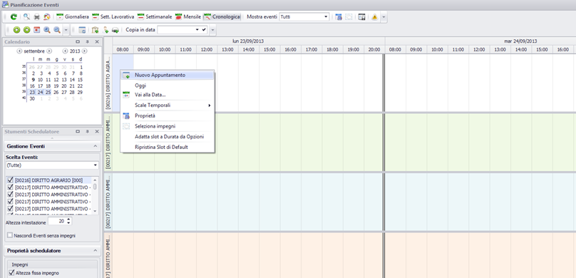

## Passo 2: Assegnazione dell'aula

Clic destro sul riquadro “risorse fisse” della maschera dell'impegno.

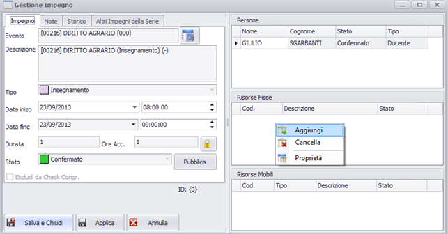

Apertura della look-up (lista valori) delle aule disponibili.

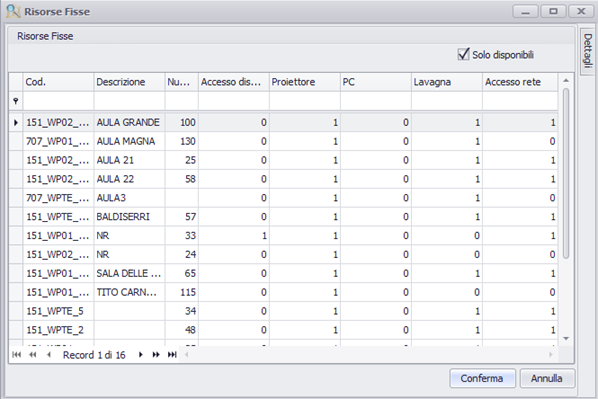

**N.B:** di default saranno visibili **solo le aule disponibili in quel determinato giorno/slot** (per vederle tutte disabilitare il flag "Solo Disponibili").  

**ATTENZIONE** per aule "disponibili" si intendono le aule che superano i **controlli di congruenza** definiti dalle opzioni del singolo utente, in particolare quelli che riguardano le aule: **"Disponibilità calendario aule", "Sovrapposzione aule" e "Compatibilità eventi-aule"**. (per dettagli vedi [Gestione controlli di congruenza (Check Congruenze)](up_client_CheckCongruenze.md))  
E' inoltre possibile selezionare più aule, effettuare filtri e ordinare le aule per attributo.

Doppio clic sull'aula desiderata e poi "Salva e chiudi".

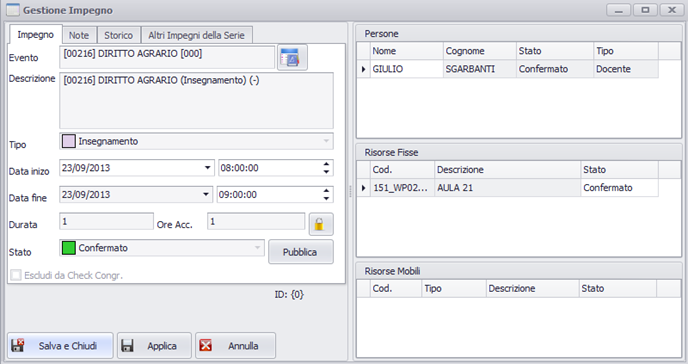

Risultato viene creato un impegno, con una durata di default (1 ora) modificabile in stato confermato.

## Passo 3: Propagazione

Per generare l'orario completo occorre ora propagare l'impegno secondo i parametri voluti per le date successive: clic destro sull'impegno. Selezionare “propaga”

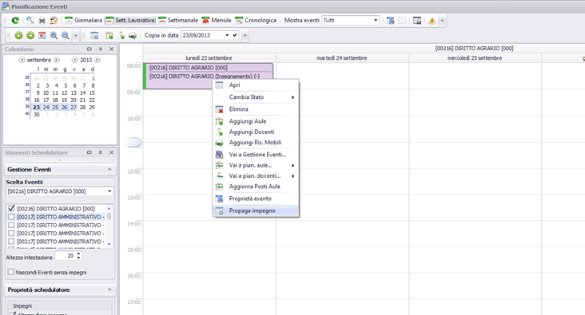

### Parametri di propagazione

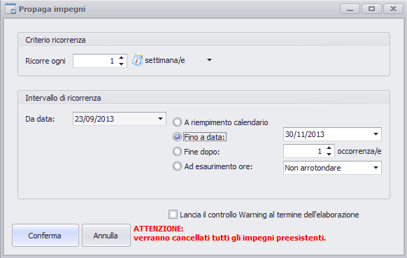

  * **Ricorrenza**: si può decidere se ripetere l'evento associato all'attuale slot/giorno, per tutte le settimane successive, ogni 2, ogni 3, ecc..;
  * **Da data**: di default la data di partenza è quella su cui è stato posizionato l'impegno;
  * **A riempimento calendario**: il programma aggiungerà impegni lo stesso giorno alla stessa ora a partire dalla data precedente fino alla data di fine del calendario associato all'evento (es: data fine del 2 semestre);
  * **Fino a data**: il programma aggiungerà impegni lo stesso giorno alla stessa ora a partire dalla data precedente fino alla data selezionabile;
  * **Fino dopo**: il programma aggiungerà impegni lo stesso giorno alla stessa ora a partire dalla data precedente per il numero di occorrenze selezionabile (1, 2, 3 volte);
  * **Ad esaurimento ore**: il programma aggiungerà impegni lo stesso giorno alla stessa ora a partire dalla data precedente fino ad esaurimento delle ore totali di durata previste dall'evento, con possibilità di arrotondamento per eccesso, per difetto o nessuno.

## Passo 4: Risultato

Viene creata una catena di impegni con lo stesso periodo. Un messaggio avverte dell'avvenuta elaborazione e del numero di ore che eventualmente la programmazione non è riuscita ad allocare. L'avvenuta propagazione è testimoniata dalla comparsa dell'icona con il ciclo.

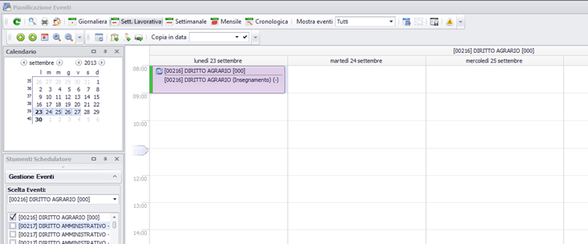

Per visualizzare tutti o più impegni generati occorre cambiare modalità di visualizzazione: es. vista mensile.

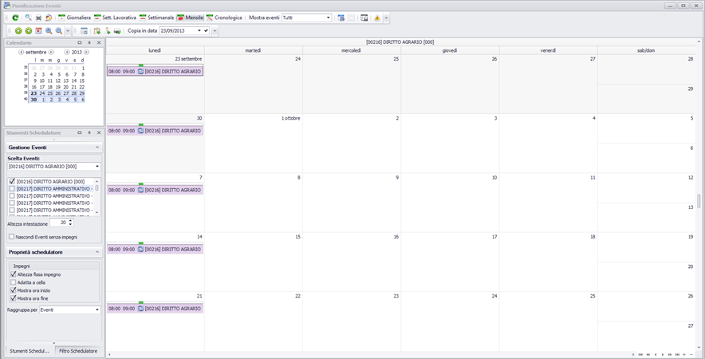

Oppure nel dettaglio dell'impegno “altri impegni della serie”:

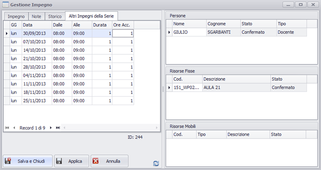

Gli impegni generati dalla medesima propagazione vengono visti infatti come un periodo unico.

## Passo 5: Propagazione multi periodo

Se gli impegni generati dalla prima propagazione non esauriscono la durata prevista dell'insegnamento o se è necessario per esigenze didattiche o del docente può essere necessario generare un altro periodo.

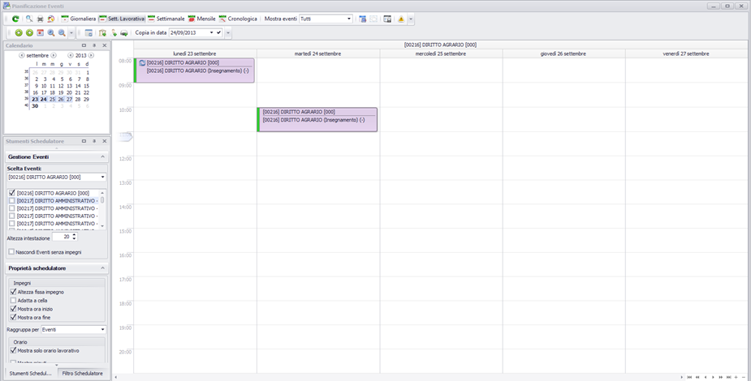

Ripetendo lo stesso procedimento la propagazione genererà un secondo periodo (magari con giorno e aula diversi) per lo stesso insegnamento completando l'orario delle lezioni.

Anche in questo caso otteniamo lo stesso risultato con una nuova serie.

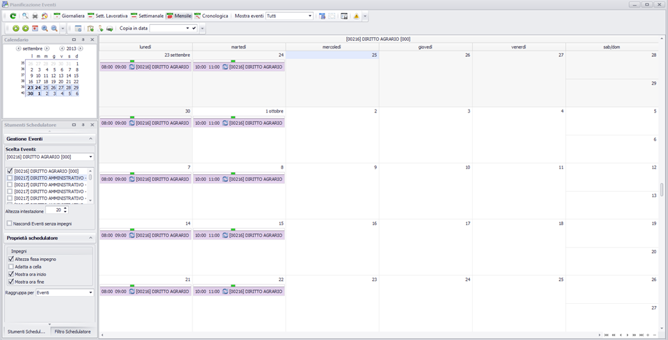

# Variazione di un assetto di orario

E' possibile modificare l'orario di un impegno, con le seguenti possibilità di modifica:

1. per singolo impegno;
2. per l'impegno corrente e tutti i successivi;
3. su tutti gli impegni collegati alla stessa serie.

Nel caso si decida di modificare il singolo impegno è inoltre possibile decidere se slegare o no l'impegno dalla serie. In questo caso l'impegno modificato non risulterà più facente parte di quella serie e il simbolo del ciclo non sarà più presente.

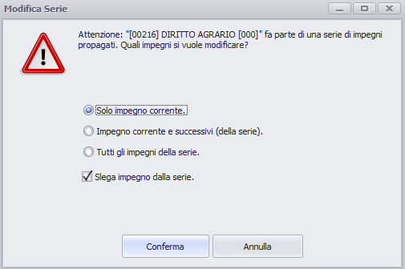

# Tipi di Visualizzazione

### Visualizzazione cronologica

  * ogni riga dello scheduler è un evento diverso
  * ogni quadratino uno slot ora
  * sovrapponendo il mouse vedo più dettagli dello stesso impegno.

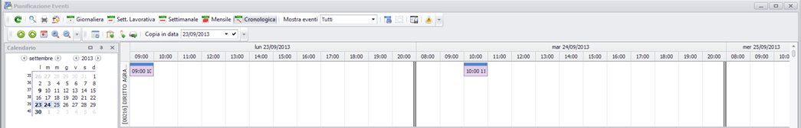

### Visualizzazione settimana lavorativa-multievento

Questa visualizzazione si ottiene selezionando come modalità di schedulatore “vista settimana lavorativa”. E' possibile cambiare l'evento visualizzato o visualizzarne altri tramite il pannello "Gestione eventi".

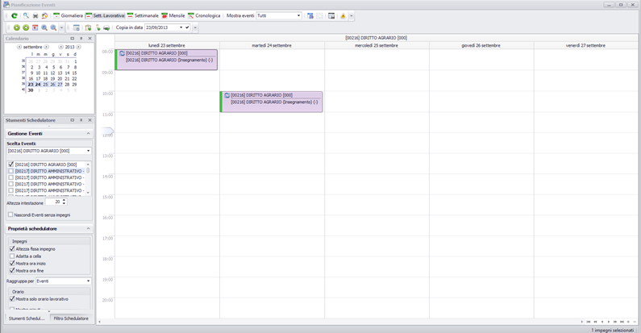

