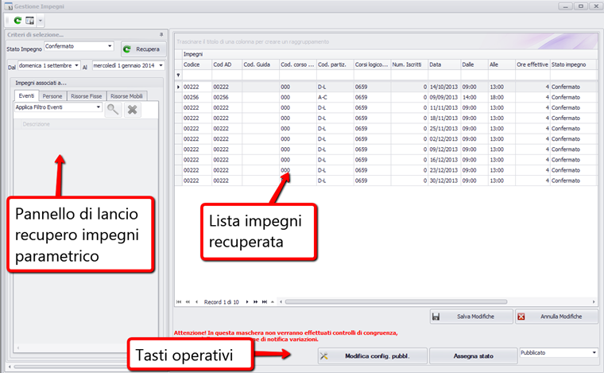
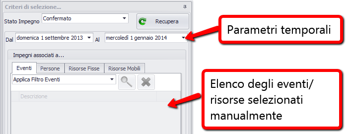
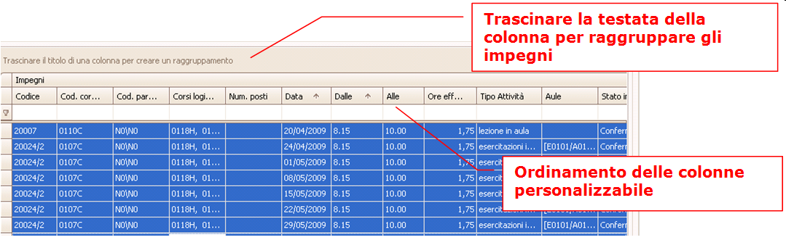
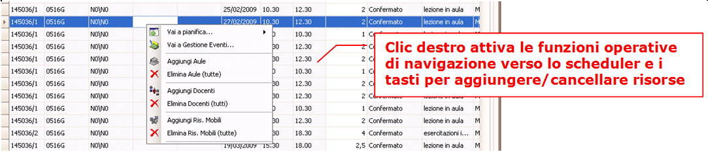
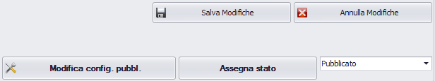
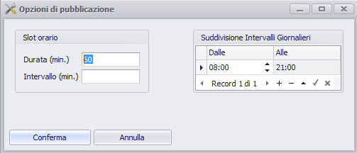


Per attivare la funzionalità di Gestione Impegni basta selezionarla dalla voce "Eventi" del menù in alto, tramite l'apposita tendina oppure utilizzare la scorciatoia da tastiera CTRL+G. Gestione impegni è la funzionalità che consente di agire massivamente su insiemi di impegni, in modalità non grafica, cioè non utilizzando le funzionalità di pianficazione o Schedulers. La funzione è stata pensata essenzialmente per i seguenti usi:

1.  **Modificare massivamente  lo stato di gruppi impegni.** Viene normalmente utilizzata per la pubblicazione massiva dell'orario delle lezioni. La pubblicazione rende visibili questi impegni al programma esterno (ESSE3 oppure altre applicazioni, es: portale) , tramite web services. Un altro caso d'uso potrebbe essere la sospensione massiva di impegni
2.  **Assegnare risorse (aule) in modo massivo.** Può essere comodo - specie se si lavora con un numero molto elevato di impegni - usare questa funzione per assegnare in modo massivo risorse. Ad esempio il caso di allocazione di appelli nelle aule, gli appelli tipicamente hanno già una data e necessitano solo di una logistica. E' bene precisare però che questo secondo tipo di utilizzo non gode di un pieno controllo di gestione come nelle funzionalità principali di pianificazione.

# Modalità di selezione degli impegni

_Stato impegno:_ indica lo stato degli impegni da recuperare. Il default è “Non Confermato”   

_Da data a data:_ campi per inserire il range di date da controllare.   

_Tab Eventi, opzioni:_ 
  *  “applica filtro eventi”: recupera solo gli impegni del filtro corrente
  *  “Selezione eventi”: consente di selezionare un singolo o più eventi fra quelli del filtro corrente
  *  “Tutti”: Ignora il filtro corrente, e recupera tutti gli impegni all'interno del filtro date

_Tab Persone, opzioni:_
  *  “applica filtro persone”: recupera solo gli impegni del filtro corrente persone
  *  “Selezione persone”: consente di selezionare la singola o più persone fra quelle del filtro corrente

_Tab Risorse Fisse opzioni:_ 
  *  “applica filtro risorse fisse”: lancia l'elaborazione solo sugli impegni del filtro corrente risorse
  *  “Selezione risorse”: consente di selezionare una singola risorsa fra quelle del filtro corrente

_Tab Risorse mobili opzioni:_ 
  *  “applica filtro risorse fisse”: lancia l'elaborazione solo sugli impegni del filtro corrente risorse
  *  “Selezione risorse”: consente di selezionare una singola risorsa fra quelle del filtro corrente

# Lista impegni
Nella finestra di lista di gestione degli impegni si può innanzitutto modificare la disposizione delle colonne con i dati disponibili. E' possibile inoltre anche ordinare e raggruppare gli impegni, trascinando la testata della colonna nello spazio superiore. Per esempio può essere utile un raggruppamento per data o per codice dell'evento.

La selezione multipla è usata normalmente per cambiare massivamente di stato agli impegni ma è anche possibile tramite clic destro aprire le maschere di assegnazione di risorse (aule, persone, o risorse mobili).
Attenzione: con la selezione multipla non vengono effettuati i filtri di disponibilità sulle aule.

**N.B:** in fase di associazione della stessa aula a più impegni, in automatico viene reso attivo il flag di esclusione dal controllo warning per gli impegni selezionati, perchè si assume che chi sta operando una associazione multipla alla stessa aula intenda creare una sovrapposizione “voluta” (es: caso di associazione stessa aula a più appelli)

A livello più operativo la lista consente di monitorare su una sola riga i principali campi di ciascun impegno. Oltre alla data, ora inizio e fine, e durata (unico campo modificabile - vedi caso di gestione degli appelli) anche le aule/persone/risorse mobili associate. Questo consente ad esempio di poter filtrare tutti gli impegni non ancora assegnati in aule, e provvedere velocemente all'allocazione.

Per qualunque altra operazione è possibile con il clic destro sul singolo impegno aprire lo scheduler e la gestione impegno che consente la piena gestione e modifica dei dati desiderati. Sempre tramite il medesimo menù si può anche aprire la “gestione eventi”, per visualizzare l'impegno nel contesto più ampio della gestione dell'evento 

# Tasti operativi
Nella parte inferiore della maschera sono disponibili i tasti funzione per l'elaborazione dei record (impegni) selezionati nella lista.

_Salva modifiche:_ salva le modifiche effettuate sulla lista degli impegni

_Annulla modifiche:_ annulla le modifiche effettuate sulla lista degli impegni

_Assegna stato:_ assegna a tutti gli impegni della lista selezionati lo stato indicato nella list box successiva

_Modifica configurazione di pubblicazione:_ il tasto attiva la maschera operativa per modificare le opzioni di pubblicazione, che normalmente vengono assegnate automaticamente. Di default le opzioni sono prese da quelle dell'utente connesso.

**N.B:** Le opzioni di pubblicazione servono per calcolare la griglia dell'agenda dell'evento sulla pagina di visualizzazione su ESSE3. Quindi la maschera propone l'ora di inizio e fine su cui calcolare le righe della griglia e lo slot orario (eventualmente comprensivo di intervallo). 

_Data di pubblicazione:_ E' importante valorizzare la data inizio della pubblicazione, quando essa non coincide con la data del filtro corrente. Ad esempio: di norma nella pubblicazione di un orario delle lezioni che avviene per semestre, la data di inizio pubblicazione coincide con la data di inizio del semestre. Tuttavia può accadere che la data di inizio del semestre non coincida con quella della “settimana tipo” del set di eventi pianificato, in questo caso va specificata una data di inizio pubblicazione diversa.
