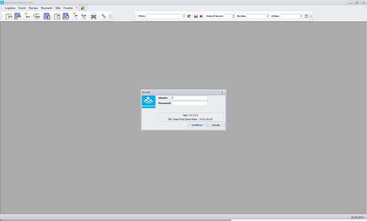
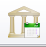
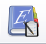



Il programma consente principalmente di gestire filtri sui dati che saranno oggetto di pianificazione, la pianificazione stessa, il controllo della pianificazione. Tutte le funzionalità sono attivabili dall'apposita toolbar principale. Alternando opportunamente queste azioni l'utente sarà in grado di lavorare volta per volta o contemporaneamente sui dati che è più comodo selezionare o visualizzare a seconda della necessità.
Per capire il funzionamento del programma occorre introdurre le nozioni di impegno e di “proposta” di impegno:  

**Proposta:** La proposta segnala l'assegnazione di una durata (in ore) ad una risorsa o persona per un determinato evento. Ad esempio possiamo trovarci di fronte ad una situazione in cui l'evento è attività didattica “analisi 1” che ha una durata di 60 ore, e che risultano proposte di impegno su questa attività per il docente “Marco Rossi” e l'”aula 1”. Una volta che tutte le proposte di impegno saranno confermate l'impegno potrà a sua volta essere confermato.  

**Impegno:** L'impegno corrisponde ad una effettiva collocazione spazio-temporale di un evento, le cui proposta di impegno per le risorse coinvolte sono confermate. Sempre seguendo l'esempio precedente, l'impegno sarà dunque lunedì 2 ottobre 2004, dalle 09.00 alle 11.00  in cui si svolgono 2 delle 60 ore previste in cui il docente “marco rossi” farà lezione di “analisi 1” nell'aula 1.  

La finalità del programma è quella dunque di creare l'orario di eventi impegnando le persone e le risorse fisse o mobili. Una volta creati gli impegni è possibile fare modifiche singolari sui singoli giorni/e orari degli impegni stessi. Nell'esempio fatto quindi, non esisterà semplicemente l'orario generale del corso di analisi 1: il lunedì dalle 9 alle 11, ma un calendario vero e proprio di date e di ore distribuite lungo un  periodo prestabilito (lunedì 2 ottobre 2004 dalle 09.00 alle 11.00, lunedì 9 novembre 2004 dalle 09.00 alle 11.00, ecc…) e si potrà dunque operare modifiche solo alle singole date, spostando la lezione di orario o di giorno.

**Funzioni:**

Le funzioni consentono di visualizzare per risorse, eventi, persone gli impegni calendarizzati nel periodo selezionato.

  *   Attiva la funzione di pianficazione per aule
  *   Attiva la funzione di pianficazione per eventi
  *   Attiva la funzione di pianficazione per docenti

**Viste:**

Solo per gli eventi è stata predisposta una funzione ad hoc per visualizzare impegni e dettagli dell'evento (persone e risorse coinvolte).
  *   Attiva la vista sugli Eventi

**Filtri:**

I filtri consentono di definire set di dati con cui lavorare sia per quanto riguarda i calendari, le risorse, le persone, e gli eventi stessi. Quando il filtro viene salvato nell'icona l'imbuto si colora di rosso, quando non è presente nessun filtro il colore è grigio. I dati che l'utente filtrerà risulteranno eventualmente già filtrati dal suo profilo (visibilità sulla Strutt. Org.).

  *   Attiva il filtro sugli eventi.
  *   Attiva il filtro sulle persone.
  *   Attiva il filtro sulle aule.
  *   Attiva il filtro sui vincoli.

**Controlli:**

  *   Attiva i controlli sulla pianificazione svolta. 
ATTENZIONE: Dalla release 05.13.00.00, l'icona generale è stata nascota dalla voce di menù principale, ed è stata inserita in ciascuna maschera di pianificazione.
