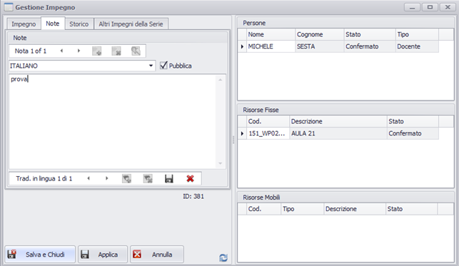

I template di nota sono dei modelli predefiniti richiamabili contestualmente dall'operatore nell'operazione di scrittura della nota.
I template di nota sono stati suddivisi in 4 tipologie:

  *  NOTE COLLEGATE A DEI PROCESSI
  *  NOTE DI EVENTI DI TIPO DIDATTICO
  *  NOTE DI EVENTI DI TIPO ESAME
  *  NOTE DI EVENTI DI TIPO ALTRO

Una nota può derivare da un template oppure essere creata ex-novo, appositamente per l'impegno o l'evento in oggetto.

Il sistema di gestione delle note prevede dunque la gestione di più lingue configurabili dall'utente, e ad ogni risorsa (evento, impegno) si possono associare più note (non solo una).

E' in fase di rilascio anche una funzione di configurazione per la creazione/ modifica di template. Occorre anche definire come rendere visibili le note nelle stampe e nell'esportazione dei dati.

# Operatività
E' stata rilasciata la funzionalità per l'associazione di una nota ad un singolo impegno. Lo stesso componente sarà disponibile anche a livello di evento.

## Associazione di una nota template:

1.  Posizionarsi su un impegno
2.  Fare doppio clic per aprire il dettaglio, e scegliere il folder “note”
3.  Cliccare sul bottoncino “apri template note”
4.  Selezionare la nota voluta e/o modificarne il testo
5.  Cliccare sulla barra sotto il testo: “Salva nota”

## Creazione di una nota (ex-novo):

1.  Posizionarsi su un impegno
2.  Fare doppio clic per aprire il dettaglio, e scegliere il folder “note”
3.  Cliccare il + sulla prima barra “aggiungi nota” 
4.  Editare il testo della nota 
5.  Cliccare sulla barra sotto il testo: “Salva nota”

