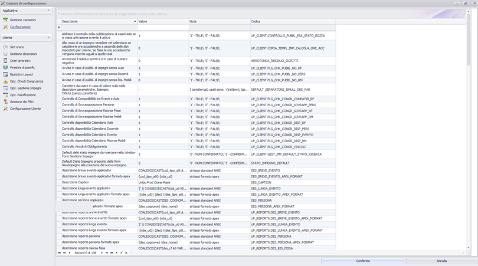

Quest'area è accessibile da _Strumenti_ > _Opzioni_.

# Gestione variazioni

Da questa maschera è possibile attivare la gestione della variazioni, personalizzando anche quale delle variazioni all'impegno deve essere tracciata:

  * 	Data
  * 	Slot orario
  * 	Risorse associate
  * 	durata

# Configurazioni (rel. 10.04.00.00)

Dalla release 10.04.00.00, gli utenti con ruolo Supervisore, possono trovare nella maschera delle opzioni sotto la voce Configurazioni, l'elenco delle configurazioni dell'applicativo. Il solo campo modificabile in tale schermata è il campo Valore, gli altri sono campi fissi. 

Per ulteriori informazioni [clicca qui](Parametri-Configurazione.md)

# Slot orario
Questa finestra consente all'utente di impostare una modalità di lavoro per “slot” per ottimizzare il tempo di occupazione delle aule. L'esigenza di una gestione a slot è legata al fatto che molto spesso le ore di lezione non sono ore effettive ma ore comprensive dell'intervallo accademico tipicamente di 15 minuti, quindi la durata effettiva di un ora sarebbe di 45 minuti. Per ottimizzare lo spazio si possono gestire degli “slot” di durata definibile indicando anche la corrispondenza in ore accademiche. Per esempio si potrebbe impostare uno slot da 105 minuti ( 45 + 45 + 15 di intervallo) che corrisponda  a due ore accademiche. 

_Intervallo accademico:_ durata dell'intervallo accademico in uno slot  

_Durata slot:_ durata dello slot in minuti  

_Ore accademiche:_ durata delle ore accademiche corrispondenti allo slot espressa in ore  

# Gestione descrizioni

Da questa maschera è possibile personalizzare i campi da visualizzare all'interno del box principale che rappresenta il singolo impegno nella time table. E' possibile  definire un layout diverso per ogni pianificatore (eventi, aule, persone/docenti).
Nel box  a seconda delle dimensioni che assume sono visibili due campi: una descrizione breve (oggetto) e una descrizione lunga (soggetto).

  

 **ATTENZIONE**

**N.B:
   Dalla versione 10.02.00.00 la gestione delle descrizioni è stata modificata notevolmente per maggiorni informazioni: [Gestione Descrizione](Gestione-Descrizione.md)**

# Orari lavorativi
Questa finestra consente all'utente di impostare l'orario di inizio e fine di uno o più blocchi orari con cui vuole suddividere la giornata. Di default si avrà un unico blocco definito dalle 08.00 alle 19.00, in mezzo a questi due orari verranno visualizzati gli slot secondo il “range” scelto (15 min, 30 min, 1 ora, ecc..). Ma si può decidere di suddividere la giornata in più blocchi per esempio per gestire pause o interruzioni fra mattina e pomeriggio. In questo caso si possono inserire ad esempio un primo blocco dalle 08.00 alle 12.30 e un secondo dalle 14.00 alle 21.00. 
Nella gestione di Pianificazione a calendario lo slot fra le 12.30 e le 14.00 verrà visualizzato come non disponibile.

# Finestre di pianificazione

_Aggiornamento dati automatico:_ abilita il refresh automatico dei dati sulle diverse finestre di pianficazione dell' applicazione client.

**N.B:** Questa opzione potrebbe influenzare la velocità di risposta dell'applicativo, perché comporta l'aggiornamento dei dati su tutte le maschere ad ogni operazione.

_Attiva gestione multi-monitor per:_ consente di attivare la modalità di lavoro multi-monitor per le finestre indicate. Molto comoda data la dimensione spesso notevole delle finestre  e dei dati da manipolare:

# Ripristino layout
Riporta allo stato iniziale le impostazioni di visualizzazione dei pianificatori e delle griglie di visualizzazione delle funzione “gestione eventi”, e “gestione impegni”. Può succedere che l‘utente nascondendo o muovendo dei componenti dello Scheduler infatti non si ritrovi nella posizione voluta , o non si trovi affatto alcuni pannelli operativi.

**N.B:** Si possono ripristinare tutti i layout, oppure separatamente quelli di ciascun pianificatore.

# Opzioni di Check di Congruenza

Vedi sezione relativa: [Gestione controlli di congruenza (Check Congruenze)](up_client_CheckCongruenze.md#Controllo_contestuale_Check_Congruenze_4)

# Opzione di gestione impegni
A livello gestione può essere utile avere automaticamente degli alert in fase di pubblicazione se essa riguarda impegni non ancora assegnati a risorse (aule/docenti/attrezzature)

# Opzioni di pianificazione
Un'opzione importate riguarda la possibilità di modificare o meno gli impegni di eventi non presenti nel filtro corrente. L'opzione abilitata consente ad esempio di lavorare sulla pianificazione eventi potendo modificare la posizione di tutti gli impegni visualizzati

# Gestione dei Filtri
Da questa maschera è possibile archiviare, cancellare e modificare la descrizione di filtri salvati
dall'utente.

# Configurazione Utente (rel 10.04.00.00)

Nella schermata qui riportata ogni utente può configurarsi alcuni parametri per l'applicazione.
I parametri presenti in tale schermata possono essere modificati solo nel campo valore, dove l'utente può configurare la propria opzioni.

