

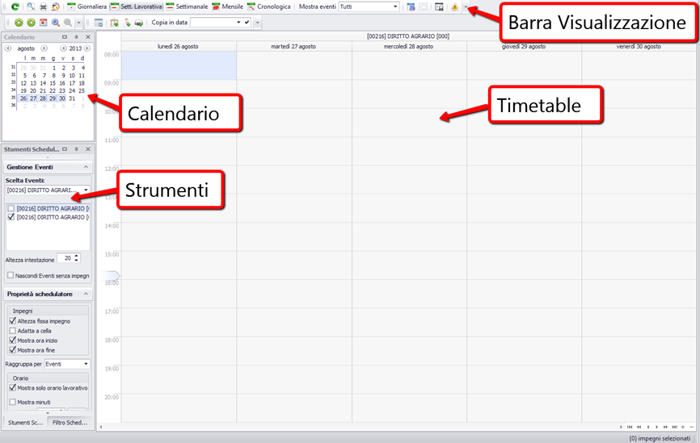

**Spostamento pannelli**  

Di ogni pannello si può decidere la posizione nello scheduler, la visualizzazione o l'eventuale riduzione a icona. Per nascondere il componente occorre settare l'icona della puntina in orizzontale cliccando sul tastino.

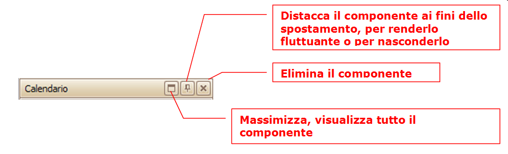

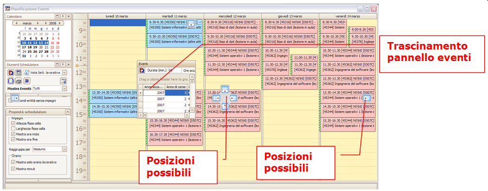

Ad esempio il pannello eventi viene spostato sul lato destro

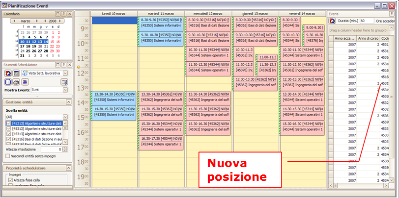

Esempio di componenti (calendario, strumenti) in modalità “nascosta”

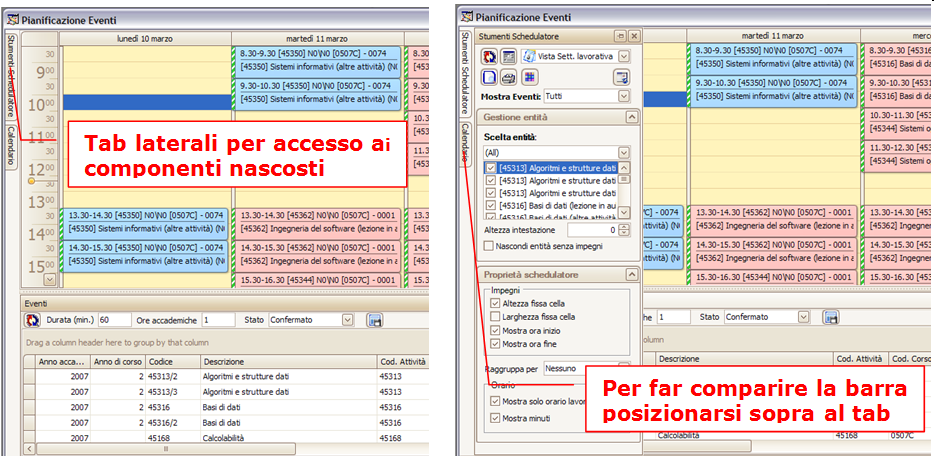

# Calendario
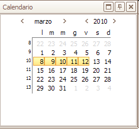

Visualizza l'elenco delle date mensile e si può scorrere per mese. Allargando la maschera si possono vedere anche più mesi in successione. All'interno del calendario si possono selezionare anche una o più date in sequenza e non. Ad esempio se si selezionano un certo numero di date consecutive lo scheduler si posizionerà sulle date in successione. Utilizzando la vista giornaliera dello scheduler, si possono visualizzare date non consecutive selezionandole tenendo premuto CTRL.

# Toolbar di visualizzazione
Questa barra consente di selezionare il tipo di vista della timetable e propone una serie di tasti operativi

_Tasto Ricarica schedulatore:_ aggiorna le modifiche fatte agli impegni sulla time table

_Anteprima di stampa:_ apre la funzione di impostazione della stampa dello scheduler, fra le varie consente di scegliere un layout, e altri parametri di stampa (data inizio e fine, slot orario, ecc). Qui di seguito possiamo vederne alcuni screenshots.

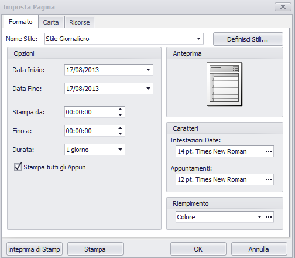

**N.B:** La leggibilità della stampa dipende da molti fattori: il numero di impegni presenti, le date, lo slot,  il font scelto per la descrizione dell'impegno, orientamento del foglio, ecc.

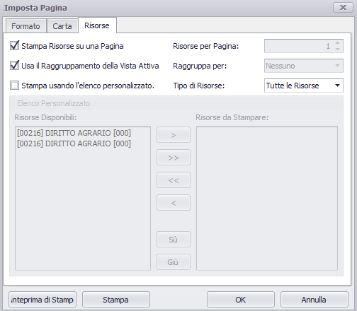

**N.B:** Fra i parametri la funzione consente anche di selezionare un sottinesieme degli eventi del filtro corrente da mettere nella stampa

_Configura colori:_ consente la modifica, aggiunta, eliminazione delle 12 tonalità di colori di default del pianificatore (visibili nelle viste: Giornaliera, Settimana lavorativa e Cronologica), utili per evidenziare le ore/giorni di disponibilità del calendario dell'evento. 

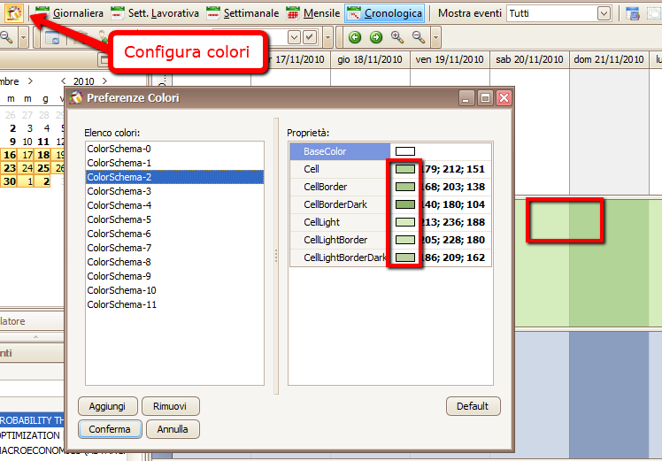

## Toolbar di opzioni visualizzazione dello scheduler

_Stampa:_ stampa la pagina con le impostazioni date

_Selettore tipi di visualizzazione:_
  *  Giornaliera
  *  Settimana lavorativa
  *  Settimana
  *  Mensile
  *  Cronologica (default)

_Selettore mostra tipi evento:_
  *  tutti
  *  solo filtro corrente (default)
  *  didattica
  *  altre
  *  esami
  *  tirocini

Di default la time table visualizzerà solo gli eventi del filtro corrente. La funzionalità di visualizzazione di tutti gli eventi è stata pensata per gli scheduler “persone” e “aule”, la cui funzione è quella di visualizzare la situazione complessiva di aule o persone (quindi non relativa alla gestione di un filtro selezionato di eventi).

**N.B:** Le performance del sistema possono cambiare considerevolmente a seconda del numero di risorse (aule, persone) e date che si intendono esaminare contemporaneamente.

## Toolbar navigazione calendario
Tasto destro sul calendario si trovano le seguenti funzionalità:

_Frecce di navigazione:_ consentono di muoversi nel calendario caricando il blocco di date immediatamente successive o precedenti a quelle visualizzate nella modalità corrente

_Tasto Today:_ posiziona il calendario sulla data corrente

_Zoom calendario:_ ingrandisce o rimpicciolisce il dettaglio della singola opzione di calendario. Rendendo possibile ad esempio visualizzare nella vista di tipo cronologico anche i singoli slot orari.

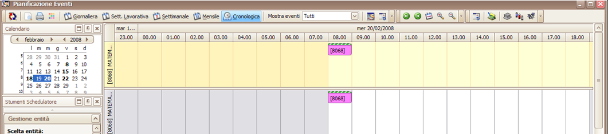

## Toolbar/menu contestuale navigazione entità/risorse
Tasto destro sull'entità si trovano le seguenti funzionalità:

_Tasto proprietà:_ visualizza le proprietà dell'evento legato all'impegno selezionato nello scheduler

_Tasto propaga impegno:_ propaga secondo le modalità selezionabili l'evento dell'impegno corrente

_Vai a gestione eventi:_ propaga apre la funzione “gestione eventi”

_Tasto aggiungi aule:_ aggiunge risorse fisse agli impegni selezionati nello scheduler

_Tasto aggiungi docenti:_ aggiunge persone agli impegni selezionati nello scheduler

_Tasto aggiungi risorse mobili:_ aggiunge risorse mobili agli impegni selezionati nello scheduler

# Strumenti dello Scheduler
Contiene tutte le opzioni per ottimizzare la visualizzazione della time table o focalizzare la vista solo su determinati eventi

## Gestione entità
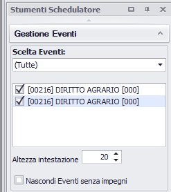

Raggruppa una serie di impostazioni per ottimizzare la visualizzazione delle entità visualizzate nello scheduler. Le entità sono le risorse che lo scheduler visualizza a seconda del pianificatore aperto (pianificatore eventi, pianificatore aule, pianificatore persone/docenti).

_Scelta entità:_ consente di posizionarsi solo su una delle entità del filtro da visualizzare nella time table  

_Elenco delle entità:_ consente di selezionare una o più entità da NON visualizzare nella time table  

_Altezza intestazione:_ modifica l'ampiezza del campo che visualizza la descrizione dell'entità nella time table  

_Nascondi entità senza impegni:_ visualizza nella time table solo le entità a cui sono associate degli impegni. Per migliorare le performance e per focalizzare l'operatore solo sulle entità su cui ci sono impegni gestiti (es: aule, persone)
 

## Proprietà schedulatore
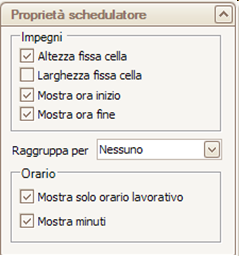

Consente di selezionare una serie di impostazioni per ottimizzare la visualizzazione agendo sul formato della griglia e sul raggruppamento delle entità

_Altezza fissa cella:_ fissa l'altezza della singola cella time table (box impegno)  

_Larghezza fissa cella:_ fissa la larghezza della singola cella time table (box impegno)  

_Mostra ora inizio:_ visualizza l'ora inizio dentro il box impegno  

_Mostra ora fine:_ visualizza l'ora fine dentro il box impegno  

_Raggruppa per:_
  *  data
  *  risorsa (default)
  *  nessuno

Di default lo schedulatore visualizza gli impegni di ciascuna entità separatamente, quindi in modalità raggruppato per risorsa. Può essere comodo visualizzare gli impegni senza alcun raggruppamento per la visualizzazione contemporanea di più eventi/impegni sulla stessa time table (vedi vista settimana lavorativa)

_Mostra solo orario lavorativo:_ visualizza nella barra verticale dello slot solo le ore diurne  

_Mostra minuti:_ visualizza nella barra verticale dello slot anche il dettaglio dei minuti  

 

# Pannello eventi
Visualizza gli eventi selezionati nel filtro per poterli trascinare nella time table secondo le modalità volute di pianificazione.

Nella parte superiore della maschera è possibile impostare la durata di default che l'impegno deve assumere nella time table, considerando sia la sua durata effettiva (durata min) e la corrispondenza in ore accademiche.

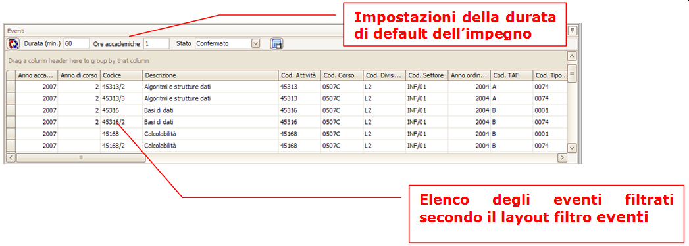

**N.B:** L'elenco degli eventi viene riportato con le stesso layout utilizzato (stessi campi e successione e size delle colonne) nel filtro eventi.

# Time table
Riporta la visualizzazione grafica della schedulazione degli impegni secondo le diverse modalità (giornaliera, settimanale, mensile,ecc.)

In tutte le viste in modalità raggruppate per risorsa, è possibile scegliere il numero di entità (eventi, aule, persone) che si vogliono contemporaneamente visualizzare all'interno della time table.

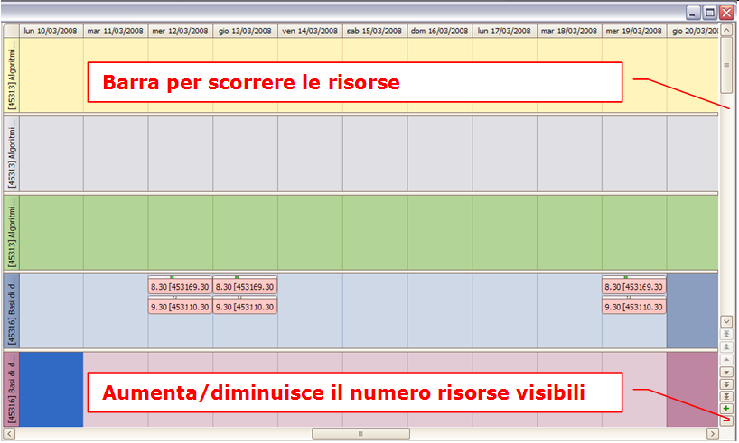

Nelle viste settimanale lavorativa e giornaliera si può modificare la barra laterale degli slot scegliendo se visualizzare un dettaglio diverso, da 60 min a 5 min.

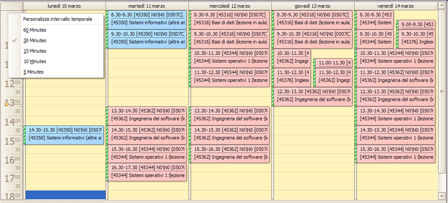
