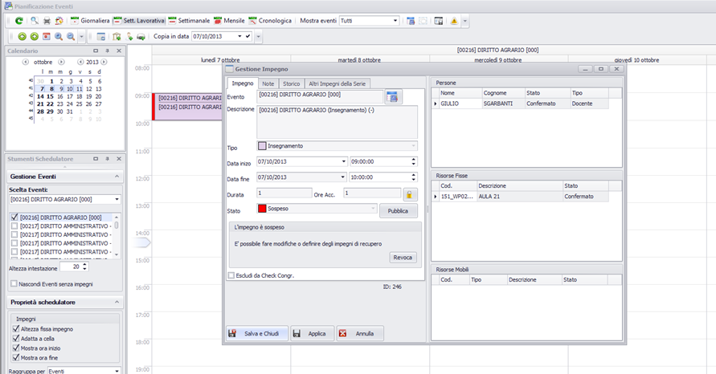
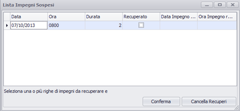

Nella terminologia adottata si introducono le seguenti definizioni:

  * **Variazione** = modifica dell'evento che ne altera la data, l'ora (slot), l'aula. Le caratteristiche dell'impegno oggetto di variazione sono parametrizzabili dall'utente;
  * **Sospensione** = stato dell'impegno che viene tracciato per una riallocazione e quindi variazione successiva;
  * **Recupero** = variazione di un impegno in stato sospeso;
  * **Revoca** = revoca di una sospensione di un impegno;
  * **Impegno aggiuntivo** = nuovo impegno dell'evento corrente che viene pubblicato dopo la prima data di pubblicazione.

Si specifica che le variazioni vengono tracciate normalmente solo a livello di singolo impegno. Variazioni globali a livello di periodo che impattano sulla ridefinizione dell'assetto didattico, non vengono tracciate singolarmente, ma come unica variazione di un riassetto della didattica (senza visualizzare l'orario precedente). Le variazioni di periodo, cioè di tutti gli impegni collegati ad una stessa serie, comporteranno la suddivisione del periodo di partenza in più periodi.

Viene inoltre contemplato il caso di variazioni complesse (variazioni che comportano la modifica della durata dell'impegno): es impegno di 2 ore che si spezza in due impegni di 1 ora, oppure 2 impegni di durata inferiore che vengono recuperati in un nuovo impegno di durata maggiore. 

# Pubblicazione di uno o più orari di lezione

Aprire la funzione “gestione Impegni” dalla Toolbar Eventi

Selezionare il periodo di pubblicazione (DAL AL, normalmente coincide con quello del filtro - semestre impostato).

Recuperare tutti gli eventi che si intendono pubblicare (tutti quelli del filtro corrente - oppure un singolo evento) in stato confermato.

Selezionare nella lista gli eventi da pubblicare

Assegnare stato pubblicato. A questo punto tutti gli impegni dell'evento sono in stato pubblicato, quindi l'orario è visibile sul web-services di pubblicazione, quindi (potenzialmente) già visibile allo studente.

# Attivazione delle variazioni

A questo punto qualunque variazione dell'orario deve essere potenzialmente notificata allo studente, quindi tracciata. Per abilitare la gestione delle variazioni occorre avere abilitato la [gestione variazioni](up_client_Opzioni.md) nell'apposito menù del configuratore  in “opzioni”.

Per eseguire le variazioni ad orario pubblicato è necessario operare innanzitutto una sospensione. 
Proponiamo a seguire tutti i casi d'uso contemplati dalla procedura, emersi in fase di analisi:

## _Variazioni semplici_

Una volta pubblicato l'impegno non sarà più presente nella _Gestione impegni_ e sarà contrassegnato da un colore blu (anziché righe verdi), e aprendolo dalla modalità di pianificazione compare l'interfaccia per la modifica

### Sospensione

Cliccare sul tasto ”sospendi”. A questo punto il sistema propone una maschera in cui l'operatore può scegliere se:
1. Inviare immediatamente la notifica di questa sospensione. Tale modalità è da utilizzare solo quando si è certi che è necessario avvertire subito lo studente della sospensione.
2. Liberare le risorse occupate dall'impegno che si sta sospendendo. Se non si è sicuri che la sospensione sia effettiva, conviene lasciare occupata l'aula finché il docente non si decide.
3. Inserire un testo nella nota che di default viene proposta, come spiegazione della sospensione (da inviare contestualmente alla sospensione).

**N.B**: L'impegno assume la caratteristica colorazione rossa. Da questo momento in poi NON vengono tracciate le modifiche ulteriori a questo impegno finché non viene ripubblicato.

### Variazione

Variazione dell'impegno: ora è possibile operare le variazioni necessarie per la riallocazione dell'impegno spostando direttamente il box sullo scheduler:

  * Cambio data
  * Cambio slot
  * Cambio aula

### Recupero

Recupero dell'impegno (lezione): Cliccando sul tasto pubblica dalla maschera dell'evento sospeso si ottiene il recupero dell'impegno. E i vecchi parametri (quelli variati) verranno scritti nello “storico”.

### Revoca

Revoca di una sospensione. Seguendo lo stesso procedimento dai punti [sospensione](#sospensione) e [variazione](#variazione), anziché variare i parametri dell'impegno sospeso si può operare una revoca della sospensione cliccando sul tasto “revoca”.

Se in fase di sospensione si era optato per la notifica in questo caso verrà notificata la revoca. Tale variazione è quindi tracciata e pubblicabile.

## _Impegno aggiuntivo_

Un altro tipo di variazione all'orario contemplato nei casi analizzati riguarda la lezione aggiuntiva, cioè l'aggiunta di un impegno dello stesso evento ad una serie di impegni già in stato pubblicato. Tale caso si gestisce semplicemente andando ad aggiungere un nuovo impegno nello schema orario. 

1. Creare nuovo impegno sullo scheduler. La procedura creerà un nuovo impegno dello stesso evento in stato “confermato”;
2. Assegnare l'aula;
3. Pubblicare direttamente dal tasto “pubblica”. Scegliere l'opzione "Lezione aggiuntiva". Tale aggiunta viene tracciata dal sistema.

## _Variazioni Complesse_

Oltre alle variazioni semplici che coinvolgono tipicamente un solo impegno, si possono gestire i seguenti casi di variazioni complesse:

1\. Sospensione. Procedere alla sospensione di un impegno come indicato nei punti 1 e 2 della sospensione. Vedi [opra](#sospensione)

2\. Allocare il primo impegno di recupero

3\. Cliccare tab “storico” e sul tasto recupera sospesi 

4\. Indicare che tale impegno è un recupero dell'impegno sospeso

5\. Salvare l'operazione cliccando "Salva e chiudi"

Lo storico NON mostra l'impegno sospeso recuperato (lo farà solo dopo la pubblicazione)

6\. Ripetere i passi dal 2 a 5 allocando il secondo evento di recupero, e indicando che anche quest'ultimo è un recupero dello stesso impegno sospeso

7\. Al termine si possono pubblicare i nuovi impegni di recupero 

L'evento sospeso di partenza viene eliminato, ma viene tracciato come impegno storico recuperato dai nuovi impegni

## Sospensione di impegni e recupero in modalità Merge

1\. Sospensione. Procedere alla sospensione di più impegni come indicato nei punti 1  e 2 della sospensione, vedi [sospensione](#sospensione) sopra.  
  

2\. Allocare l'impegno di recupero

3\. Cliccare tab “storico” e sul tasto recupera sospesi. Verranno visualizzati entrambi gli impegni sospesi. Selezionarli entrambi e confermare. Salvare le modifiche con “OK”

4\. Pubblicando il nuovo impegno di recupero si cancellano i due precedentemente sospesi

## Variazioni a serie di impegni già pubblicati

Può capitare di dover modificare l'intero assetto orario di uno o più insegnamenti. In questo caso si può partire dal primo elemento della serie da modificare e procedere come segue:

1\. Sospendere l'impegno (vedi [sospensione](#sospensione)) senza generare notifica e senza sospendere i restanti impegni della serie

2\. operare la modifica necessaria  
  

3\. In fase di ripubblicazione se l'impegno è collegato ad una serie, viene chiesto se estendere la variazione a tutti gli impegni della stessa serie

4\. All'atto della pubblicazione viene tracciata una sola variazione di tipo “modifica dell'assetto orario”.

## Gestione delle notifiche di variazione

Oltre il tracciamento delle variazioni il sistema offre una gestione delle notifiche di tali variazioni. La notifica della variazione può essere contestuale alla variazione stessa, oppure essere trattata in modo “differito” utilizzando l'apposita funzione client.

La funzione visualizza tutte le notifiche che il sistema ha tracciato a partire da una certa data (configurabile da sistema). Le notifiche possono essere raggruppate come nell'esempio per data e per descrizione dell'evento, permettendo all'operatore di posizionarsi sui dati voluti.

  * _**Elimina**_: Dall'interfaccia si possono cancellare le notifiche non necessarie. Ad esempio nel caso di una sospensione a cui segue immediata ripianificazione e quindi recupero della lezione, l'operatore può decidere di notificare solo quest'ultima.
  * _**Dettagli**_: Per ogni notifica si può inoltre modificare la nota di accompagnamento che esplicita le motivazioni  della variazione attraverso l'apposita funzionalità (vedi [Gestione note](up_client_Note.md)).
  * _**Notifica**_: il tasto notifica rende effettiva la comunicazione delle notifica. Può essere utilizzato sia singolarmente che per più righe. Nel caso di gestione differita delle notifiche tale funzione consente ad esempio all'operatore di “inviare” periodicamente (es: fine giornata, oppure a metà giornata) tutte le variazioni selezionate.
  * _**Stampa**_: il tasto stampa consente di stampare l'avviso singolo di notifica della variazione effettuata su una o più righe selezionate
  * _**Esporta**_: esporta tutte le notifiche su documento Excel, PDF, HTML, TXT o RTF

**N.B:** Per notifica si intende la gestione del messaggio di notifica, ma non il delivery finale di tale messaggio. Il sistema è predisposto anche per a fase di delivery attraverso l'invio di e-mail o sms, che naturalmente deve essere configurato. Tuttavia per la fase finale di pubblicazione del messaggio si intende affrontare lo scenario ateneo per ateneo a seconda delle esigenze.

