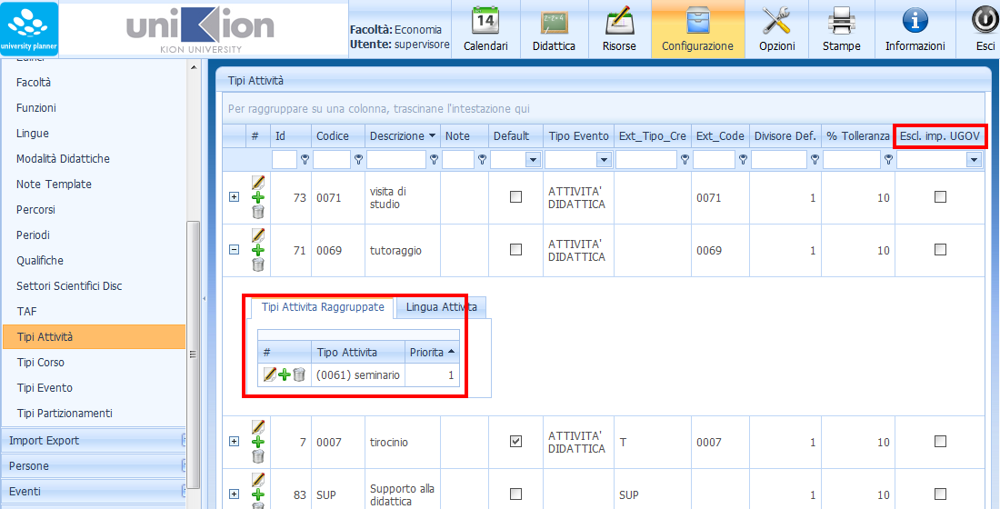
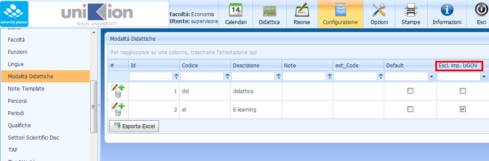
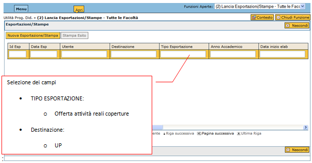
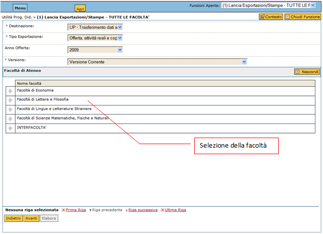
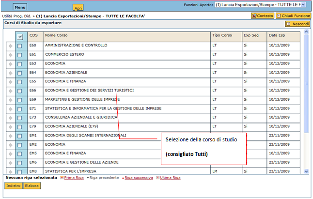
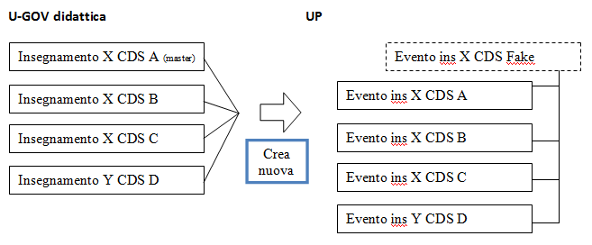
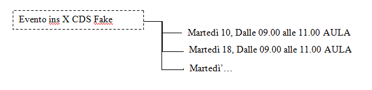
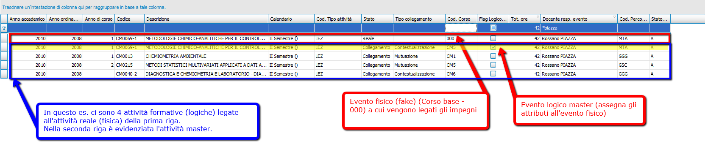
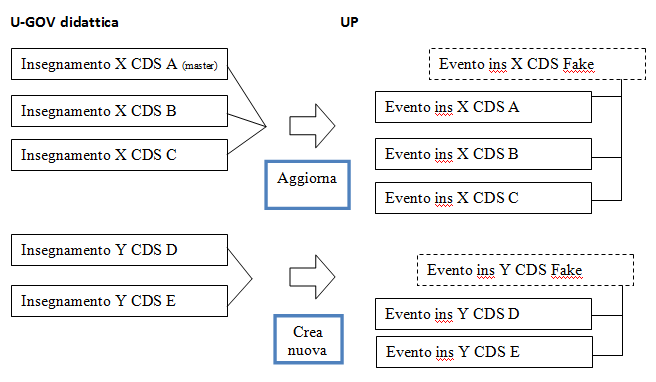



#  Import didattica da SIADI (Ugov didattica)

Descriviamo di seguito il funzionamento dell'integrazione fra U-Gov didattica e il modulo UP (University Planner).  
Lo scambio di dati fra i due sistemi è monodirezionale (da U-GOV ad UP), assumendo che nel contesto in cui l'ateneo utilizza U-Gov come sistema di programmazione didattica, tale sistema diventa “master” dei dati relativi all'offerta formativa, sia nei confronti di ESSE3 che di UP.   
Questa nuova modalità di integrazione quindi, di fatto, sostituisce e amplifica la precedente integrazione diretta con ESSE3. 
E' da considerare pertanto alternativa a quella che prevede l'import dei dati di didattica da ESSE3.  
Le due integrazioni **NON **possono essere gestite contemporaneamente. Rimane invece possibile gestire l'integrazione con ESSE3 per quanto riguarda la gestione degli esami, indipendentemente da quella della didattica.

## Configurazione dell'esportazione dati

### Tipi attività
Al fine di rendere l'esportazione dei dati relativi agli insegnamenti più vicina ai desideri del pianificatore dell'orario, è possibile modificare il dettaglio di raggruppamento con cui ciascun insegnamento viene esportato su UP.   

Nella modalità standard l'invio avviene considerando come unità minima di pianificazione lo stesso dettaglio espresso nell'offerta didattica.   

Ad esempio un insegnamento X che prevede 30 ore di lezione e 20 ore di esercitazione, verrà esportato in UP come _due _eventi rispettivamente di 30 e 20 ore. In deroga a questa modalità è possibile accorpare le attività di diversa tipologia, come se fossero un unico insegnamento di 50 ore di lezione.  

E' possibile stabilire quali tipi attività inviare ad UP e quali tipi attività “collassare/raggruppare” su altri tipi attività. Per esempio è possibile escludere le attività di “tutoraggio” o di “e-learning”, in quanto per definizione non necessitano di una pianificazione in spazi. Per ogni tipologia è possibile specificare su quale altra tipologia si intende accorparla.  

Ciò è possibile definendo nella maschera "Configurazione\**Tipi attività**" di **UP WEB** quali "tipologie di attività" (lezione, esercitazione, laboratorio, tutoraggio,…) vanno accorpate durante l'esportazione e quali vanno escluse. 

**NB:** 
  *  si consiglia di mantenere però la stessa suddivisione in tipologie espressa in offerta formativa, in modo da poter più facilmente ricondurre un orario ad un insegnamento o modulo di insegnamento.
  *  data l'importanza di tale raggruppamento per "Tipi Attività" (ai fini della Logistica), non verranno importate le lezioni (AF) prive di tale attributo.
Per cui è **OBBLIGATORIO **che le AF da esportare abbiano almeno una **copertura docente associata** (anche solo ad un docente _fittizio_ con _zero_ ore)  

### Modalità didattica

L'esclusione è possibile anche a livello di "Configurazione\**Modalità didattica**"

### Parametri di configurazione

La gestione di aggiornamento dei dati è in parte configurabile e consente di stabilire default per quanto riguarda l'aggiornamento di alcuni dati.
Sono perciò disponibili una serie di parametri di configurazione che influenzano notevolmente l'import da Ugov _(disponibli per i soli utenti "supervisore" e "configuratore")_.
Per maggiori dettagli consultare le sezioni "Paramentri da UGOV" e "Parametri Import UP" della [pagina dei parametri](Parametri-Configurazione.md)
modificabili dalle maschere "Opzioni\Configurazioni" di [UP client](http://doc.apex-net.it/UP.up_web_Opzioni.ashx.md#Configurazioni_0) e [UP Web](http://doc.apex-net.it/UP.up_client_Opzioni.ashx.md#Configurazioni_rel_BAAEAAAA_1) 

## Modalità esportazione dei dati verso UP

La nuova integrazione consente una gestione dell'aggiornamento dei dati da U-Gov ad UP in modalità “sincrona”. Il che significa che i dati inviati ad UP vengono esportati la prima volta e aggiornati tutte le volte successive in maniera **incrementale**. A differenza della prima integrazione con ESSE3 UNA TANTUM, che dopo il primo export prevedeva una gestione completamente disaccoppiata dei due sistemi.   

Le modalità di esportazione possono essere gestite in maniera automatica (tramite una schedulazione notturna) o manuale (lanciabile direttamente da U-GOV) oppure mista.

### Esportazione programmata

L'export verso UP può venire schedulato per aggiornare automaticamente i dati, ad un determinato momento della giornata. Ad esempio può essere stabilito un export giornaliero tutte le notti.

  *  Questa modalità è consigliata quando non essendoci forte collegamento tra i pianificatori dell'orario e la segreteria della Strutt. Org. (programmazione didattica), chi pianifica sa che lo stato di aggiornamento dei dati è sempre disponibile all'ultima versione.  
  *  La controindicazione di questa modalità è che vengono aggiornati i dati sempre, quindi quando ancora la programmazione didattica potrebbe essere molto provvisoria.
L'effetto collaterale è quindi che il pianificatore potrebbe trovarsi a lavorare su dei dati ancora molto indefiniti o quantomeno incompleti e inadatti a prendere decisioni (es. mancanza di docente assegnato). 

### Interfacce operative per l'esportazione su U-GOV

L'export verso UP può venire effettuato anche manualmente dal singolo operatore della singola Strutt. Org.. Tramite apposite interfacce l'operatore può decidere autonomamente quando inviare i dati dell'offerta formativa di uno o più corsi. 

Opzionare dal menù di U-GOV didattica: Lancia esportazioni 

 

 

  

Questa modalità operativa consente un maggior controllo dei dati che vengono inviati alla pianificazione dell'orario, in quanto si assume che un operatore invii pacchetti di dati consistenti dopo sessioni di programmazione didattica compiute. 

Pur essendo possibile inviare i dati di singoli corsi (vengono presi i "pacchetti" di condivisioni logistiche in cui il corso di studio selezionato è quello dell'attività formativa Master), si consiglia di utilizzare sempre la modalità di invio per Strutt. Org., per via delle numerose dipendenze che spesso gli insegnamenti hanno all'interno della singola Strutt. Org. in termini di condivisioni logistiche e mutuazioni.
   

## Mappatura dei dati in UP
Per consentire una gestione efficace degli aggiornamenti, anche a fronte di modifiche strutturali radicali, in programmazione didattica è stato implementato un nuovo sistema di mappatura fra insegnamenti (attività formative) ed eventi, che consente di preservare sempre i dati che vengono gestiti in UP (orario) a fronte di cambiamenti nella didattica.  
Viene, in pratica, generato per ogni "pacchetto di insegnamenti in condivisione" un record fittizio nascosto (**Corso base - 000**) (visibile solo in fase di pianificazione orario), sul quale si associano gli impegni effettivi (date delle lezioni). In questo modo è possibile ricostruire la struttura del pacchetto di attività in condivisione e l'orario viene preservato.    

**Ad esempio:**  
  

 
1.  in un primo invio viene inviata la seguente struttura di dati da U-Gov ad UP:
 
Come indicato nello schema viene generato un evento "insegnamento fittizio" (fake) sul quale verranno legati gli impegni delle singole date.   

 
In pratica viene creato "fisicamente" quello che su Ugov si chiama "Attività reale" che viene generata come condivisione di più attività formative e risulta trasparente all'utente finale.  

**NB: l'evento fittizio (fake) acquisisce gli stessi attributi dell'attività formativa Master**

 

1.  Ad un secondo invio in caso di modifica strutturale, le modifiche in UP verrebbero recepite in questo modo: 

 

L'aggiornamento del primo pacchetto viene effettuato senza intaccare l'orario già generato e viene creato un secondo pacchetto di eventi tra di loro legati, in cui viene associato un nuovo evento fittizio. 

### Interfacce operative post aggiornamento su UP
Per i casi di aggiornamento che richiedono una decisione non automatizzabile (ad esempio, impegni con aule occupate legati ad eventi a cui è stato cambiato il semestre) sono state predisposte apposite interfacce su UP per consentire all'operatore di "aggiustare" i dati in modo manuale. E' possibile impostare come default l'apertura di questa funzione per consentire all'operatore di avere il cruscotto operativo, prima di ciascuna sessione di lavoro. 

Per maggiore dettagli leggere il paragrafo seguente "Azioni post-import".

#  Azioni post-import (UP CLIENT) 

{t:Azioni-post-import}
