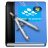


  *  [Introduzione](up_manual_introduzione.md)

##   UP WEB - Configurazione e calendari

  *  [Introduzione](up_web_Introduzione.md)

  *  [Usabilità](up_web_Usabilita.md)

  *   [Calendari](up_web_Calendari.md)
  *   [Risorse](up_web_Risorse.md)
  *   [Configurazione](up_web_Configurazione.md)
  *   [Opzioni](up_web_Opzioni.md)

##   UP CLIENT - Pianificazione logistica

  *  [Introduzione](up_client_Introduzione.md)
  *   [Opzioni di configurazione](up_client_Opzioni.md)
  *   [Gestione dei filtri](up_client_Filtri.md)
  *   [Settimana Template (Tipo)](Pianificazione Settimana Tipo.md) 
  *   [Funzioni di pianificazione (Scheduler)](up_client_Pianificazione.md)
  *   [Gestione Eventi](up_client_Eventi.md)
  *   [Gestione Controlli](up_client_CheckCongruenze.md)
  *   [Gestione impegni](up_client_Impegni.md)
  *   [Generatore Automatico](up_client_Generatore_Automatico.ashx.md)

##  UP CLIENT - Tutorial

  *  [Introduzione](UP-client-Tutorial-Introduzione.md)
  *   [Pianificazione dell'orario e propagazione](up_client_Howto_Pianificare.md)
  *   [Tracciamento delle variazioni](up_client_Variazioni.md)
  *   [Gestione note](up_client_Note.md)

##  UP REPORTS - Stampe

  *  [Introduzione](up_reports_Introduzione.md)
  *   [Interfaccia **UP Web**](up_reports_up_web.md)
  *   [Interfaccia **UP Client**](up_reports_up_client.md)

  *  [Elenco Reports](up_reports_elenco.md)

##   UP WEB PUBL - Area pubblica 

  *  [Introduzione](up_web_publ_Introduzione.md)
  *  [Calendario Pubblico](up_web_publ_Servizi_Web.md)
  *  [Integrazioni e Chiamate esterne](up_web_publ_Come_Chiamare.md)

##   UP WS - WebServices Import/Export dati

  *  [Introduzione](up_ws_Introduzione.md)
  *  [Import dati in UP](up_ws_import.md)
  *  [Export dati da UP](up_ws_export.md)

##   Integrazioni

  *  [Introduzione](up_integraz_Introduzione.md)
  *  [Integrazione: appelli di Esse3](up_integraz_ESSE3.md)
  *  [Integrazione: didattica di UGOV](up_integraz_UGOV.md)
