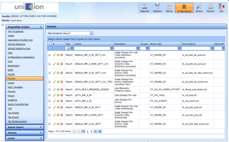
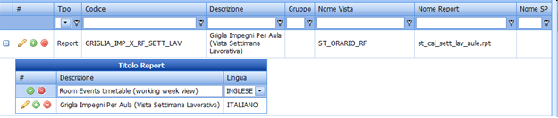
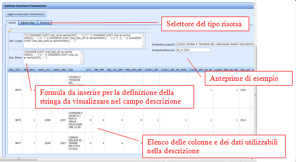


UP dispone di un modulo proprio di generazione di stampe con alcuni layout predefiniti, che rispecchiano quelli richiesti dagli atenei utilizzatori.  

Le stampe disponibili da Client e da Web sono elencate al seguente [link](up_reports_elenco.md).  
  

Tale elenco viene recuperato da DB ed è configurabile per ogni ruolo utente utilizzando la funzione: **Autorizzazioni ** del Web (vedi [link](http://doc.apex-net.it/UP.up_web_Configurazione.ashx.md#Autorizzazioni_33)). E' possibile, quindi, decidere quali stampe mettere a disposizione di ogni profilo utente del sistema. Questa operazione deve essere fatta all'atto della configurazione generale del sistema.

# Configurazione stampe

## Personalizzazione della nomenclatura e delle descrizioni
Il nome delle stampe è  recuperato da DB e si può modificare in base alle esigenze. Attualmente la nomenclatura standard è organizzata nel modo seguente:

" &lt;tipo di report&gt; &lt;contenuto del dettaglio&gt; per &lt;raggruppamento principale&gt; (&lt;tipo di vista&gt;) " in cui:

  *  &lt;tipo di report&gt;: "Griglia" o "Lista"
  *  &lt;contenuto del dettaglio&gt;: "impegni", "docenti", "aule", ecc.
  *  &lt;raggruppamento principale&gt;: "aula", "evento", "docente", ecc.
  *  &lt;tipo di vista&gt;: "vista settimanale", "vista giornaliera", "vista mensile", ecc.

E' possibile modificare ulteriormente l'intestazione di stampa nel campo TITOLO che viene valorizzato di default col Nome del report.  Su tutti i report è editabile anche il campo SOTTOTITOLO che di default propone Strutt. Org./Anno acc./Periodo, ma è comunque modificabile dall'utente (Opzionale).

## Modifica dei titoli e attivazione della stampe in lingua
Dalla versione 05.12.00.00 (SOLO all'utente Supervisore) è possibile configurare le stampe direttamente da WEB, tramite l'accesso dal menù funzioni…

In particolare è possibile:
1. 	Rinominare ciascuna stampa secondo la descrizione più opportuna per singolo ateneo
2. 	Aggiungere la versione in lingua del report, con relativo titolo in lingua
3. 	Eliminare le stampe che si ritiene non verranno mai utilizzate (per una visualizzazione _per utente_ usare la maschera [Autorizzazioni](up_web_Configurazione.ashx.md#Autorizzazioni_31))

## Configurazione delle descrizioni delle risorse
Con questa funzione (visibile solo all'utente supervisore e configuratore) è possibile configurare le descrizioni delle risorse dello scheduler che verranno visualizzate nel calendario web e nelle stampe.
Per descrizione delle “risorse” si intende la descrizione di Aule, Docenti ed Eventi.  E' possibile ovviamente fare delle eccezioni personalizzando il report. Il default è attualmente il seguente (quando il campo è vuoto viene messo un "-", ma è configurabile anche questo):

  *  Descrizione per Aule: " &#0091;&lt;Codice Aula&gt;&#0093; &lt;Desc. Aula&gt;"
  *  Descrizione per Docenti: "&lt;Cognome&gt; &lt;Nome&gt;"
  *  Descrizione Lunga Evento: "&#0091;&lt;Cod. evento&gt;&#0093; &lt;Desc. Evento&gt; &lt;Desc. Tipo attività&gt; &lt;Desc. Partizione&gt;
  *  Descrizione Breve Evento1 : "&lt;Cod. Tipo attività&gt; &lt;Cod. evento&gt; 

L'uso della descrizione Lunga per Evento è alternativa a quella Breve ed è stata scelta in base allo spazio disponibile nel report.

- - -
1 In uso solo nella stampe "Griglia impegni per aula (Vista mensile)" e in "Griglia impegni per aula (Vista cronologica)"

Dalla versione 10.02.00.00 la configurazione delle descrizioni parametriche è stata modificata radicalmente, per maggiorni informazioni: [Gestione Descrizione](Gestione-Descrizione.md)
# Formato di stampa
Sono stati adottati gli stessi stili di carattere (Arial) su tutti i report, con un rimpicciolimento di dimensione Font in base al raggruppamento (da 13px per il tiolo a 10px per il dettaglio).   

Tutte le stampe riportano in basso il dettaglio &lt;pagina/totale pagine&gt;

