

  
  
  
 **ATTENZIONE**

  *  Il layout grafico può cambiare in base al tipo risorsa (persona, aula, evento) per il quale viene lanciato.
  *  se non diversamente specificato il report è presente sia nella maschera Client che in quella Web.
  *  in caso di modifica al nome descrittivo della stampa (vedi [paragrafo](up_reports_Introduzione.ashx.md#Configurazione_stampe_3) del manuale) riferirsi al Codice tra parentesi tonde per trovare la corrispondenza

  *  **NB:** le stampe con questo simbolo:  sono sprovviste della funzionalità di [Descrizione parametrica per utente](up_web_Opzioni.ashx?.md#Descrizioni_Parametriche_3 )

# Stampe a lista
Le stampe a lista è tipicamente una stampa a elenco di tutti gli impegni (data, ora) di una aula/persona/evento. 

## Lista impegni per evento (cod: LISTA_IMP_X_EV)

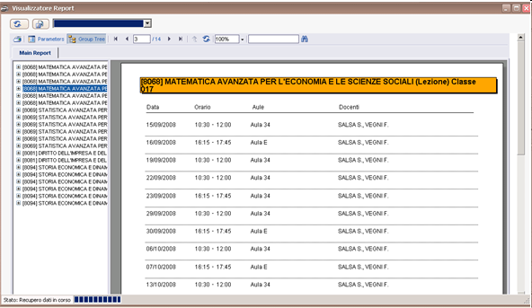

## Lista impegni per docente (cod: LISTA_IMP_X_PERS)

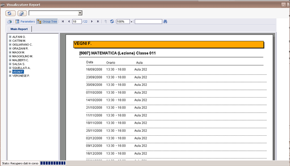

**N.B:** lanciata mettendo come opzioni di filtro "filtra Pers. associate a eventi" verranno stampati i soli docenti coinvolti negli eventi del filtro

## Lista impegni per aula (cod: LISTA_IMP_X_RF)

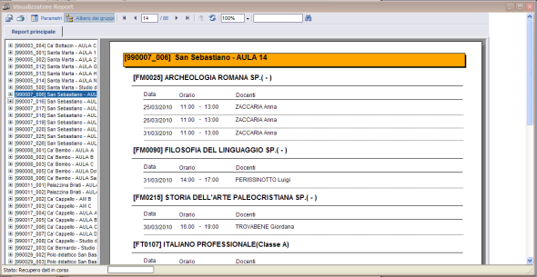

NB: lanciata mettendo come opzioni di filtro "filtra Ris. associate a eventi" verranno stampati solo le aule coinvolte negli eventi del filtro

Le stampe a lista sono le uniche all'interno delle quali vengono stampate le note 

Alcune stampe di tipo Lista sono state richieste per scopi specifici:

## Lista impegni per Aula ed Edificio (cod: LISTA_IMP_X_RF_EDIFICIO) 
Questo particolare layout è utile per avere un elenco completo di tutte le attività che si svolgono in un determinato edificio, ordinate per ora

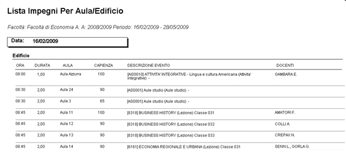

## Lista evento per periodo (cod: LISTA_IMP_X_EV_X_PERIODO) 

Questa stampa visualizza per ogni evento (es: lezione) i giorni di impegno, ma anziché elencarli uno ad uno vengono raggruppati indicando solo la data inizio e fine del periodo di date degli impegni. Questa stampa presuppone che vengano gestiti degli orari delle lezioni tramite l'uso della propagazione che crea serie omogenee di impegni per lo stesso evento.

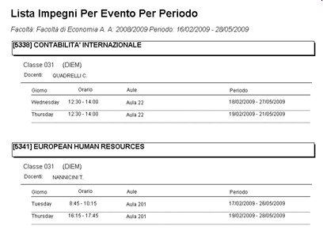

## Lista warning (cod: LISTA_WARN_CONGR) 
La stampa lista warning (lanciabile solo dalla omonima funzione di controllo) serve per monitorare tutti gli errori di una data elaborazione raggruppati per tipologia (sovrapposizione aula, sovrapposizione evento, ecc..)

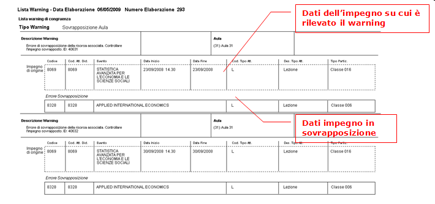

# Stampe a griglia
Si definiscono stampe a griglia, le stampe il cui layout non consiste in un semplice elenco di impegni, ma che prevedono appunto di essere incasellati in una specifica griglia(come ad esempio quella della agenda settimanale)

Ad esempio la stampa **“Griglia eventi settimanale”** ripropone tutti gli impegni allocati (data, ora) di un determinato evento o gruppo di eventi, ma li propone in una visualizzazione tabellare a schema settimanale. Ogni pagina dunque corrisponderà ad una settimana a partire dalle date selezionate nel filtro di lancio.

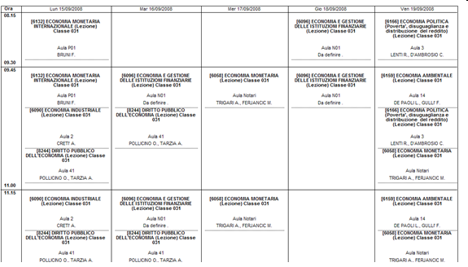

In base al tipo di raggruppamento scelto si avrà una visualizzazione degli impegni settimanali dai diversi punti di vista.

Ecco l'elenco delle stampe a griglia generiche:

#### Griglia Impegni Per Evento (Vista Settimanale) (cod: GRIGLIA_IMP_X_EV_SETT) 
Calendario settimanale degli impegni raggruppati per evento

#### Griglia Impegni Per Evento (Vista Settimana Lavorativa) (cod: GRIGLIA_IMP_X_EV_SETT_LAV) 
Calendario settimanale degli impegni raggruppati per evento escluso il weekend (sabato/domenica)

#### Griglia Impegni Per Docente (Vista Settimanale) (cod: GRIGLIA_IMP_X_PERS_SETT) 
Calendario settimanale degli impegni raggruppati per docente 

#### Griglia Impegni Per Docente (Vista Settimana Lavorativa) (cod: GRIGLIA_IMP_X_PERS_SETT_LAV) 
Calendario settimanale degli impegni raggruppati per docente escluso il weekend (sabato/domenica)

#### Griglia Impegni Per Aula (Vista Settimanale) (cod: GRIGLIA_IMP_X_RF_SETT) 
Calendario settimanale degli impegni raggruppati per aula

#### Griglia Impegni Per Aula (Vista Settimana Lavorativa) (cod: GRIGLIA_IMP_X_RF_SETT_LAV) 
Calendario settimanale degli impegni raggruppati per aula escluso il weekend (sabato/domenica)

## Griglia vista settimana template (o tipo)  **SOLO CLIENT**
Questa stampa propone sempre un layout a settimana, ma senza entrare nel dettaglio delle date effettive di svolgimento degli eventi. Il risultato è quindi l'orario della settimana “template” (o "tipo") per un certo evento/risorsa/docente.

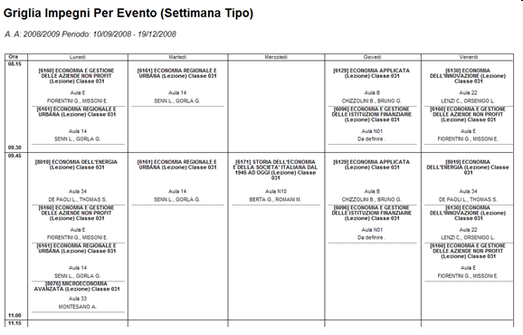

Ecco l'elenco delle stampe a griglia per la settimana template:

#### Griglia Impegni Per Evento (Settimana Tipo) (cod: GRIGLIA_IMP_X_EV_SETT_TIPO) 

#### Griglia Impegni Per Evento (Settimana Lavorativa Tipo) (cod: GRIGLIA_IMP_X_EV_SETT_LAV_TIPO) 

#### Griglia Impegni Per Docente (Settimana Tipo) (cod: GRIGLIA_IMP_X_PERS_SETT_TIPO) 

#### Griglia Impegni Per Docente (Settimana Lavorativa Tipo) (cod: GRIGLIA_IMP_X_PERS_SETT_LAV_TIPO) 

#### Griglia Impegni Per Aula (Settimana Tipo) (cod: GRIGLIA_IMP_X_RF_SETT_TIPO) 

#### Griglia Impegni Per Aula (Settimana Lavorativa Tipo) (cod: GRIGLIA_IMP_X_RF_SETT_LAV_TIPO) 

**N.B:** la leggibilità della stampa dipende sempre dal numero di eventi selezionati dal filtro corrente: una stampa con molti eventi rischia di essere illeggibile, specie se ci sono sovrapposizioni (lezioni che si tengono allo stesso giorno nello stesso slot)

## Griglia persone per evento 
Si tratta di una stampa a “griglia” con layout diverso da quello di tipo “agenda”. Visualizza sulle righe l'elenco degli eventi del filtro nelle colonne i giorni di impegno con all'interno le persone. La stampa ha lo scopo di visualizzare su un'unica tabella l'impegno delle persone settimanalmente

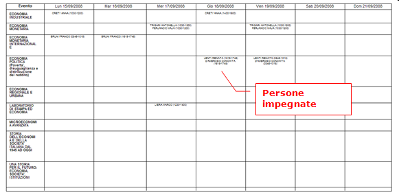

# Stampe di statistica
Sono stampe dedicate appunto alla rilevazione statistica dell'occupazione aule oppure della presenza rilevata in aula (tramite l'apposita funzione web).

## Griglia Occupazione Aule **SOLO WEB** 

Il report serve a monitorare l'occupazione e l'utilizzo delle risorse dell'ateneo. Il report considera l'occupazione di una determinata risorsa o gruppo di risorse (es tutte quelle di un certo edificio) da una data ad una data, ed eventualmente è possibile anche isolare una fascia oraria. Se non viene specificata la fascia oraria viene considerata l'occupazione secondo gli slot impostati di default dall'utente (Es: 8.00-20.00). 

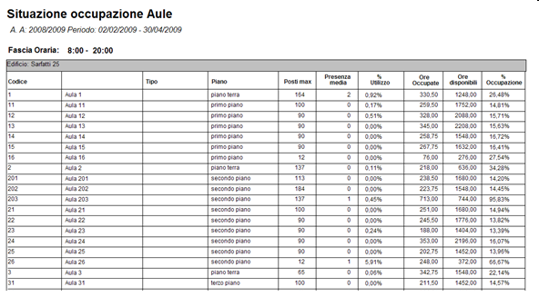

I dati nel report sono raggruppati per edificio, nelle righe del report sono riportate le aule (risorse) con alcuni attributi (capienza tipo, ecc).   

La **presenza media** si riferisce al dato ricavato dalla rilevazione presenze (media de numero rilevato di tutti eventi di quell'aula nel periodo-fascia oraria in oggetto).   

La **percentuale utilizzo** quindi si calcola considerando la presenza media in rapporto alla capacità dell'aula.   

La colonna **ore occup**, contiene la somma delle ore di impegno allocate in quell'aula nel periodo-fascia oraria in oggetto, le ore degli impegni sovrapposti vengono contate una sola volta.   

La colonna **ore totali disp**, contiene la somma delle ore di disponibilità dell'aula nel periodo-fascia oraria in oggetto (sia quelle impegnate che quelle non). La somma terrà conto del calendario di disponibilità della risorsa ove presente, ove assente varrà il totale delle ore per la fascia oraria specificata (ES: 08.00-20.00 = 12 ore).   

La **percentuale occupazione** è calcolata quindi rapportando le ore occupate sulle ore totali di disponibilità.   

In fondo al report: i **totali parziali** che sono la somma dei dati delle rispettive colonne.

Altre stampe di tipo statistico vengono tipicamente gestite da web per monitoraggio delle presenze sono:

## Lista Rilevazione Presenze Per Anno Corso/CodAD **SOLO WEB** 

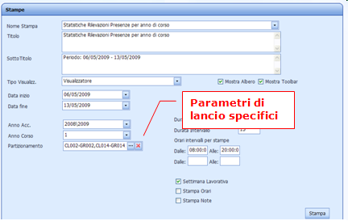

Il report visualizza il consuntivo delle rilevazioni per ogni attività didattica in ordine di codice. Per ogni attività vengono mostrate assieme tutte le partizioni  dell'insegnamento stesso. Il dato della presenza viene incrociato (se disponibile) con quello relativo al numero di “studenti atteso”, il numero di studenti che partecipano all'evento. Il range % di presenza media/iscritti indica

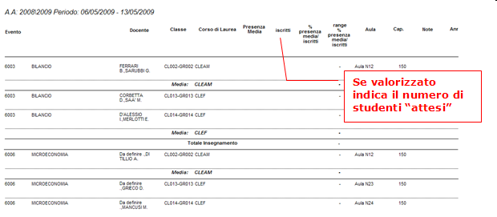

## Lista Rilevazione Presenze Per Anno Corso/Partizione **SOLO WEB** 

Il report visualizza il consuntivo delle rilevazioni per ogni attività didattica in ordine di codice, ma raggruppato per partizione. Cioè vengono giustapposte tutte le attività a parità di partizione, per monitorare simultaneamente le presenze di un insieme omogeneo di studenti (partizione) su più corsi.  dell'insegnamento stesso. Il dato della presenza viene incrociato (se disponibile) con quello relativo al numero di “studenti atteso”, il numero di studenti che partecipano all'evento. Il range % di presenza media/iscritti indica

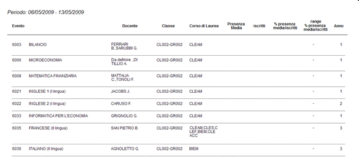

## Lista Rilevazioni Presenze Per Aula **SOLO WEB** 

Il report ha lo scopo di riassumere la presenza rilevata in un periodo o in una singola data, per singola aula o per gruppi di aule. A differenza degli altri report statistici (che aggregano il dato) indica comunque il dettaglio di ogni impegno dell'intervallo di date indicate.

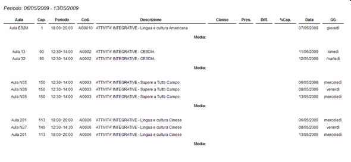

# Stampa delle note
Il dettaglio delle Note nella lingua di default (italiano) viene recuperato su tutte le stampe a Lista sia a livello di impegno, che a livello di evento. Vengono stampate le note solo se viene selezionato il parametro di "Stampa Note".Vengono stampate solo le note in stato “pubblicato”.

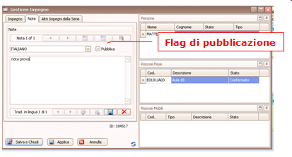

