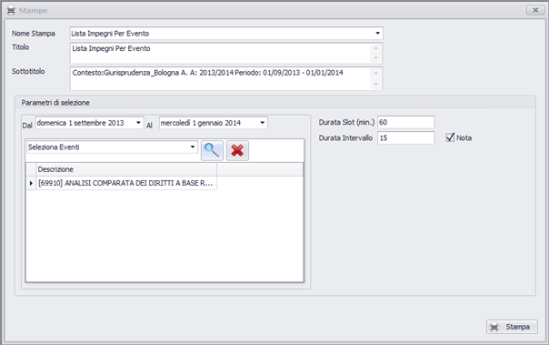
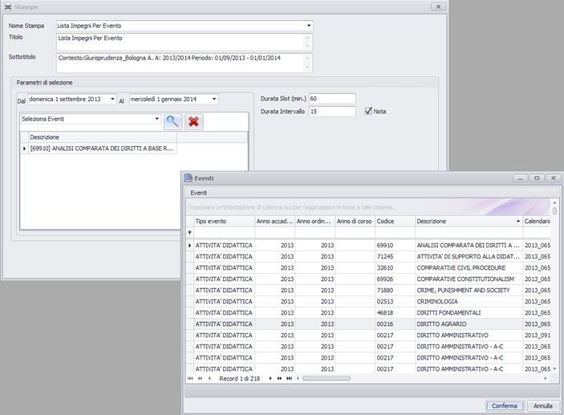


Le stampe sono parametrizzabili, ossia non ci sono stampe predefinite ma il loro contenuto cambia in base ai parametri utilizzati.
La funzione di stampa consente di selezionare il tipo di stampa desiderata e di richiedere per quale risorsa, persona, evento o gruppo di eventi visualizzarla. 

Lanciata la stampa viene aperto un visualizzatore dell'anteprima di stampa. Il file può essere poi esportato in diversi formati (pdf, excel, word, word editabile, txt) e stampato fisicamente su carta.

_Nome stampa:_ seleziona il tipo di stampa desiderata

_Titolo:_ personalizza titolo della stampa (default proposto: nome del tipo)

_Sottotitolo:_ personalizza sottotitolo della stampa (default proposto:filtro di base- Strutt. Org., anno accademico, e periodo preselezionato del filtro corrente)

### Parametri di selezione:

_Da data/a data: _ range di date (per default la maschera propone quelle del filtro selezionato)

#### Opzioni di filtro:

  *  _Persone:_ se la stampa ha come “contenuto del dettaglio” le persone, consente di selezionare una singola o più persone, oppure usare il filtro persone corrente. Applicando  il “filtra Pers. associate a eventi” la stampa filtrerà solo le persone contenute in tutti gli eventi del filtro corrente

  *  _Risorse fisse:_ se la stampa ha come “contenuto del dettaglio” le risorse, consente di selezionare una singola o più risorse, oppure usare il filtro aule corrente. Applicando  il “filtro Ris. associate a eventi” la stampa filtrerà solo le aule assegnate in tutti gli eventi del filtro corrente

  *  _Evento:_ se la stampa ha come “contenuto del dettaglio” gli eventi, consente di selezionare un singolo o più eventi, oppure usare il filtro eventi corrente.

#### Orari intervalli per stampe: 
è possibile variare per le stampe le impostazioni correnti di visualizzazione dell'utente impostando

  *  _da ora a ora:_ range orario desiderato
  *  _durata slot:_ indica la durata dello slot minimo da visualizzare 
  *  _durata intervallo:_ indica la durata dell'intervallo

_stampa orari:_ ove previsto nella stampa include gli orari di inizio e fine nei singoli slot

_stampa nota:_ ove previsto dalla stampa vengono stampate anche le note associate all'evento o all'impegno

