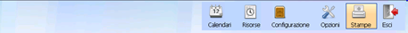
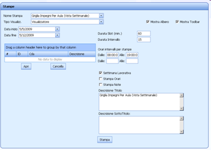
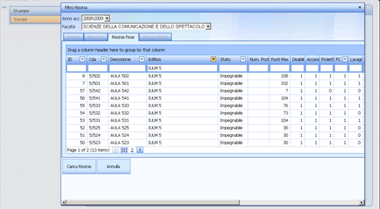
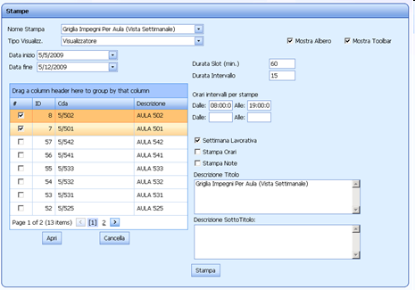



Analogamente all'[Interfaccia UP Client](up_reports_up_client.md) viene proposta una pagina dalla quale poter scegliere il tipo di stampa e impostare i parametri voluti. In aggiunta sul web si può già decidere se avere l'anteprima del report nel visualizzatore oppure scegliere un formato di stampa (pdf, word, ecc..)

Per comporre filtri sui dati relativi alle risorse (persone, aule, eventi) occorre cliccare sul tasto “apri” per utilizzare il filtro opportuno. Nel web si può unicamente in base alla risorsa del tipo di dettaglio contenuto nel titolo della stampa. Per cui una stampa di tipo Aule, consentirà di effettuare filtri solo sulle aule.

Una volta richiesto un set di dati dal filtro è possibile raffinare ulteriormente la stampa selezionando sottogruppi di risorse dall'elenco caricato.

