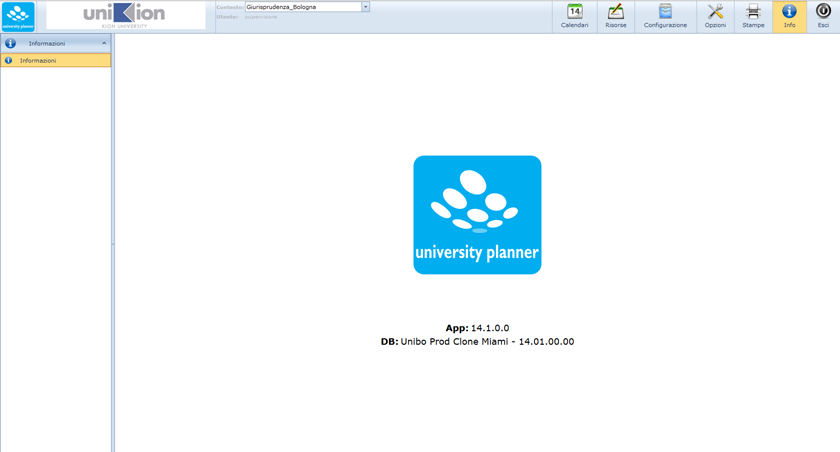



Dalla versione 05.05.00 è stata introdotta la nuova gestione del calendario web in UP. Si tratta di un intervento volto a concentrare in un unico componente le funzionalità di consultazione degli orari  (per risorse fisse/mobili, persone, eventi), la funzionalità di agenda del docente, la creazione/modifica di nuovi impegni per gli utenti prenotatori. Il nuovo componente per la consultazione del calendario che prende il nome di “Scheduler”, è del tutto simile nel funzionamento all'analogo componente client, e segna l'inizio del passaggio ad una gestione globale dell'applicazione sul web. Questo passaggio comporta anche un riassetto globale del sistema sul nuovo framework che modifica il layout generale, ma anche il funzionamento di alcuni componenti es: le griglie delle tabelle (vedi paragrafo precedente).

Tute le funzionalità web accessibili dalla nuova toolbar generale sono le seguenti:

[Calendari:](up_web_Calendari.md) 
  * 	Impegni personali (apre lo scheduler filtrato sugli impegni collegati all'utente connesso- vecchia funzione “agenda”)
  * 	Gestione calendari (apre lo scheduler con default sugli impegni di tutte le risorse della Strutt. Org. dell'utente in data odierna)
  * 	Nuovo impegno (apre la form per la creazione di un nuovo impegno)
  * 	Gestione impegni (apre la form di gestione di impegni già esistenti)

[Risorse:](up_web_Risorse.md) 
  * 	Nuova prenotazione
  * 	Gestione delle prenotazioni 
  * 	rilevazione presenze

[Configurazione](up_web_Configurazione.md) (da accesso al menù della configurazione)

[Opzioni](up_web_Opzioni.md) (permette di settare alcune impostazioni dell'utente connesso)
  * 	visualizza profilo utente
  * 	cambio password
  * 	gestione opzioni di disponibilità

[Stampe](up_reports_up_web.md) (accesso alle maschere di lancio delle stampe dell'orario)

Esci
