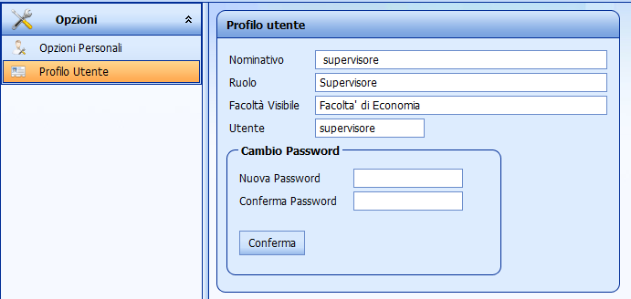
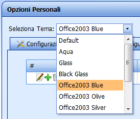
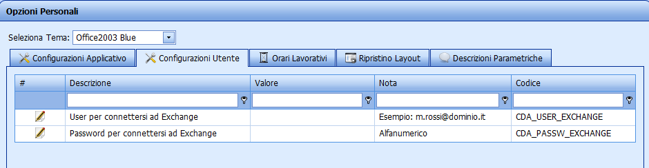
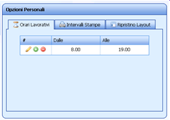
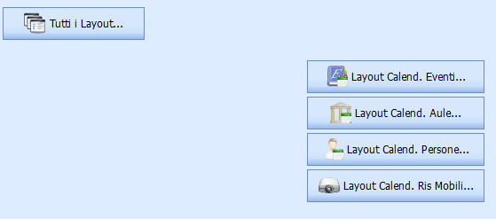
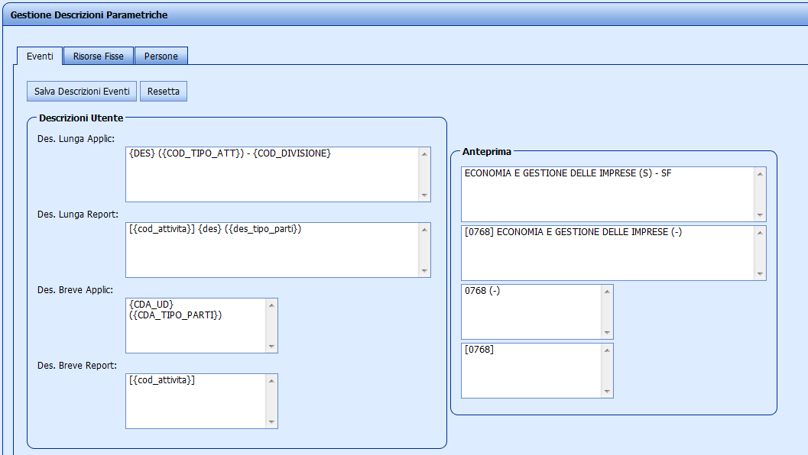


# Opzioni

## Profilo Utente

Visualizza i dati relativi al proprio profilo e il proprio user name. L'utente può decidere di cambiare la password, attraverso i campi cerchiati nella finestra "Cambio Password" e salvando al termine dell'operazione

## Opzioni Personali

La schermata delle opzioni è suddivisa in diversi pannelli.   

In elenco il dettaglio di ciascuno.  
  

**E' possibile dalla Release 10.04.00.00** configurare e personalizzare anche il tema di visualizzazione dell'intera applicazione WEB, tramite il campo Seleziona Tema.

### Configurazioni

 **ATTENZIONE**

**Modifiche dalla release 10.04.00.00**

Gli utenti con ruolo Supervisore, possono trovare nella maschera delle opzioni personali nel pannello Configurazioni Applicativo, l'elenco delle configurazioni dell'applicativo, dove il solo campo modificabile in tale schermata è il campo Valore, gli altri sono campi fissi. 

Tutti gli altri utenti, nel pannello Configurazioni Utente trovano l'elenco delle configurazioni riservate agli utenti. Anche in questa schermata il solo campo modificabile è il Valore delle configurazioni.

Per ulteriori informazioni sul significato delle configurazioni e dei propri valori consultare la seguente [pagina](Parametri-Configurazione.md).

  

### Orari Lavorativi

Altre opzioni personali riguardano l'impostazione degli slot orari in visualizzazione su calendario web e stampe. Per entrambi è possibile inserire uno o più intervalli “da ora” “a ora”

  

### Ripristino Layout

Le funzionalità di ripristino del layout globale, è separato per singolo Scheduler (calendario eventi, calendario aule, calendario persone)

### Descrizioni Parametriche

 **ATTENZIONE**

 **Dalla versione 10.02.00.00 la gestione delle descrizioni è stata modificata notevolmente.  
 
Per maggiorni informazioni consultare la pagina: [Gestione Descrizione](Gestione-Descrizione.md)**

Da questa maschera è possibile personalizzare i campi da visualizzare all'interno del box principale che rappresenta il singolo impegno nella time table. E' possibile definire un layout diverso per ogni pianificatore (eventi, aule, persone/docenti).

