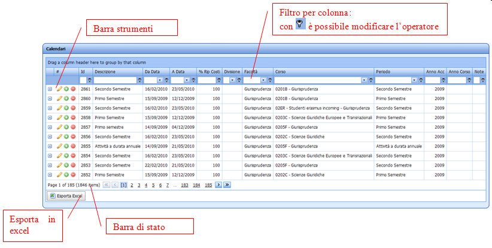
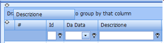
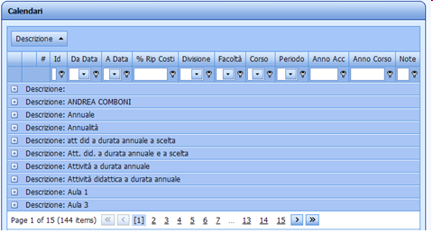
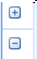
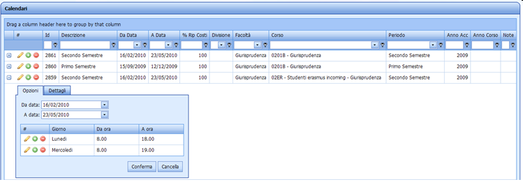
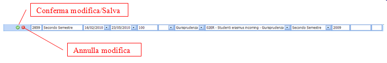

Ecco alcune indicazioni per l'utilizzo generale delle griglie Web, in uso soprattutto per la gestione delle tabelle di configurazione. 

Le principali novità rispetto alle versioni precedenti sono:

1. 	Tutti i campi sono visualizzati nella stessa pagina
2. 	I dettagli sono visualizzati aprendo con l'apposita icona + la singola riga
3. 	Tutte le modifiche ad una riga vengono salvate senza fastidiosi refresh della pagina
4. 	Possibilità di filtrare per colonna
5. 	Possibilità di Raggruppare per colonna (trascinare la colonna nell'apposita area sopra l'intestazione delle colonne)

Le modalità di ricerca e di gestione della griglia rimangono pressoché invariate. E' attiva la funzionalità di ridimensionamento delle colonne e rimane la possibilità di ordinarle in modo personalizzato.

## Strumenti
Le funzionalità della barra operativa agiscono sulla singola riga:

  *   apri/chiudi dettaglio

 
  *    modifica

  *    aggiungi record
  *    elimina

   
