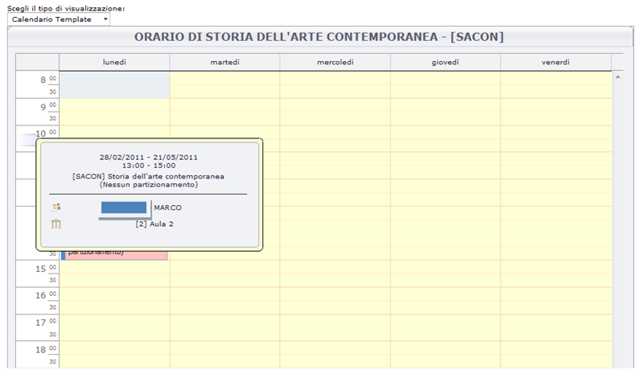
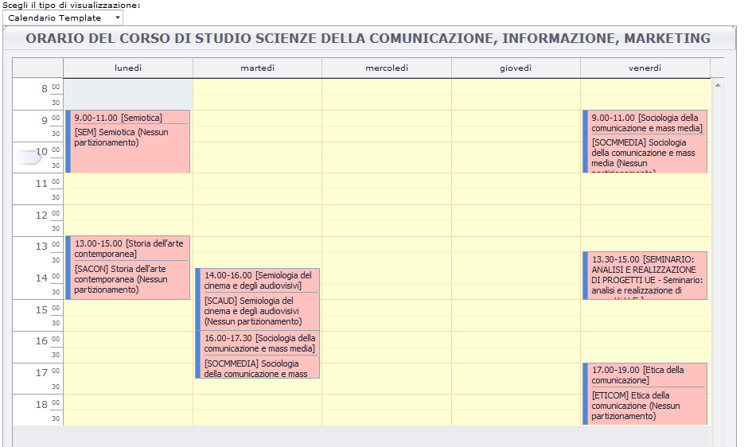
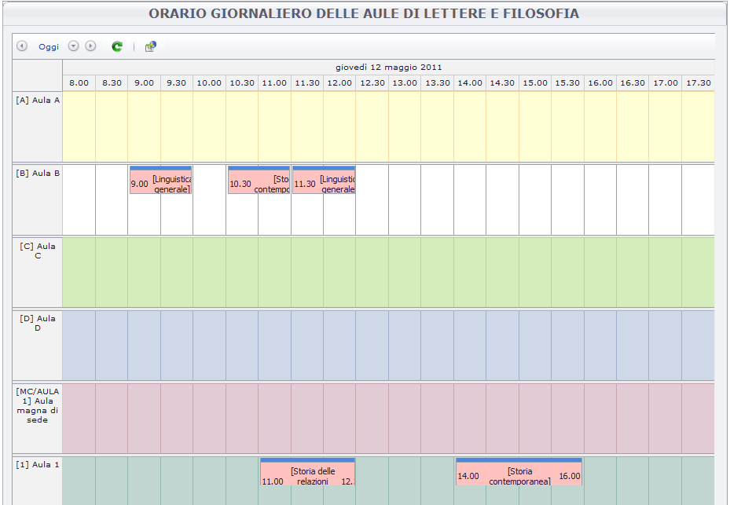
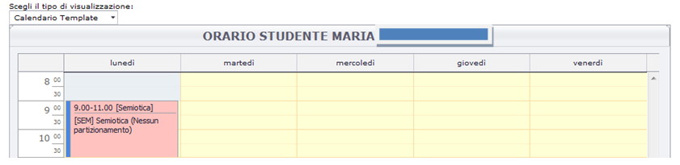
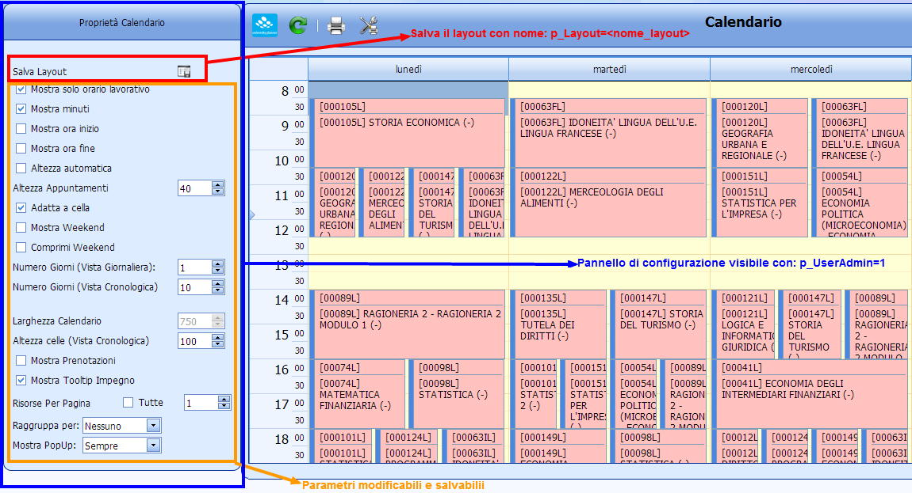


	
# Guida On Line/Area Pubblica ESSE3
 	
Nell'area pubblica **GUIDA ON LINE di ESSE3**, sono stati realizzati a standard le seguenti visualizzazioni:

## Pagina orario attività didattica singola
 	
E' la pagina che serve a visualizzare l'orario della singola attività didattica. La pagina mostra sottoforma di calendario settimanale l'orario di tutti i moduli e/o tipologie di attività legate al singolo insegnamento. 
 	
La logica di recupero delle informazioni rimane quindi invariata rispetto alla vecchia pagina realizzata dentro il web di ESSE3

## Pagina orario AD stesso cds/pds per semestre anno di corso
 	
Questa pagina ha lo scopo di mostrare allo studente l'orario cumulativo di un gruppo consistente di insegnamenti del proprio corso di laurea, e percorso di studi. Viene mostrato l'orario di ogni insegnamento per ogni anno di corso in un unico schema settimanale. Questo in prima approssimazione dovrebbe infatti coincidere con l'orario di lezioni degli studenti di quel Corso Percorso

La logica di recupero delle informazioni però è leggermente diversa rispetto alla vecchia pagina realizzata dentro il web di ESSE3, in cui veniva ulteriormente suddiviso l'orario anche per periodo (primo semestre, secondo semestre, annualità). La nuova pagina non presenta come nella vecchia pagina webesse3 gli insegnamenti raggruppati per periodo ma lo indica semplicemente come attributo nell'elenco. L'orario quindi risulterà più completo.

## Orario Giornaliero Per Aule Di Strutt. Org. (Occupazione Aule)

Si tratta di una pagina già esistente nel vecchio web, che intendiamo rimpiazzare con la nuova visualizzazione data la sua utilità. Non verrà però messa a standard nella GUIDA On line.

## Altre visualizzazione sulle Aule 

Nella Guida on line come sul modulo QA (Quality Assurance) è prevista la gestione di una vista ad-hoc che visualizza l'occupazione delle aule per singolo Corso di laurea (come richiesto dai requisiti di trasparenza). Le pagine “elenco edifici”, “elenco aule per edificio”, “orario mensile per aula” esistenti nel vecchio web ESSE3 non verranno riproposte a Standard in quanto la gestione e il tipo di visualizzazione dell'occupazione delle aule non sono oggetto specifico della guida studente ma in generale dei servizi che afferiscono al portale di ateneo o di Strutt. Org., o ad altre applicazioni web dedicate.

# Area Web Studente ESSE3
Nell'area studente di WEB ESSE3 è attivata una nuova funzionalità “Agenda” che consente al singolo studente di visualizzare in formato calendario l'elenco delle lezioni che sulla base del proprio libretto dovrebbe frequentare a seconda dei periodi dell'anno.

L'agenda considera l'orario alla data odierna quindi mostra la settimana effettiva, visualizzando quindi le date effettive (giorno, ora) delle lezioni previste in quella settimana. 
Essendo l'agenda sensibile al calendario effettivo, lo studente non si troverà dunque disorientato dal vedere sovrapposizioni di orario di attività che appartengono a periodi diversi (orari di insegnamenti del primo semestre assieme a quelli del secondo), ma tutte e solo le lezioni che in quel momento dell'anno sono disponibili e fruibili secondo il suo piano di studi.
Come approssimazione ottimale consideriamo che la vista dello studente sarà su tutte le attività dell'anno di corso minore uguale all'anno di iscrizione, che NON sono in stato “sostenuto”.
Con questa logica possiamo così mostrare anche le attività del primo anno che non sono ancora state sostenute, e che quindi lo studente dovrebbe rifrequentare.

E' previsto dalla stessa pagina anche un link al motore di “ricerca orari”, già filtrato per il corso di studio di appartenenza. Con questa ulteriore funzione, allo studente è consentito un accesso rapido e contestualizzato alle informazioni di orario più prossime alle sue esigenze

# Area Web Docente ESSE3

Analogamente a quanto realizzato per lo studente, si può attivare in area docente una funzione specifica “agenda” che consente al docente di vedere l'orario delle lezioni (di insegnamenti a lui attribuiti) alla data odierna.

# Chiamate dirette Pagine Pubbliche UP (appendice tecnica)
E' sempre possibile richiamare le pagine pubbliche di UP che visualizzano l'orario con diversi parametri di selezione e visualizzazione.

I link su cui effettuare i test sono: 

  *  http://nomemacchina/UP_<PROD|TEST>/UP_WEB_PUBL/test/callcalendpubl.html _(pagina di test per aiutare a comporre l'URL con i parametri giusti)_
  *  http://nomemacchina/UP_<PROD|TEST>/UP_WEB_PUBL/Calendari/CalendarioImpegni.aspx  _(pagina pubblica **principale**)_

Elenchiamo ora nel dettaglio i parametri con cui possono essere invocate le pagine di UP da WEB ESSE3 o da altre applicazioni. Le combinazioni opportune di questi parametri consentono di ottenere una vastissima gamma di viste sull'orario.

## PARAMETRI CONFIGURAZIONE UP 

<table border="1" cellspacing="0" cellpadding="1">
<thead><tr>
<td>Nome parametro</td>
<td>Lunghezza</td>
<td>Valori</td>
<td>Descrizione</td>
<td>Note</td>
</tr></thead>
<tr>
<td style="background-color: #01BCBC; color: #FFFFFF;">p_CurrentResource 
<td>2 </td>
<td>EV,RF,PE </td>
<td>Tipo di risorsa attiva </td>
<td>Eventi, Risorse Fisse e Persone </td>
</tr><tr>
<td style="background-color: #01BCBC; color: #FFFFFF;">p_ViewVisible 
<td>4 </td>
<td>1, 0 </td>
<td>Indica quali viste rendere visibili, bisogna passarle tutte e 4 In base alla posizione le viste che si abilitano:   
  1-Giornaliera   
  2-Settimanale Lav   
  3-Settimanale   
  4-Cronologica </td>
<td>ES: vedere solo la cronologica: 0001 Vedere giornaliera e settimanale lavorativa: 1100 </td>
</tr><tr>
<td style="background-color: #01BCBC; color: #FFFFFF;">p_ViewActive 
<td>1 </td>
<td>1,2,3,4 </td>
<td>Indica la vista attiva tra quelle visibili.   
 1-Giornaliera   
  2-Settimanale Lav   
  3-Settimanale   
  4-Cronologica </td>
<td>Es: rendere attiva la settimanale: 3 </td>
</tr><tr>
<td style="background-color: #01BCBC; color: #FFFFFF;">p_NumRisPagina 
<td> </td>
<td>ALL, numerico </td>
<td>Il numero di risorse che si vogliono vedere nella _p_ViewActive_ selezionata. Passare un valore numerico oppure **ALL** per mostrare tutte le risorse </td>
<td> </td>
</tr><tr>
<td style="background-color: #01BCBC; color: #FFFFFF;">p_SameNumRisPagAllViews 
<td>1 </td>
<td>1,0 </td>
<td>Abbinato al parametro _p_NumRisPagina _indica se impostare lo stesso numero di risorse per TUTTE le visualizzazioni </td>
<td> </td>
</tr><tr>
<td style="background-color: #01BCBC; color: #FFFFFF;">p_TipoRaggruppamento 
<td>1 </td>
<td>N,E,D </td>
<td>Il tipo di raggruppamento del calendario. N - Nesssuno E - Entita D - Data </td>
<td> </td>
</tr><tr>
<td style="background-color: #01BCBC; color: #FFFFFF;">p_UserConnection 
<td> </td>
<td>username </td>
<td>Username dell'utente UP_WEB, con il quale si leggono i parconf utente e le opzioni, se non viene passato legge l'utente di default (user: **defaultWebPubblico ** pwd: 1)</td>
<td> </td>
</tr><tr>
<td style="background-color: #01BCBC; color: #FFFFFF;">p_UserAdmin 
<td>1 </td>
<td>1,0 </td>
<td>Mostra o no il pannello di amministratore per gestire alcune proprietà del calendario e il recupero dati </td>
<td> </td>
</tr><tr>
<td style="background-color: #01BCBC; color: #FFFFFF;">p_Layout 
<td> </td>
<td>nome layout </td>
<td>Nome del layout da caricare da db </td>
<td> </td>
</tr><tr>
<td style="background-color: #01BCBC; color: #FFFFFF;">p_TitoloCalend  
<td> </td>
<td>titolo </td>
<td>Titolo da impostare al calendario </td>
<td> </td>
</tr><tr>
<td style="background-color: #01BCBC; color: #FFFFFF;">p_SceltaPagVisible 
<td>1 </td>
<td>1,0 </td>
<td>Mostra o no la lista dove potere scegliere i calendari o le griglie </td>
<td> </td>
</tr><tr>
<td style="background-color: #01BCBC; color: #FFFFFF;">p_SceltaPagAttiva 
<td>1 </td>
<td>1,2,3 </td>
<td>Imposta quale pagina aprire di default:   
  1- Calendario    
  2- Calendario Template    
  3- Elenco  </td>
<td> </td>
</tr><tr>
<td style="background-color: #01BCBC; color: #FFFFFF;">p_SceltaPagEnabled 
<td>3 </td>
<td>1,0 </td>
<td>Indica quali pagine abilitare.    
 1- Calendario    
 2- Calendario Template  3- Elenco  </td>
<td>ES: per vedere solo i due calendari: 110 </td>
</tr><tr>
<td style="background-color: #01BCBC; color: #FFFFFF;">p_StartDate 
<td>10 </td>
<td>data </td>
<td>Data di inizio recupero impegni. Formato yyyy-mm-dd </td>
<td>ES: 2010-10-18 </td>
</tr><tr>
<td style="background-color: #01BCBC; color: #FFFFFF;">p_NumDays  
<td> </td>
<td>numerico </td>
<td>Numero di giorni da recuperare in avanti e indietro per la vista giornaliera o cronologica </td>
<td> </td>
</tr><tr>
<td style="background-color: #01BCBC; color: #FFFFFF;">p_EnableTimeScales 
<td>4 </td>
<td>1,0 </td>
<td>Quali fasce orarie mostrare per la vista cronologica:   
 Giorno    
 Ore   
 Mezzore   
 Quarto d'ora </td>
<td> </td>
</tr><tr>
<td style="background-color: #01BCBC; color: #FFFFFF;">p_EventiList 
<td> </td>
<td> </td>
<td>Lista degli eventi da rucuperare (vedi par. [venti](#EVENTI)) </td>
<td> </td>
</tr><tr>
<td style="background-color: #01BCBC; color: #FFFFFF;">p_EventiListCod  
<td> </td>
<td> </td>
<td>Lista degli eventi da rucuperare con chiave composta da Codici (vedi par. [venti](#EVENTI)) </td>
<td> </td>
</tr><tr>
<td style="background-color: #01BCBC; color: #FFFFFF;">p_IdPersona 
<td> </td>
<td> </td>
<td>Id persona da recuperare </td>
<td> </td>
</tr><tr>
<td style="background-color: #01BCBC; color: #FFFFFF;">p_MatricolaPersona  
<td> </td>
<td> </td>
<td>Matricola persona da recuperare </td>
<td>  </td>
</tr><tr>
<td style="background-color: #01BCBC; color: #FFFFFF;">p_ExtPersona  
<td> </td>
<td> </td>
<td>ExternalCode persona da recuperare </td>
<td> </td>
</tr><tr>
<td style="background-color: #01BCBC; color: #FFFFFF;">p_IdAula  
<td> </td>
<td> </td>
<td>Id risorsa fissa da recuperare </td>
<td> </td>
</tr><tr>
<td style="background-color: #01BCBC; color: #FFFFFF;">p_CdaAula  
<td> </td>
<td> </td>
<td>Codice risorsa fissa da recuperare </td>
<td> </td>
</tr><tr>
<td style="background-color: #01BCBC; color: #FFFFFF;">p_ExtAula  
<td> </td>
<td> </td>
<td>ExternalCode risorsa fissa da recuperare </td>
<td> </td>
</tr><tr>
<td style="background-color: #01BCBC; color: #FFFFFF;">p_IdEdificio  
<td> </td>
<td> </td>
<td>Id Edificio delle risorse fisse da recuperare </td>
<td> </td>
</tr><tr>
<td style="background-color: #01BCBC; color: #FFFFFF;">p_CdaEdificio  
<td> </td>
<td> </td>
<td>Codice Edificio delle risorse fisse da recuperare </td>
<td> </td>
</tr><tr>
<td style="background-color: #01BCBC; color: #FFFFFF;">p_ExtEdificio  
<td> </td>
<td> </td>
<td>ExternalCode Edificio delle risorse fisse da recuperare </td>
<td> </td>
</tr><tr>
<td style="background-color: #01BCBC; color: #FFFFFF;">p_IdFacolta  
<td> </td>
<td> </td>
<td>Id Strutt. Org. delle risorse fisse da recuperare </td>
<td> </td>
</tr><tr>
<td style="background-color: #01BCBC; color: #FFFFFF;">p_CdaFacolta  
<td> </td>
<td> </td>
<td>Codice Strutt. Org. delle risorse fisse o degli eventi da recuperare </td>
<td> </td>
</tr><tr>
<td style="background-color: #01BCBC; color: #FFFFFF;">p_ExtFacolta  
<td> </td>
<td> </td>
<td>ExternalCode Strutt. Org. delle risorse fisse da recuperare </td>
<td> </td>
</tr><tr>
<td style="background-color: #01BCBC; color: #FFFFFF;">p_AnnoAccademico  
<td> </td>
<td> </td>
<td>Anno accademico degli eventi da recuperare </td>
<td> </td>
</tr><tr>
<td style="background-color: #01BCBC; color: #FFFFFF;">p_AnnoOrdinamento  
<td> </td>
<td> </td>
<td>Anno ordinamento degli eventi da recuperare </td>
<td> </td>
</tr><tr>
<td style="background-color: #01BCBC; color: #FFFFFF;">p_CdaAttivita  
<td> </td>
<td> </td>
<td>Codice attività didattica (AK) degli eventi da recuperare </td>
<td> </td>
</tr><tr>
<td style="background-color: #01BCBC; color: #FFFFFF;">p_CdaSede  
<td> </td>
<td> </td>
<td>Codice sede (AK) degli eventi da recuperare </td>
<td> </td>
</tr><tr>
<td style="background-color: #01BCBC; color: #FFFFFF;">p_CdaCorso  
<td> </td>
<td> </td>
<td>Codice corso di studio (AK) degli eventi da recuperare </td>
<td> </td>
</tr><tr>
<td style="background-color: #01BCBC; color: #FFFFFF;">p_CdaPercorso  
<td> </td>
<td> </td>
<td>Codice percorso degli eventi da recuperare </td>
<td> </td>
</tr><tr>
<td style="background-color: #01BCBC; color: #FFFFFF;">p_AnnoCorso  
<td> </td>
<td> </td>
<td>Anno di corso degli eventi da recuperare </td>
<td> </td>
</tr><tr>
<td style="background-color: #01BCBC; color: #FFFFFF;">p_AnnoRegDid  
<td> </td>
<td> </td>
<td>Anno regolamento didattico (coorte) degli eventi da recuperare </td>
<td> </td>
</tr><tr>
<td style="background-color: #01BCBC; color: #FFFFFF;">p_CdaPeriodo  
<td> </td>
<td> </td>
<td>Codice periodo (AK) degli eventi da recuperare </td>
<td> </td>
</tr><tr>
<td style="background-color: #01BCBC; color: #FFFFFF;">p_CdaPartiz  
<td> </td>
<td> </td>
<td>Codice  partizionamento studenti (AK) degli eventi da recuperare </td>
<td> </td>
</tr><tr>
<td style="background-color: #01BCBC; color: #FFFFFF;">p_CdaUd  
<td> </td>
<td> </td>
<td>Codice unità  didattica (AK) degli eventi da recuperare </td>
<td> </td>
</tr><tr>
<td style="background-color: #01BCBC; color: #FFFFFF;">p_MostraPrenotatore  
<td>1 </td>
<td>1,0 </td>
<td>Mostra o no  nell'impegno il dettaglio di chi ha effettuato la prenotazione dell'aula </td>
<td> </td>
</tr><tr>
<td style="background-color: #01BCBC; color: #FFFFFF;">p_MostraDettPE 
<td>1 </td>
<td>1,0 </td>
<td>Mostra o no  nell'impegno il dettaglio di chi è il docente associato</td>
<td> </td>
</tr><tr>
<td style="background-color: #01BCBC; color: #FFFFFF;">p_MostraDettRF 
<td>1 </td>
<td>1,0 </td>
<td>Mostra o no  nell'impegno il dettaglio di qual'è l'aula associata.</td>
<td> </td>
</tr><tr>
<td style="background-color: #01BCBC; color: #FFFFFF;">p_MostraDettRM
<td>1 </td>
<td>1,0 </td>
<td>Mostra o no  nell'impegno il dettaglio di quali sono le risorse mobili associate</td>
<td> </td>
</tr>
</table>

Per quanto riguarda il recupero dati in questo momento è stata implementata la seguente logica:

### PERSONE

Per il recupero delle persone o docenti è previsto in input l'id del docente in UP, la matricola oppure l'ExternalCode. E' previsto che venga passato solo uno di questi tre parametri.

Esempio:

1.  Recupero persona tramite id : p_IdPersona=6
2.  Recupero persona tramite matricola: p_MatricolaPersona=002015
3.  Recupero persona tramite ExternalCode: p_ExtPersona=002015

### RISORSE FISSE

Per il recupero delle risorse fisse sono previste in input tre tipologie di recupero, recupero per singola aula, recupero aule per Strutt. Org., recupero aule per edificio. Per ognuno di questi recuperi è possibile passare l'id di UP, il codice di UP o l'ExternalCode. E' previsto che venga passato solo uno di questi tre parametri.

Esempio:

1.  Recupero risorsa fissa tramite id Aula : p_IdAula=6
2.  Recupero risorsa fissa tramite codice Strutt. Org.: p_CdaStrutt. Org.205478
3.  Recupero risorsa fissa tramite ExternalCode edificio: p_ExtEdificio=2534774

### EVENTI

Per il recupero degli eventi sono previste diverse modalità:

_1.'' **p_EventiList**: è prevista in input una stringa che prevede il passaggio di più eventi. 

La stringa che identifica un evento è cosi composta:

  *  Anno Accademico, intero di 4 caratteri
  *  Anno Ordinamento, intero di 4 caratteri
  *  Anno di Coorte (regolamento), intero di 4 caratteri
  *  ExternalCode Corso, stringa 20 caratteri *
  *  ExternalCode Percorso, stringa 40 caratteri (20 caratteri se il parametro OLD_EXT_CODE_ID_ESSE3 = 1) *
  *  ExternalCode Attività Didattica, stringa 20 caratteri *
  *  Codice UD, stringa 20 caratteri
  *  ExternalCode Partizionamento, stringa 20 caratteri *
  *  ExternalCode Periodo, stringa 20 caratteri *
  *  ExternalCode Sede, stringa 20 caratteri *

    * l' ExternalCode delle anagrafiche di base contiene un valore alfanumerico che identifica univocamente una riga rispetto al sistema esterno da cui si importa (tipicamente ESSE3 o Ugov). Se il parametro OLD_EXT_CODE_ID_ESSE3 = 1 è necessario comporre la stringa con gli ID di ESSE3 (vecchia integrazione),
altrimenti si usano normalmente i campi CODICE (chiave univoca alternativa).

> Esempio: 

1.  Singolo evento: 
p_EventiList=201020060000$$$$$$$$$$$$$$$$$$13$$$$$$$$$$$$$$$$$$44$$$$$$$$$$$$$$$500$$$$$$$$$$$$$$$$$$$$$$$$$$$$$$$$$$$$$$$$$$$$$$$$$$$$$$$$$$S1$$$$$$$$$$$$$$$$$$$$
2.  Multi evento: 
p_EventiList=201020060000$$$$$$$$$$$$$$$$$$13$$$$$$$$$$$$$$$$$$44$$$$$$$$$$$$$$$500$$$$$$$$$$$$$$$$$$$$$$$$$$$$$$$$$$$$$$$$$$$$$$$$$$$$$$$$$$S1$$$$$$$$$$$$$$$$$$$$;  
201020060000$$$$$$$$$$$$$$$$$$13$$$$$$$$$$$$$$$$$$44$$$$$$$$$$$$$$$3$$$$$$$$$$$$$$$$$$$$$$$$$$$$$$$$$$$$$$$$$$$$$$$$$$$$$$$$$$S1$$$$$$$$$$$$$$$$$$$$;  
201020060000$$$$$$$$$$$$$$$$$$13$$$$$$$$$$$$$$$$$$44$$$$$$$$$$$$$$$504$$$$$$$$$$$$$$$$$$$$$$$$$$$$$$$$$$$$$$$$$$$$$$$$$$$$$$$$$$S1$$$$$$$$$$$$$$$$$$$$;  
201020060000$$$$$$$$$$$$$$$$$$13$$$$$$$$$$$$$$$$$$44$$$$$$$$$$$$$$$608$$$$$$$$$$$$$$$$$$$$$$$$$$$$$$$$$$$$$$$$$$$$$$$$$$$$$$$$$$S1$$$$$$$$$$$$$$$$$$$$;  
201020060000$$$$$$$$$$$$$$$$$$13$$$$$$$$$$$$$$$$$$44$$$$$$$$$$$$$$$791$$$$$$$$$$$$$$$$$$$$$$$$$$$$$$$$$$$$$$$$$$$$$$$$$$$$$$$$$$S1$$$$$$$$$$$$$$$$$$$$;  
201020060000$$$$$$$$$$$$$$$$$$13$$$$$$$$$$$$$$$$$$44$$$$$$$$$$$$$$$792$$$$$$$$$$$$$$$$$$$$$$$$$$$$$$$$$$$$$$$$$$$$$$$$$$$$$$$$$$S1$$$$$$$$$$$$$$$$$$$$;  
201020060000$$$$$$$$$$$$$$$$$$13$$$$$$$$$$$$$$$$$$44$$$$$$$$$$$$$$$1302$$$$$$$$$$$$$$$$$$$$$$$$$$$$$$$$$$$$$$$$$$$$$$$$$$$$$$$$$$S1$$$$$$$$$$$$$$$$$$$$

_2._ **p_EventiListCod:** è prevista in input una stringa che prevede il passaggio di più eventi. 
La stringa che identifica un evento è cosi composta in maniera identica a p_EventiList, ma
il filtro degli eventi avviene esplicitamente sui campi Codice invece che quelli ExternalCode (il parametro OLD_EXT_CODE_ID_ESSE3 è ininfluente).

  *  Anno Accademico, intero di 4 caratteri
  *  Anno Ordinamento, intero di 4 caratteri
  *  Anno di Coorte (regolamento), intero di 4 caratteri
  *  Codice Corso, stringa 20 caratteri 
  *  Codice Percorso di studio, stringa 40 caratteri *
  *  Codice Attività Didattica, stringa 20 caratteri 
  *  Codice UD, stringa 20 caratteri
  *  Codice Partizionamento, stringa 20 caratteri 
  *  Codice Periodo, stringa 20 caratteri 
  *  Codice Sede, stringa 20 caratteri 

  * Il percorso di studio ha come chiave univoca alternativa i campi: Cod. corso  + anno ordinamento +  anno regolamento didattico (coorte) + Cod. percorso.
Per cui per recuperare un unico percorso è necessario comporre la chiave concatenando i valori col separatore ‘_' nel formato: <CodCorso>_<AnnoOrd>_<AnnoRegDid>_<CodPercorso>. E', inoltre, possibile concatenare il valore 9999 al posto del campo AnnoRegDid in caso in cui il parametro UP_WEB_PUBL.IGNORE_ANNO_REGDID sia uguale a 1 e non sia quindi possibile determinare l'anno di coorte dell'attività (come in caso di vecchia integrazione con la didattica di ESSE3) 
(Esempio: 100/35_2008_9999_PDS0-2008).

> Esempio:

1.  Singolo evento: 
p_EventiList=201120040000$$$$$$$$$$$$$$$$$F60$$$$$$$$$$$$$$$$F60_2004_9999_F60-04-GGG$$$$$$$$$$$$$$F00204$$$$$$$$$$$$$$$$$$$$$$$$$$$$$$$$$$$$$$$$$$$$$$$$$$$$$$$$$$$$$$$$$$$$$$$$$$$$$$$$
2.  Multi evento: 
p_EventiList=201120040000$$$$$$$$$$$$$$$$$F60$$$$$$$$$$$$$$$$F60_2004_9999_F60-04-GGG$$$$$$$$$$$$$$F00204$$$$$$$$$$$$$$$$$$$$$$$$$$$$$$$$$$$$$$$$$$$$$$$$$$$$$$$$$$$$$$$$$$$$$$$$$$$$$$$$;  
201120040000$$$$$$$$$$$$$$$$$F60$$$$$$$$$$$$$$$$F60_2004_9999_F60-04-GGG$$$$$$$$$$$$$$F00205$$$$$$$$$$$$$$$$$$$$$$$$$$$$$$$$$$$$$$$$$$$$$$$$$$$$$$$$$$$$$$$$$$$$$$$$$$$$$$$$;  
201120010000$$$$$$$$$$$$$$$$$F60$$$$$$$$$$$$$$$$F60_2001_9999_F60-01-GGG$$$$$$$$$$$$$$F00636$$$$$$$$$$$$$$$$$$$$$$$$$$$$$$$$$$$$$$$$$$$$$$$$$$$$$$$$$$$$$$$$$$$$$$$$$$$$$$$$;  
201120040000$$$$$$$$$$$$$$$$$F60$$$$$$$$$$$$$$$$F60_2004_9999_F60-04-GGG$$$$$$$$$$$$$$F00635$$$$$$$$$$$$$$$$$$$$$$$$$$$$$$$$$$$$$$$$$$$$$$$$$$$$$$$$$$$$$$$$$$$$$$$$$$$$$$$$;  
201120040000$$$$$$$$$$$$$$$$$F60$$$$$$$$$$$$$$$$F60_2004_9999_F60-04-GGG$$$$$$$$$$$$$$F00656$$$$$$$$$$$$$$$$$$$$$$$$$$$$$$$$$$$$$$$$$$$$$$$$$$$$$$$$$$$$$$$$$$$$$$$$$$$$$$$$;  
201120040000$$$$$$$$$$$$$$$$$F60$$$$$$$$$$$$$$$$F60_2004_9999_F60-04-GGG$$$$$$$$$$$$$$F00657$$$$$$$$$$$$$$$$$$$$$$$$$$$$$$$$$$$$$$$$$$$$$$$$$$$$$$$$$$$$$$$$$$$$$$$$$$$$$$$$;

_**NB:**_ E' obbligatorio passare sempre tutti i parametri dell'evento secondo la lunghezza indicata, utilizzando
come valore di riempimento il dollaro “$” per le stringhe. Per non valorizzare un campo di tipo stringa passare “$$$$$$$$$$$$$$$$$$$$”, per il tipo intero “0000”. 

Per passare più eventi fare una stringa di chiavi logiche eventi separate dal carattere “;”

_3._ **Filtro per codici:** è possibile utilizzare uno o più dei campi p_CdaStrutt. Org., p_AnnoAccademico, p_AnnoOrdinamento, p_CdaAttivita, p_CdaSede, p_CdaCorso, p_CdaPercorso, p_AnnoCorso, p_AnnoRegDid, p_CdaPeriodo, p_CdaPartiz, p_CdaUd per recuperare gli eventi corrispondenti (i campi a NULL verranno ignorati)

## PARAMETRI CONFIGURAZIONE DA ESSE3 

Elenco dettagliato dei parametri di configurazione di ESSE3 con cui possono essere invocate le pagine di UP (da WEB ESSE3).

<table border="1" cellspacing="0" cellpadding="1">
<thead><tr>
<td>Nome parametro</td>
<td>Tabella</td>
<td>Descrizione</td>
</tr></thead>
</tr><tr>
<td style="background-color: #01BCBC; color: #FFFFFF;">ABILITA_INTEGRAZIONE_LOGISTICA_UP
<td>PAR_CONF </td>
<td>Abilitazione integrazione con il modulo di logistica UP. 0 = disabilitata; 1 = abilitata, in questo caso nel web vengono visualizzati gli orari caricati in UP e nella funzione client Informazioni logistiche, nella finestra "Docenti e orari", i blocchi "Periodo Validità Orario" e "Orario" non vengono visualizzati; 2: in questo caso integriamo il nuovo sistema di visualizzazione orario tramite collegamento indirizzato sulla pagina del calendario impegni</td>
</tr><tr>
<td style="background-color: #01BCBC; color: #FFFFFF;">ABILITA_INTEGRAZIONE_LOGISTICA_STU
<td>PAR_CONF </td>
<td>Abilitazione integrazione con con il modulo di logistica per lo studente</td>
</tr><tr>
<td style="background-color: #01BCBC; color: #FFFFFF;">URL_LOGISTICA_UP
<td>PAR_CONF_URL</td>
<td>Indirizzo dell'applicazione UP relativo al calendario impegni.</td>
</tr><tr>
<td style="background-color: #01BCBC; color: #FFFFFF;">IMPOSTA_SCELTA_PAG_ATTIVA_UP
<td>PAR_CONF </td>
<td>Tipo pagina UP che l'Ateneo apre di default: 1=calendario, 2 = calendario template, 3 = lista</td>
</tr><tr>
<td style="background-color: #01BCBC; color: #FFFFFF;">IMPOSTA_SCELTA_PAG_ENABLED_UP
<td>PAR_CONF </td>
<td>Indica quali pagine abilitare. ES: per vedere solo i due calendari:</td>
</tr><tr>
<td style="background-color: #01BCBC; color: #FFFFFF;">IMPOSTA_SCELTA_PAG_VISIBILE_UP
<td>PAR_CONF </td>
<td>Mostra o no la lista dove potere scegliere i calendari o le griglie. 1=mostra lista, 0 = non mostra lista</td>
</tr><tr>
<td style="background-color: #01BCBC; color: #FFFFFF;">ABILITA_INTEGRAZIONE_LOGISTICA_UP_DOC
<td>PAR_CONF </td>
<td>Abilitazione integrazione con il modulo di logistica UP per il docente. 0 = disabilitata; 1 = abilitata, in questo caso nel web vengono visualizzati gli orari caricati in UP per lo docente</td>
</tr><tr>
<td style="background-color: #01BCBC; color: #FFFFFF;">ABILITA_INTEGRAZIONE_LOGISTICA_UP_STU
<td>PAR_CONF </td>
<td>Abilitazione integrazione con il modulo di logistica UP per lo studente. 0 = disabilitata; 1 = abilitata, in questo caso nel web vengono visualizzati gli orari caricati in UP per lo studente rispettando certi filtri (si accettano di visualizzare l'orario solo delle lezioni non superate, che fanno parte del anno che frequenti)</td>
</tr>
</table>

## CONFIGURAZIONE GRAFICA E LAYOUT

Per quel che riguarda il risultato grafico si può agire su due aspetti:

###  A. Utente Web Pubblico  
Accedendo ad UP_WEB con l'utente **defaultWebPubblico** (pwd: 1) dalla funzione _Opzioni->Opzioni personali_ è possibile modificare le impostazioni "Generali" del calendario pubblico:

  *  il tema (i colori)
  *  gli orari lavorativi
  *  le descrizioni parametriche per evento (il contenuto degli impegni), aule e persone 

Per maggiore dettagli consultare la pagina [Opzioni](up_web_Opzioni.md).

E' inoltre possibile specificare un utente diverso da quello di default con l'uso del parametro:** p_UserConnection=_username_ **

**NB: ** per vedere le modifiche effettuate, aggiornare la pagina del calendario pubblico (o chiudere e riaprire il browser)

###  B. Salvataggio Layout grafico  

Attraverso l'uso di due parametri specifici è possibile configurare un layout diverso per ogni chiamata effettuata,
attraverso i seguenti passi:

1.  innanzitutto è necessario scegliere un nome del layout da assegnare alla visualizzazione desiderata (es: "layoutProva")
2.  assegnamo tale nome alla visualizzazione desiderata con l'uso del parametro: _**p_Layout=layoutProva**_ (va aggiunto agli altri parametri)
3.  abilitiamo la configurazione per un utente "administrator" con l'uso del parametro: _**p_UserAdmin=1**_ (va aggiunto agli altri parametri)
4.  dal pannello di configurazione che compare, possiamo agire su alcune impostazioni del calendario (visualizzazione ore, altezza, larghezza, giorni feriali, ecc.)
e vedere immediatamente gli effetti di tali modifiche
5.  una volta trovato il layout migliore per i propri scopi, premiamo il pulsante "Salva layout" (verrà salvato con il nome "# disabilitiamo la configurazione per un utente "administrator" eliminando il parametro p_UserAdmin oppure impostandolo: _**p_UserAdmin=0**_ 
6.  ogni qual volta verrà effettuata una chiamata con l'uso del parametro: _**p_Layout=layoutProva**'', verranno applicate le impostazioni salvate (altrimenti valgono le configurazioni di default)

Link di esempio:  

[http://ambint.kion.it/UP_DEMO/UP_WEB_PUBL/Calendari/CalendarioImpegni.aspx?p_CurrentResource=EV&p_AnnoAccademico=2012&p_CdaCorso=ET10&p_AnnoCorso=1&p_CdaPeriodo=P21&p_ViewVisible=1111&p_ViewActive=2&p_TipoRaggruppamento=N&p_UserAdmin=1&p_StartDate=12%2F11%2F2012&p_Layout=layoutProva&p_SceltaPagVisible=1&p_SceltaPagAttiva=1&p_SceltaPagEnabled=111](http://ambint.kion.it/UP_DEMO/UP_WEB_PUBL/Calendari/CalendarioImpegni.aspx?p_CurrentResource=EV&p_AnnoAccademico=2012&p_CdaCorso=ET10&p_AnnoCorso=1&p_CdaPeriodo=P21&p_ViewVisible=1111&p_ViewActive=2&p_TipoRaggruppamento=N&p_UserAdmin=1&p_StartDate=12%2F11%2F2012&p_Layout=layoutProva&p_SceltaPagVisible=1&p_SceltaPagAttiva=1&p_SceltaPagEnabled=111.md)
