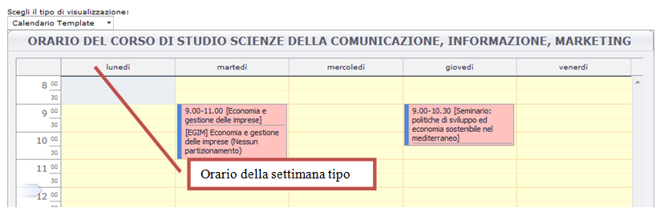
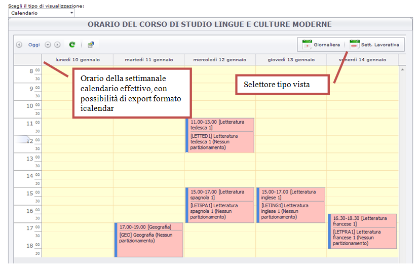
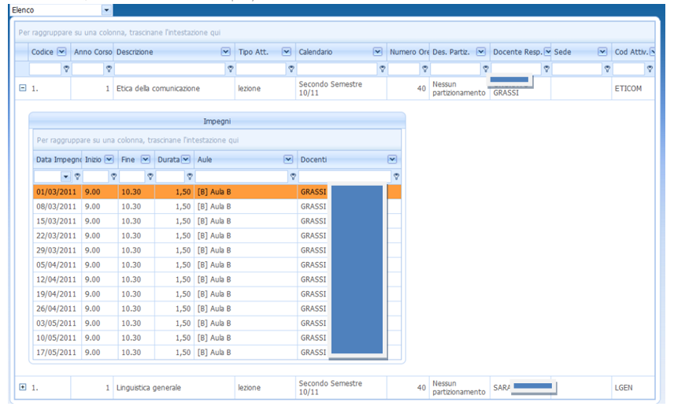
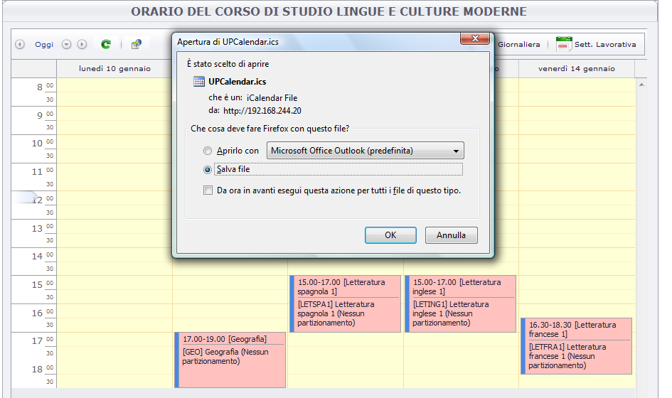



In questa sezione descriviamo brevemente i nuovi servizi di visualizzazione dell'orario delle lezioni e più in generale della calendarizzazione eventi nelle aule che sono resi disponibili dal sistema UP (University Planner).

L'idea centrale è quella di sostituire le attuali pagine sviluppate con il WEB di ESSE3 con pagine pubbliche direttamente richiamate in punti specifici dell'area web pubblica, dalla GUIDA on line, dalle aree web studente e docente. Questo cambio di visione eleva il livello di servizio, dando i seguenti vantaggi:

  *  Introduzione di pagine con “capacità espressiva” molto più elevata dal punto di vista della rappresentazione dei dati in vari formati calendario 
  *  Eliminazione di pagine ad hoc in web ESSE3 la cui realizzazione e customizzazione per singola Università è globalmente più onerosa da fare e mantenere
  *  Introduzione di interfacce “pubbliche” di UP, quindi potenzialmente richiamabili anche da applicazioni terze (portali atenei, altri moduli U-GOV)

Sostanzialmente è stato realizzato un nuovo WS di UP che oltre alla restituzione di dati (che andrebbero poi visualizzati in qualche modo all'interno di una interfaccia da costruire), fornisce anche l'interfaccia stessa, cioè una vera e propria pagina web. Tale pagina può poi essere opportunamente visualizzata come pagina a sé stante (in una nuova finestra browser) o eventualmente incapsulata in una applicazione web.

Con questa nuova soluzione si possono chiamare pagine pubbliche con diverse tipologie di interfacce e viste sui dati

# Vista a calendario template
Consente di visualizzare in una griglia a calendario gli impegni “template”, che servono alla pubblicazione di un orario tipo. Quello che attualmente  quasi tutti gli atenei pubblicano come orario delle lezioni: uno schema di orario generico con indicata la data inizio e fine.

# Vista a calendario
Consente di visualizzare in una griglia a calendario gli impegni “effettivi”, quindi coincide con la visualizzazione della prima settimana effettiva di inizio dell'insegnamento. In questo caso l'utente potrà anche scorrere in avanti o indietro il calendario effettivo per  vedere se lo schema settimanale rimane invariato nel corso del tempo o subisce variazioni.

La vista a calendario può consentire poi la possibilità di ulteriori viste specifiche del calendario come di consueto:
  *  Giornaliera 
  *  Settimanale lavorativa 
  *  Settimanale 
  *  Cronologica 

Il tasto di selezione del cambio vista può in alcuni casi essere reso visibile anche all'utente fruitore (GUEST)

# Vista a elenco
La vista a elenco è chiaramente utile solo per la visualizzazione tabellare dell'orario effettivo, cioè l'elenco di tutte le date di lezione di uno o più insegnamenti

# Opzioni Utente
L'utente finale (GUEST) anziché essere spettatore passivo di una pagina preconfigurata può interagire con l'interfaccia per aumentarne la “leggibilità” secondo i propri scopi.

## Funzioni di visualizzazione
  *  cambia slot
  *  barra aggiunta risorse
  *  barra di spostamento calendario

## Funzioni di esportazione
  *  esporta agenda in formato i.calendar 
  *  esporta in excel (disponibile dalla funzione di stampa)
  *  stampa 

